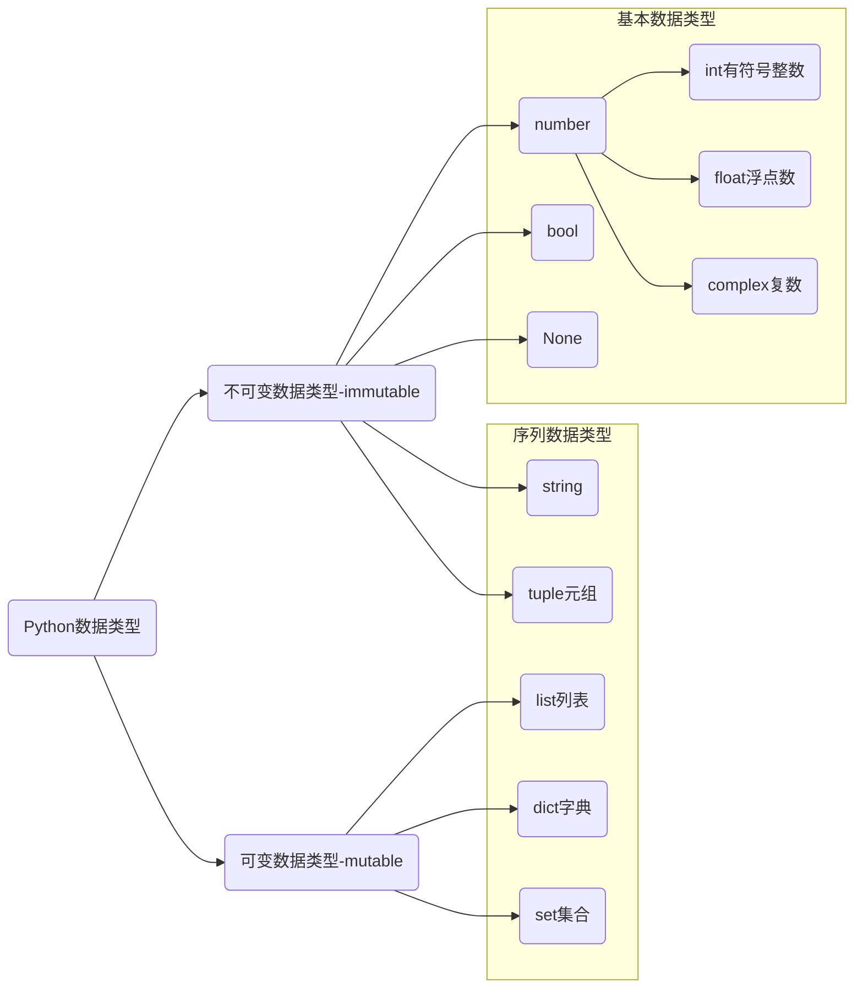

# 数据类型与程序流程

## Python中的数据类型



`complex`复数，主要用于科学计算，例如：平面场问题、波动问题、电感电容等问题。

上图列举了所有的Python数据类型，其它序列类型包括：`stirng`，`tuple`，`list`，`dict`和`set`。

* 序列提供了一系列特有的操作方法。
* 序列类型分为可变序列和不可变序列。
* 序列类型是Python内置的数据类型和传统意义上的数据结构，堆、栈、链表等不同。


## 程序的三大流程

* 顺序 —— 从上向下，顺序执行代码。
* 分支 —— 根据条件判断，决定执行代码的分支。
* 循环 —— 让特定代码重复执行。


## 综合练习

> [!tip]
>
> 统计文章中的一段使用了多少个汉字和每个汉字出现的次数。
>
> [文章链接](https://baijiahao.baidu.com/s?id=1720661522278169835&wfr=spider&for=pc)

```python
docs = '''
黄河安澜是中华儿女的千年期盼。
近年来，我走遍了黄河上中下游9省区。
无论是黄河长江“母亲河”，还是碧波荡漾的青海湖、逶迤磅礴的雅鲁藏布江；
无论是南水北调的世纪工程，还是塞罕坝林场的“绿色地图”；
无论是云南大象北上南归，还是藏羚羊繁衍迁徙……这些都昭示着，人不负青山，青山定不负人。
'''

signs = ['。', '；', '“', '”', '，', '……', '、', '9', '\n']

result = docs
for sign in signs:
    result = result.replace(sign, '')

chars = set(result)
print(f'字符数量为: {len(chars)}')

max_num = 0
max_char = ''
for char in chars:
    num = result.count(char)
    print(f'字符： {char}, 使用了: {num} 次')
    if num > max_num:
        max_char = char
        max_num = num

print(f'使用最多的字符是: {max_char}, 次数是: {max_num}')
```

# 基本数据类型中的相似操作

## 容器类型转换

* `set()` 转换为集合

```python
colors = ['red', 'blue', 'yellow', 'green']
print(tuple(colors))
print(set(colors))
```

## 运算符

### `in` 或 `not in`

```python
person = {'name': '龙傲天', 'age': 20, 'is_male': True, 'height': 1.86 }
print('name' in person)
print('name' not in person)
print('job' in person)
```

## 公共方法

| 函数             | 描述                                                         |
| ---------------- | ------------------------------------------------------------ |
| `len()`          | 计算容器中元素个数                                           |
| `del` 或 `del()` | 删除                                                         |
| `max()`          | 返回容器中元素最大值                                         |
| `min()`          | 返回容器中元素最小值                                         |
| `enumerate()`    | 函数用于将一个可遍历的数据对象(如列表、元组或字符串)组合为一个索引序列，同时列出数据和数据下标，一般用在 for 循环当中。 |

### `len()`

```python
message = 'hello world'
print(len(str))

colors = ['red', 'blue', 'yellow', 'green']
print(len(colors))

colors = tuple(colors)
print(len(colors))

colors = set(colors)
print(len(colors))

person = {'name': '龙傲天', 'age': 20, 'is_male': True, 'height': 1.86}
print(len(person))
person['job'] = '管家'
print(len(person))
```

### `del()`

```python
message = 'hello world'
del message
print(message)

colors = ['red', 'blue', 'yellow', 'green']
del colors[0], colors[1]
print(colors)
del colors

person = {'name': '龙傲天', 'age': 20, 'is_male': True, 'height': 1.86}
del person['name'], person['age']
print(person)
del person

colors = ('red', 'blue', 'yellow', 'green')
del colors[0]
```

> [!warning]
>
> 1. 元组为不可变序列，单个元素无法使用 `del` 删除，但是可以使用 `del` 删除整个元组。
> 2. 集合中的元素移除只能使用相关方法，不能使用 `del`，但是可以使用 `del` 删除整个集合。

### `min()` 或 `max()`

```python
message = 'hello, world'
print(max(message))
print(min(message))

nums = [10, 20, 30, 40]
print(max(nums))
print(min(nums))

nums = set(nums)
print(max(nums))
print(min(nums))

letters = {'a': 1, 'b': 2, 'c': 3}
print(max(letters))
print(max(letters.values()))
print(min(letters))
print(min(letters.values()))
```

### `enumerate()`

```python
colors = ['red', 'blue', 'yellow', 'green']

for i in enumerate(colors):
    print(i)

for index, color in enumerate(colors, start=2):
    print(f'索引是{index}, 对应的颜色是{color}')
    
colors = set(colors) # 变换集合后顺序会发生变化
for i in enumerate(colors):
    print(i)
    
person = {'name': '龙傲天', 'age': 20, 'is_male': True, 'height': 1.86}
for i in enumerate(person):
    print(i)
```


## 列表生成式

