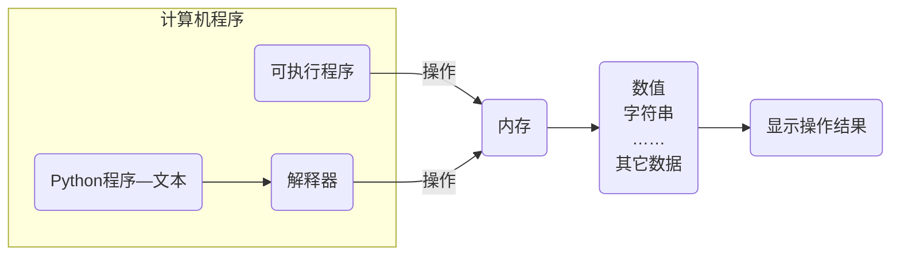

# 程序执行原理

## 计算机程序的本质

计算机程序的本质是对数据的处理和操作



## 计算机的三大件

计算机中包含有较多的硬件，但执行程序的三个核心硬件是：

1. CPU
   * 中央处理器，是一块超大规模的集成电路
   * 负责处理数据和计算
2. 内存
   * 临时存储数据（断电之后，数据会消失）
   * 速度快、空间小（单位价格高）
3. 硬盘
   * 永久存储数据
   * 速度慢、空间大（单位价格低）

## 程序执行的原理


1. 程序运行之前，程序是保存在硬盘中的。
2. 当要运行一个程序时：
   * 操作系统会首先让CPU把程序复制到内存中。
   * CPU执行内存中的程序代码。

### 程序在内存中的运行过程


## 编译语言执行过程

在VsCode中创建一个`hello.c`文件，输入如下代码

```python
#include <stdio.h>

int main() {
    printf("hello, world");
}
```

执行编译过程

## Python 程序执行过程


1. 操作系统控制CPU，首先把Python解释器的程序复制到内存中。
2. Python解释器根据语法规则，从上向下让CPU翻译`.py`文件中的代码。
3. CPU一行行的执行翻译完成的代码。

### Python 解释器的大小

```shell
ls -lh /Users/xusu/opt/anaconda3/bin/python
```

## 程序的调试

在VSCode中调试如下代码

```python
price = 8.5
number = 10
money = price * number # 计算金额
money *= 0.8

print(money)
```

打开调试工具


调试程序

