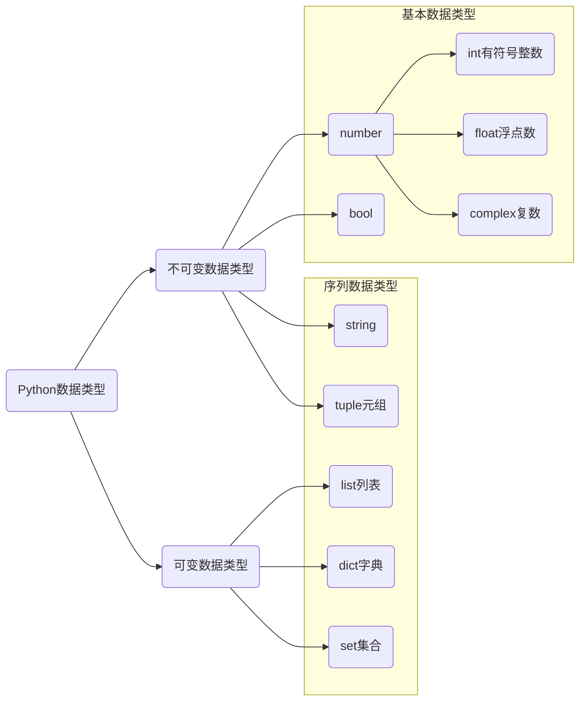

# 从变量开始

## 第一个程序

1. Python 源程序就是一个特殊格式的文本文件，可以使用任意文本编辑器编写。
2. Python 程序的文件扩展名通常都是 `.py`。
3.  创建一个 `main.py` 文件，在文件中输入如下文本。

```python
print('Hello, world!')
```

4. 在控制台执行如下命令

```shell
python main.py
```

> [!warning]
>
> 每行代码只完成一个操作。

## 代码注释

### 注释得到作用

在程序中给某些代码添加说明，增强程序的可读性。

### 单行注释

```python
# 这是第一个单行注释，print 是在控制台中输出的函数
print('Hello, world!') # 为了保证代码可读性，注释和代码之间保留空格
```

### 多行注释

如果需要注释的信息很多，一行无法显示就可以使用多行注释。

```python
"""
这是一个多行注释

在多行注释之间，可以写很多很多的内容……
""" 
print('Hello Python world!')
```

### 注释的作用


1. 注释不是越多越好，对于一目了然的代码，不需要添加注释。
2. 对于复杂的操作，应该在操作开始前写上若干行注释。
3. 对于不是一目了然的代码，应在其行尾添加注释。
4. 绝不要描述代码，假设阅读代码的人比你更懂 Python，他只是不知道你的代码要做什么。

## 变量的基本使用

变量是存储数据的容器。


### 变量的定义

每个变量在使用前都必须赋值，变量赋值以后才会被创建。

等号（`=`）用来给变量赋值

* `=` 左边是一个变量名（左值）
* `=` 右边是存储在变量中的值（右值）
* 变量定义后，后续代码中可以直接使用

```python
# 变量名 = 值
message = "Hello, world!"
```

在内存中创建一个变量，会包括：

1. 变量的名称
2. 变量保存的数据
3. 变量存储数据的类型
4. 变量的地址

变量的操作

1. 变量名只有在第一次出现时才是定义变量。
2. 变量名再次出现，不是定义变量，而是直接使用之前定义过的变量。
3. 变量中保存的值可以修改。

### Python的数据类型

数据类型决定了数据在程序中存储、读取和运算的方式。



* 在 Python 2.x 中，整数的长度还分为 `int/long`，Python 3.x 中已取消。
* complex复数，主要用于科学计算，例如：平面场问题、波动问题、电感电容等问题。
* 在 Python 中定义变量时不需要指定类型，Python 解释器可以自动推导变量类型。

```python
message = 'Hello, Python'
month = 6
pi = 3.14
is_male = True

# 使用type函数查看变量类型
type(message)
type(month)
type(pi)
type(is_male)
```


## 变量的计算

Python 程序支持常见的数学运算包括：

| 运算符 |  描述  | 实例                                       |
| :----: | :----: | ------------------------------------------ |
|   +    |   加   | 10 + 20 = 30                               |
|   -    |   减   | 10 - 20 = -10                              |
|   *    |   乘   | 10 * 20 = 200                              |
|   /    |   除   | 10 / 20 = 0.5                              |
|   //   | 取整除 | 返回除法的整数部分（商） 9 // 2 输出结果 4 |
|   %    | 取余数 | 返回除法的余数 9 % 2 = 1                   |
|   **   |   幂   | 又称次方、乘方，2 ** 3 = 8                 |

1. 数字型变量的计算：
   * 数字型变量之间可以直接进行算数运算。

   * 如果变量是 `bool` 型，在计算时：
     * `True` 对应的数字是 `1`
     * `False` 对应的数字是 `0`

```python
a = 2
b = 3
print(a + b)
print(a - b)
print(a * b)
print(a / b)

c = True
print(a * c)

print(2 ** 1000) # 其他语言计算会非常复杂
```

2. 字符串操作
   * 字符串变量之间使用 `+` 拼接字符串。
   * 字符串变量可以和整数使用 `*` 重复拼接相同的字符串。

```python
first_name = "三"
last_name = "张"
first_name + last_name

"-" * 50
```

3. 数字型变量和字符串之间不能进行其他计算。

```python
first_name + 10
```

### 运算符的优先级

Python 中进行数学计算时，运算符的优先级和数学计算规范一致：

* 先乘除后加减
* 同级运算符是从左至右计算
* 可以使用 `()` 调整计算的优先级

算数优先级由高到低排序如下表：

| 运算符   | 描述                   |
| -------- | ---------------------- |
| **       | 幂 (最高优先级)        |
| * / % // | 乘、除、取余数、取整除 |
| + -      | 加法、减法             |

算数优先级测试

```python
print(2 + 3 * 5)
print((2 + 3) * 5)
print(2 ** 2 + 5)
print(2 ** (2 + 5))
```

## 赋值运算符

在 Python 中，除 `=` 可以给变量赋值外，还提供了一系列的与算术运算符对应的赋值运算符，来简化代码的编写。

| 运算符 | 描述                       | 实例                                        |
| ------ | -------------------------- | ------------------------------------------- |
| `=`    | 简单的赋值运算符           | `c = a + b` 将 `a + b` 的运算结果赋值为 `c` |
| `+=`   | 加法赋值运算符             | `c += a` 等效于 `c = c + a`                 |
| `-=`   | 减法赋值运算符             | `c -= a` 等效于 `c = c - a`                 |
| `*=`   | 乘法赋值运算符             | `c *= a` 等效于 `c = c * a`                 |
| `/=`   | 除法赋值运算符             | `c /= a` 等效于 `c = c / a`                 |
| `//=`  | 取整除赋值运算符           | `c //= a` 等效于 `c = c // a`               |
| `%=`   | 取 **模** (余数)赋值运算符 | `c %= a` 等效于`c = c % a`                  |
| `**=`  | 幂赋值运算符               | `c \**= a` 等效于`c = c ** a`               |

```python
a = 2
b = 3

b *= a
b -= b
b += a
b **= a
```

## 关系运算符

| 运算符 | 描述                                                         |
| ------ | ------------------------------------------------------------ |
| ==     | 检查两个操作数的值是否相等，如果是，则条件成立，返回 True    |
| !=     | 检查两个操作数的值是否不相等，如果是，则条件成立，返回 True  |
| >      | 检查左操作数的值是否大于右操作数的值，如果是，则条件成立，返回 True |
| <      | 检查左操作数的值是否 小于右操作数的值，如果是，则条件成立，返回 True |
| >=     | 检查左操作数的值是否大于或等于右操作数的值，如果是，则条件成立，返回 True |
| <=     | 检查左操作数的值是否小于或等于右操作数的值，如果是，则条件成立，返回 True |

```python
a = 2
b = 3
c = 3

print(c == b)
print(a >= b)
print(a < c)

a = '张三' 
b = '张三'
c = '李四'

print(a == b) # 比较两个字符串值是否相等
print(c == c)
```

> [!warning]
>
> 由于字符串比较大小计算规则复杂，通常只使用 `==` 运算符。

## 认识Bug

Bug是指程序不能正常执行，或执行结果符合期望。原因包括：
* 语法和拼写错误。
* 计算异常。
* 业务逻辑错误。

```python
i / 0
```

> [!warning]
>
> 程序员要学会发现和解决程序编写中产生的Bug。一般工作中Codeing时间占工作时间的三分之一，而三分之二的时间用来修改Bug。

## 变量输入

函数 `input()` 让程序暂停运行，等待用户输入一些文本。获取用户输入后，Python将其存储在一个变量中。

```python
message = input("请输入")
```

用户输入的任何内容都视为是一个字符串，如果想从输入信息中获得数字，需要强制类型转换。

| 函数     | 说明                  |
| -------- | --------------------- |
| int(x)   | 将 x 转换为一个整数   |
| float(x) | 将 x 转换到一个浮点数 |

```python
print(int('10'))
print(float('18.5'))
print(int('张三'))
```

### 价格计算

```python
price_str = input("请输入商品单价：")
number_str = input("请输商品数量：")

price = float(price_str)
number = float(number_str)

total = price * number
print(total)
```

函数嵌套调用

```python
price = float(input("请输入商品单价："))
```

## 变量的格式化输出

* 格式化输出是指在打印文字的同时，可以打印变量中的数据。`print`  函数可以完成格式化输出。
* `%` 被称为格式化操作符，专门用于格式化输出：
  * 包含 `%` 的字符串，被称为格式化字符串。
  * `%` 和不同的字符连用，可以完成不同类型数据的格式化输出。

| 格式化字符 | 含义                                                         |
| ---------- | ------------------------------------------------------------ |
| %s         | 字符串                                                       |
| %d         | 有符号十进制整数，`%06d` 表示输出的整数显示位数，不足的地方使用 `0` 补全 |
| %f         | 浮点数，`%.2f` 表示小数点后只显示两位                        |
| %%         | 输出 `%`                                                     |

```python
name = '张三'
student_no = 1011
scale = 0.2

print("你好，我是 %s，请多多关照！" % name)
print("我的学号是 %06d" % student_no)
print("请输入商品单价 %.02f 元，商品数量 %0f 个，需要支付 %.02f 元" % (price, number, total))
print("百分百为 %.02f%%" % (scale * 100))

student_no = 12345678
print("我的学号是 %06d" % student_no)
```

* 可以写为 `f'{表达式}'`（Python3.6新增的格式化⽅方法）

```python
print(f"我的名字是{name}，学号是{student_no}")
```

## 变量的命名

### 标识符与关键字

#### 标识符

标示符就是程序员定义的变量名、函数名，标识符定义的原则——见名知义。

* 标示符只可以由字母、下划线和数字组成。
* 不能以数字开头，不能包含空格。
* 不能与关键字重名。
* Python 中的标识符是区分大小写的。

```python
Name = 'Tom'
name = 'Andy'
```

判断标识符是否正确？

```
stuedent1
stuedent#12
one_boolean
one-Boolean
Object2
2Object
oneInt
_test
test!1
unit(L)Value
tom_jerry
tom&jerry
CPU
C.P.U
```

#### 关键字

关键字是在 `Python` 内部已经使用的标识符

* 关键字具有特殊的功能。
* 开发者 不允许定义和关键字相同的名字的标示符。

```python
import keyword # 导入包
print(keyword.kwlist) # 查看 Python 中的关键字
```

## 代码规范

> 任何语言的程序员，编写出符合规范的代码，是开始程序生涯的第一步。

* Python 官方提供有一系列 PEP（Python Enhancement Proposals）文档，其中第8篇文档专门针对Python 的代码格式给出了建议，也就是俗称的**PEP8**。
* [官方文档](https://www.python.org/dev/peps/pep-0008/)
* [中文文档](http://zh-google-styleguide.readthedocs.io/en/latest/google-python-styleguide/python_style_rules/)


### 驼峰命名法


```python
firstName = '三' # 小驼峰式命名法
LastName = '张' # 大驼峰式命名法
```

* python 中的类通常使用大驼峰式命名法
* 变量和函数通常用小写单词和下划线组合的方式

```python
user_name = 'Tom'
```


