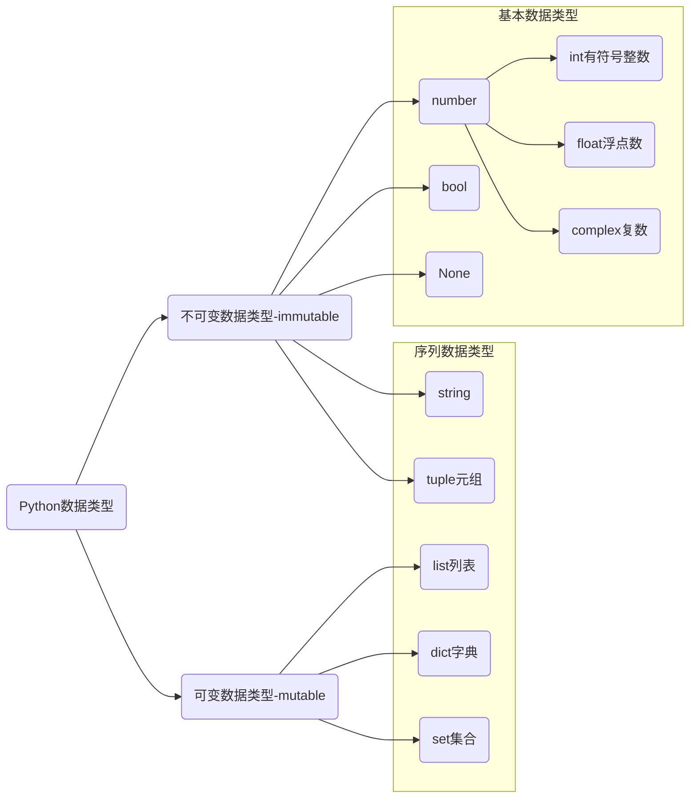

# 数据类型




* complex 复数，主要用于科学计算，例如：平面场问题、波动问题、电感电容等问题。

## 序列数据类型


### 测试序列的长度

`len()` 获得列表中数据的个数。


### 字典

字典是存储键值对的可变容器模型，键必须是可散列对象（不可变数据类型），值可以为任意值。

```python
person = {'name': '龙傲天', 'age': 20, 'is_male': True, 'height': 1.86 }

# 空字典
box = {}
pack = dict()
```


#### 索引

```python
print(person['name'])
```

5. `in` 判断某个元素是否在序列，存储返回True，否则返回False。
6. `not in` 与上面情况相反

```python
print('blue' in colors)
print('blue' not in colors)

color = input('请输入您要搜索的颜色：')

if color in colors:
    print(f'您输入的颜色是{color}, 颜色已经存在')
else:
    print(f'您输入的颜色是{color}, 颜色不存在')
```


### 集合

集合是一个无序的不重复序列。

```python
person = {'龙傲天', 20, True, 1.86}
print(person)

colors = {'red', 'blue', 'yellow', 'purple'}
print(colors)

str = set('abcdefg')
print(str)

s4 = set() # 创建空集合只能使用 set() 
```

> [!warning]
>
> 1. 集合可以去掉重复数据。
> 2. 集合数据是无序的，故不支持下标。