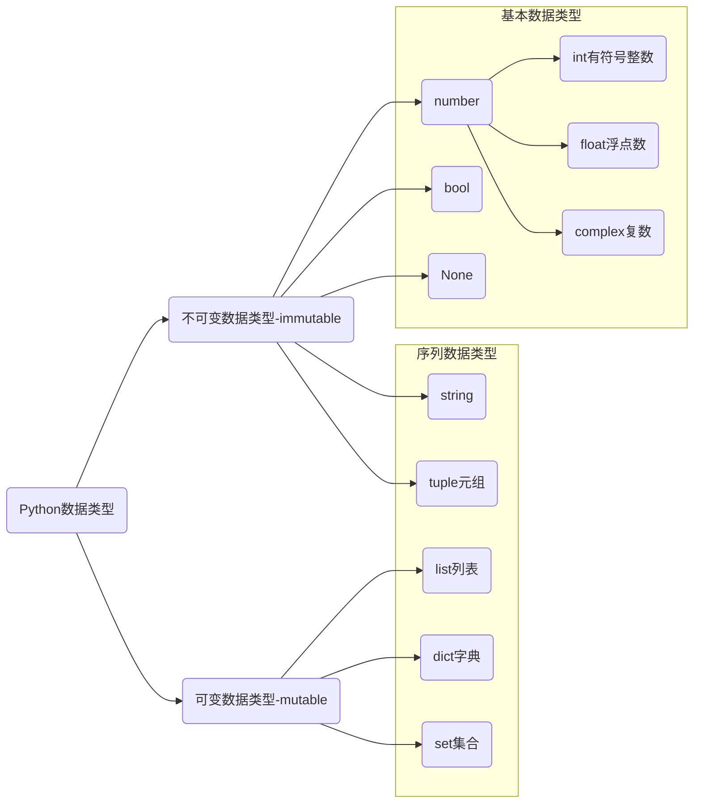

# 数据类型




* complex 复数，主要用于科学计算，例如：平面场问题、波动问题、电感电容等问题。

## 序列数据类型

#### 索引与切片

字符串在内存中连续存储的


**索引：**访问连续数据中某一精确位置的数据。Python 中索引值可以为负数。

```python
name = '北方工业大学'
print(name[0])
print(name[3])
print(name[-3])
print(name[-6])
```

**切片：**截取连续数据其中一部分的操作。

```python
name[begin:end:step]

sub = name[2:5:1]
print(sub)
print(type(sub))
print(name[2:5])  
print(name[:5])  
print(name[1:]) 
print(name[:])  
print(name[::2])  
print(name[:-1])  
print(name[-4:-1])  
print(name[::-1]) # 字符串逆序
```

1. end 不包含结束位置下标对应的数据，遵循计算机计数法。
2. begin 和 end 正负整数均可。
3. 步长是选取间隔，正负整数均可，默认步长为1。负数步长是从右向左计算。
4. 字符串切片后返回的数据类型是字符串。

> [!warning]
>
> 字符串、列表、元组都支持切片操作。

### 列表

列表是一种有序可变容器，每个元素都对应唯一的索引值。同一列表可以保存不同的数据类型。

#### 创建列表

```python
colors = ['red', 'green', 'blue', 'yellow', 'white', 'black']
student = ['龙傲天', 18, True, 1.82]

chars = []

chars = list()
chars = list('北方工业大学')
```


<br/>


#### 索引

```py
print(colors[0])
print(colors[-2])
```

#### 切片

列表的切片与字符串操作类似，生成新的列表。


```python
numbers = [10, 20, 30, 40, 50, 60, 70, 80, 90]

sub = numbers[2:7]
print(sub)
print(numbers[-2:-6:-1])
```

### 元组

元组是一种有序不可变容器，特性与列表类似。

#### 创建元组

```python
webs = ('Google', 'Runoob', 'Wiki', 'Taobao', 'Wiki', 'Weibo','Weixin')
webs = ('Google',) # 单个数据元组，必须加 ',' 否则解释器会把 () 当优先运算符处理。
webs = 'Google', 'Runoob', 'Wiki' # 元组定义的简化写法

print(type(webs))
```


#### 索引

```python
print(webs[0])
print(webs[-2])
```

#### 切片

元组切片操作与列表类似，生成新元组。

```python
sub = webs[0:3]
print(sub)
print(webs[-1:-4:-1])
```

### 字典

字典是存储键值对的可变容器模型，键必须是可散列对象（不可变数据类型），值可以为任意值。

```python
person = {'name': '龙傲天', 'age': 20, 'is_male': True, 'height': 1.86 }

# 空字典
box = {}
pack = dict()
```


#### 索引

```python
print(person['name'])
```

### 集合

集合是一个无序的不重复序列。

```python
person = {'龙傲天', 20, True, 1.86}
print(person)

colors = {'red', 'blue', 'yellow', 'purple'}
print(colors)

str = set('abcdefg')
print(str)

s4 = set() # 创建空集合只能使用 set() 
```

> [!warning]
>
> 1. 集合可以去掉重复数据。
> 2. 集合数据是无序的，故不支持下标。