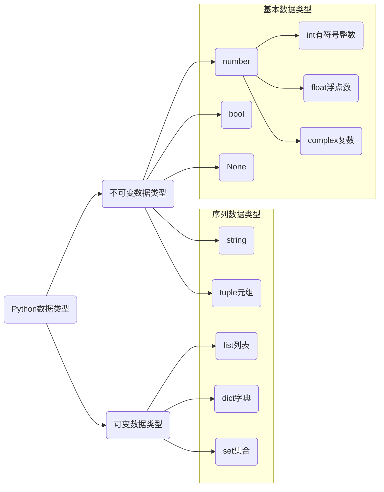

# 数据类型

数据类型决定了数据在程序中存储、读取和运算的方式。



* 在 Python 2.x 中，整数的长度还分为 int/long，Python 3.x 中已取消。
* complex 复数，主要用于科学计算，例如：平面场问题、波动问题、电感电容等问题。
* 在 Python 中定义变量时不需要指定类型，Python 解释器可以自动推导变量类型。
* None 为空数据。

## 基本数据类型

### 数值型

数值类型是可以直接用于数学计算的数据类型。

```python
month = 6
pi = 3.14

type(month)
type(pi)
```

字面量数字特别长可以可以使用 _ 分割开。

```python
total = 1_000_000
type(total)
```

### 布尔值

布尔值是用来表示“真假”的数据类型，只有两个可选值 True 和 False。Python 中布尔值可以看做整形的子类型，直接当做 1 和 0 使用。

```python
is_male = True
type(is_male)
```

>[!warning]
>
>type 函数可以用来检测数据类型。

## 序列数据类型

### 字符串

字符串是用来处理文本的数据类型。

```python
message = 'Hello, Python'
type(message)
```

#### 创建字符串

1. 单引号或双引号

```python
shool = '北方工业大学'
short = "北工大"

sentence = '鲁迅写到："在我的后园，可以看见墙外有两株树，一株是枣树，还有一株也是枣树。"'
```

2. 三个引号字符串，三引号形式的字符串支持换行。

```python
school = '''
北方工业大学
理学院
'''
print(school)

school = """
北方工业大学
理学院
"""
print(school)
```

#### 字符串的格式化

格式化输出是指在打印文字的同时，打印变量中的数据。Python 中常用的格式化字符串操作有三种：

1. 使用 %（格式化操作符）输出格式化字符串。% 和不同的字符连用，可以完成不同类型数据的格式化输出。

| 格式化字符 | 含义                                                         |
| ---------- | ------------------------------------------------------------ |
| %s         | 字符串                                                       |
| %d         | 有符号十进制整数，%06d 表示输出的整数显示位数，不足的地方使用0补全 |
| %f         | 浮点数，%.2f 表示小数点后只显示两位                          |
| %%         | 输出 %                                                       |

```python
name = '龙傲天'
student_id = 1011
height = 1.86

print('你好，我是 %s，请多多关照！' % name)
print('我的学号是 %06d' % student_id)
print('姓名: %s，学号: %d，身高: %.02f 米' % (name, student_id, height))
print('百分比为: %.0f%%' % (0.35 * 100))

student_no = 12345678
print('我的学号是 %06d' % student_no)
```

2. 使用 `str.format` 输出格式化字符串。

```python
print('姓名: {}，学号: {:07d}，身高: {:.03f} 米'.format(name, student_id, height))
print('学生 {0} - 姓名: {0}，学号: {1:07d}，身高: {2:.03f} 米'.format(name, student_id, height))
```

3. f-string 输出格式化字符串（Python3.6新增的格式化⽅方法）。

```python
print(f'姓名: {name}，学号: {student_id:07d}，身高: {height:.03f} 米')
```

#### 转义字符

| 转义字符       | 描述       |
| -------------- | ---------- |
| `\` (在行尾时) | 续行符     |
| `\\`           | 反斜杠符号 |
| `\"`           | 双引号     |
| `\'`           | 单引号     |
| `\n`           | 换行       |
| `\t`           | 横向制表符 |

#### 索引与切片

字符串在内存中连续存储的


**索引：**访问连续数据中某一精确位置的数据。Python 中索引值可以为负数。

```python
name = '北方工业大学'
print(name[0])
print(name[3])
print(name[-3])
print(name[-6])
```

**切片：**截取连续数据其中一部分的操作。

```python
name[begin:end:step]

sub = name[2:5:1]
print(sub)
print(type(sub))
print(name[2:5])  
print(name[:5])  
print(name[1:]) 
print(name[:])  
print(name[::2])  
print(name[:-1])  
print(name[-4:-1])  
print(name[::-1]) # 字符串逆序
```

1. end 不包含结束位置下标对应的数据，遵循计算机计数法。
2. begin 和 end 正负整数均可。
3. 步长是选取间隔，正负整数均可，默认步长为1。负数步长是从右向左计算。
4. 字符串切片后返回的数据类型是字符串。

> [!warning]
>
> 字符串、列表、元组都支持切片操作。

### 列表

列表是一种有序可变容器，每个元素都对应唯一的索引值。同一列表可以保存不同的数据类型。

#### 创建列表

```python
colors = ['red', 'green', 'blue', 'yellow', 'white', 'black']
student = ['龙傲天', 18, True, 1.82]

chars = []

chars = list()
chars = list('北方工业大学')
```


<br/>


#### 索引

```py
print(colors[0])
print(colors[-2])
```

#### 切片

列表的切片与字符串操作类似，生成新的列表。


```python
numbers = [10, 20, 30, 40, 50, 60, 70, 80, 90]

sub = numbers[2:7]
print(sub)
print(numbers[-2:-6:-1])
```

### 元组

元组是一种有序不可变容器，特性与列表类似。

#### 创建元组

```python
webs = ('Google', 'Runoob', 'Wiki', 'Taobao', 'Wiki', 'Weibo','Weixin')
webs = ('Google',) # 单个数据元组，必须加 ',' 否则解释器会把 () 当优先运算符处理。
webs = 'Google', 'Runoob', 'Wiki' # 元组定义的简化写法

print(type(webs))
```


#### 索引

```python
print(webs[0])
print(webs[-2])
```

#### 切片

元组切片操作与列表类似，生成新元组。

```python
sub = webs[0:3]
print(sub)
print(webs[-1:-4:-1])
```

### 字典

字典是存储键值对的可变容器模型，键必须是可散列对象（不可变数据类型），值可以为任意值。

```python
student = {'name': '龙傲天', 'age': 20, 'is_male': True, 'height': 1.86 }

# 空字典
box = {}
pack = dict()
```


#### 索引

```python
print(student['name'])
```

### 集合

集合是一个无序的不重复序列。

```python
student = {'龙傲天', 20, True, 1.86}
print(student)

colors = {'red', 'blue', 'yellow', 'purple'}
print(colors)

str = set('abcdefg')
print(str)

s4 = set() # 创建空集合只能使用 set() 
```

> [!warning]
>
> 1. 集合可以去掉重复数据。
> 2. 集合数据是无序的，故不支持下标。