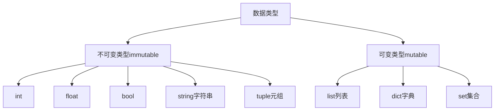

# 参数和返回值

## 函数的参数

### 形参与实参

```python
def greet_user(username):
	print(f'Hello!, {username.title()}')

greet_user('jesse')
```

1. `username`形参：定义函数时用于接收数据的参数。
2. `jesse`实参：调用函数时传入了真实的数据。

### 位置参数

一个函数可以由多个参数，函数调用时按顺序关联形参和实参。

```python
def describe_pet(animal_type, pet_name):
    print(f"I have a {animal_type}.")
    print(f"My {animal_type}'s name is {pet_name.title()}.")
    
describe_pet('dog', 'harry')
```

### 关键字参数

通过键值对形式指定实参，调用时将名称和值会关联起来，可以忽略参数顺序。

```python
describe_pet(animal_type='dog', pet_name='harry')
describe_pet(pet_name='harry', animal_type='dog')
```

> [!warning]
>
> 关键字参数是函数调用时，传递参数的一种方式。
>
> 位置参数和关键字参数可以一起使用，位置参数一定在关键字参数之前，且实参个数必须与形参一致。

```python
describe_pet('dog', pet_name='harry')
```

强制使用关键字参数。

```python
def describe_pet(animal_type, *, pet_name):
    print(f"I have a {animal_type}.")
    print(f"My {animal_type}'s name is {pet_name.title()}.")

describe_pet('dog', pet_name='harry')
describe_pet(pet_name='harry', animal_type='dog')
describe_pet('dog', 'harry') # 调用时会报错
```

### 不定长参数

不定长参数（可变参数），传入的参数可以个数和值可以任意变化。

#### 元组形式

```python
def print_args(*args):
    print(type(args))
    print(args)

print_args(1, [1, 2], 'red')
print_args([1, 2])
```

1. 在形参前加星号 `*args` ，获取参数时去掉星号。
2. 获取到的参数类型是元组。

#### 字典形式

```python
def print_args(**kwargs):
    print(type(kwargs))
    print(kwargs)

print_args(name='Bob', age=25, job='dev')
```

1. 在形参前加两个星号 `*args` ，获取参数时去掉星号。
2. 获取到的参数类型是字典。

### 参数默认值

在函数定义时，可以为参数指定默认值，调用是可以有默认值的参数形参可以不传。

```python
def describe_pet(pet_name, animal_type='dog'):
    print(f"I have a {animal_type}.")
    print(f"My {animal_type}'s name is {pet_name.title()}.")
    
describe_pet('harry')
describe_pet('tom', 'cat')
```

> [!warning]
>
> 函数定义的规则：
>
> 1. 定义函数时函数的参数顺序从左到右为：位置参数、元组参数和字典参数。
>
> 2. 如果有默认参数，要写在不定长参数之前，位置参数最右侧。

```python
def all_args(first, second='yellow', *args, **kwargs):
    print(f'first: {first}')
    print(f'second: {second}')
    print(f'args: {args}')
    print(f'kwargs: {kwargs}')

all_args('red', a=1, b=2, c=3)
all_args('red', 'blue', 'white', 'pink', a=1, b=2, c=3)
```

## 函数的返回值

Python 中可以同时返回多个值

```python
def circle(r):
    pi = 3.14
    length = 2 * pi * r
    area = pi * r ** 2
    return length, area

length, area = circle(5)

print(length)
print(area)
```

1. `return length, area` 默认返回的是元组类型。
2. `return` 后面也可以用列表或字典，返回多个值。

> [!warning]
>
> 尽量只返回一种类型数据。

### 卫语句

使用卫语句来优化函数中的条件判断。

```python
def score2level(score):
    if score >= 90:
        return 'A'
    elif score >= 80:
        return 'B'
    elif score >= '70':
        return 'C'
    else:
        return 'D'

level = score2level(95)
```

1. 
2. `return` 可以将函数体中的执行结果传返回到函数调用的位置。

> [!warning]
>
> 函数返回后，后续的程序不会再执行。

## 引用传参

### 在函数中修改列表

Python 函数的参数默认值只会在函数定义阶段被创建一次，之后使用是同一对象。

```python
def append_value(value, items=[]):
    items.append(value)
    return items


first = append_value('foo')
print(first)
second = append_value('bar')
print(second)
```

两次调用返回同一函数。

```python
print(append_value.__defaults__[0]) # 读取参数的默认值
```

如果希望使用可变默认参数，通常使用 `None`

```python
def append_value(value, items=None):
    if items is None:
        items = []
    items.append(value)
    return items
```

### 引用传参的原理

Python 中变量是一个指针，用于指向数据的内存地址，而所有的数据在 Python 中都是对象。



使用 `id()` 函数可以查看变量的内存地址。

1. 不可变变量，相同的值有唯一的存储地址。可变变量初始化相同的值，会指向不同的内存。

```python
# 不可变类型
a = 1
b = 2
c = 1

print(id(a))
print(id(b))
print(id(c))

a = 'hello, world'
b = 'hello, world!'
c = 'hello, world'

print(id(a))
print(id(b))
print(id(c))

a = 1, 2
b = 1, 1
c = 1, 2

print(id(a))
print(id(b))
print(id(c))

# 可变类型
a = [1, 2]
b = [1, 1]
c = [1, 2]

print(id(a))
print(id(b))
print(id(c))

print(id(a[0]) == id(b[0])) # 数组里相同的不可变类型指向相同的地址
```

2. 不可变变量改变值时会指向新的地址。可变类型改变变量的值不会指向新的地址。

```python
# 1. 不可变类型
a = 1
b = a

print(f'a={a}, b={b}')
print(f'a_id={id(a)}, b_id={id(b)}')

a = 2
print(f'a={a}, b={b}')
print(f'a_id={id(a)}, b_id={id(b)}')

# 2. 可变类型
aa = [10, 20]
bb = aa

print(f'a={aa}, b={bb}')
print(f'a_id={id(aa)}, b_id={id(bb)}')

aa.append(30)
print(f'a={aa}, b={bb}')
print(f'a_id={id(aa)}, b_id={id(bb)}')
```

### 函数参数

```python
def self_add(a):
    print(f'a={a}, a_id={id(a)}')
    a += a
    print(f'a={a}, a_id={id(a)}')

# 1. 不可变类型
b = 100
self_add(b)

# 2. 可变类型
c = [11, 22]
self_add(c)
print(f'c={c}, a_id={id(c)}')
```


