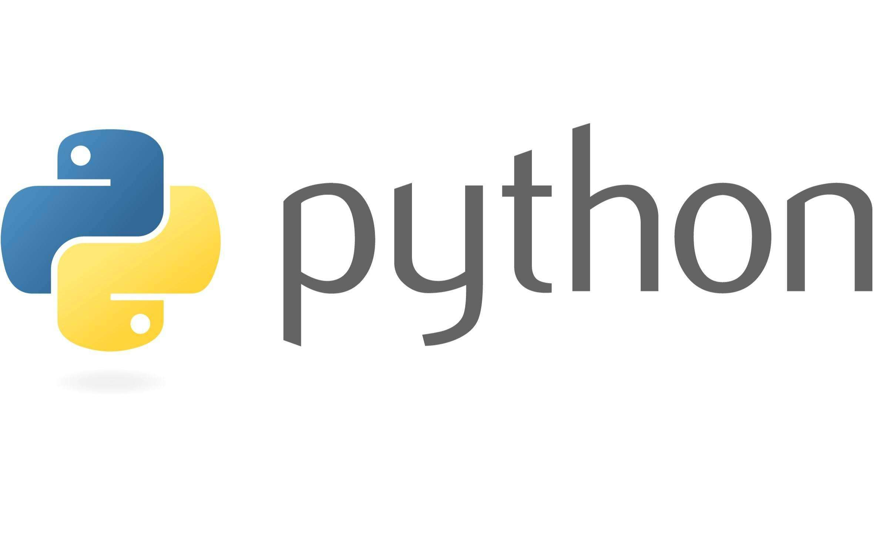
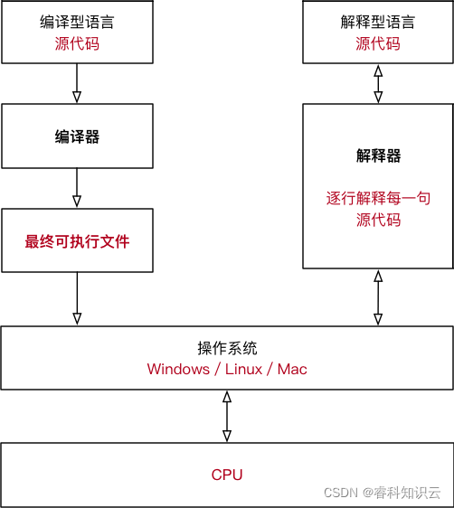
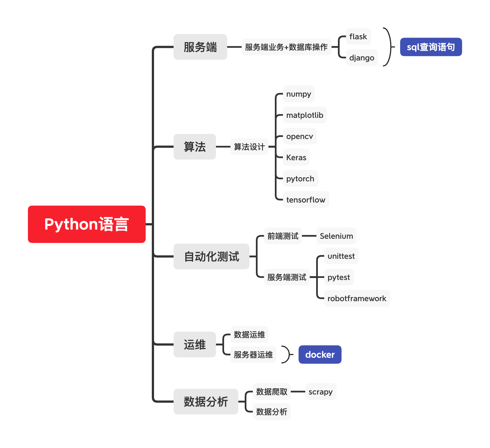

# 认识Python

> 人生苦短，我用 Python —— Life is short, you need Python

Python（蟒蛇）

## Python 的起源

Python之父——吉多·范罗苏姆（Guido van Rossum）

1991年，在荷兰阿姆斯特丹，开发出一个新的解释程序Python。第一个 Python 解释器用 C 语言实现的，并能够调用 C 语言的库文件。

### 编译语言与解释语言

计算机硬件只能执行二进制指令，程序员所写的程序需要转换成二进制指令计算机才能执行。

将其程序转换为二进制指令的工具，被称为编译器。编译器执行的方式有两种：一个是编译，另外一个是解释。

* 编译型语言：程序在执行之前经过编译，转换为可执行文件，运行时直接执行。程序可以直接执行，运行效率高，依赖编环境，跨平台性差些。如 C、C++。
* 解释型语言：程序不进行编译，以文本方式存储，代码会由解释器一行行执行。程序执行时需要依赖于解释器程序。

编译型语言和解释型语言对比

* 编译型语言执行速度快更快。
* 解释型语言开发效率更高跨平台性好。

**Python是一门解释性语言**，Python官方解释器是由C语言实现，同时也包含其它语言的解释器。

## Python 特点

**优点**

* 简单直观且代码量少，代码像纯英语那样容易理解。

* 可以用于短期开发的日常任务，也可以用于项目开发。

* Python是完全面向对象的语言。

  * 在Python中一切皆对象。
  
  
    * 完全支持继承、重载、多重继承。
  
  
    * 支持重载运算符，也支持泛型设计。
  

* Python拥有强大的标准库，标准库提供了系统管理、网络通信、文本处理、数据库接口、图形系统、XML 处理 等额外的功能。

* 开源免费，Python 社区提供了大量的第三方模块覆盖：科学计算**、**人工智能**、**机器学习**、**Web 开发**、**数据库接口**、**图形系统多个领域。

* 可扩展性（胶水语言）Python可以调用其它语言的函数如：C/C++

**缺点**

* 运行速度慢

## 为什么选择 Python

1. 简单易学、免费、开源、有大量的可供使用的第三方模块。
2. [TIOBE Index](https://www.tiobe.com/tiobe-index/) 计算机语言流行度标准，排名靠前。
3. 深度学习、数据分析等工作利器。
4. 对于数学专业可以完全代替 Matlab 工具。

