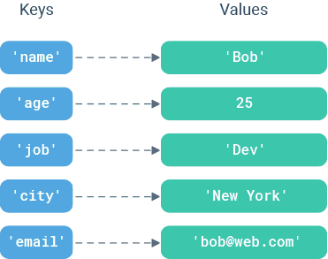

# 字典与集合

## 字典

字典是一系列键值对，每个键都与一个值关联，可以使用键来访问与之关联的值。键必须是可散列对象（不可变数据类型），值可以为任意Python数据类型。

```python
person = {
  'name': 'Bob', 
  'age': 25, 
  'job': 'Dev', 
  'city': 'New York', 
  'email': 'bob@web.com' 
}

# 空字典
empty = {}
pack = dict()

# 字典的布尔测试: 空字典为False，其它为True
print(bool(person))
print(bool(empty))
```



### 访问字典的值

字典的索引是通过key值操作的

```python
print(person['name'])
print(person['is_male']) # 获取值报错
```

可以通过`get(key, default)`获取键对于不存的值为`default`

```python
print(person.get('job', 'Manager'))
print(person.get('is_male', True))
```

### 添加

字典是可变数据类型可以动态添加键值对。

```python
person['is_male'] = True
print(person)
```

### 修改

通过已存在的索引修改数据

```python
person['job'] = 'Manager'
print(person)
```

### 删除

1. `del`删除键值对

```python
del person['age']
print(person)
```

2. `clear()`清空字典

```python
person.clear()
```

### 成员运算

成员运算符可以用于判断key是否存在字典中，存在返回`True`，不存在返回`False`

```python
print('name' in person)
print('name' not in person)
```

### 字典的遍历

1. `keys()`返回一个所有键组成的可迭代对象。

```python
print(student.keys()) # 可迭代对象类似于数组
for key in student.keys():
    print(student[key])
```

2. `value()`返回一个所有值组成的可迭代对象。

```python
print(student.values())
for value in student.values():
    print(value)
```

3. `items()`返回一个键值对组成的可迭代对象，每个键值对是一个元组。

```python
print(student.items())
for item in student.items():
    print(f'{item[0]} = {item[1]}')
```

### 字典推导式

字典也可以使用推导式生成。

```python
# 生成字典
dict1 = {i: i**2 for i in range(1, 5)}

# 组合字典，注意数组对齐
keys = ['name', 'age', 'is_male']
values = ['Tom', 20, True]

persons = {keys[i]: values[i] for i in range(len(keys))}
print(persons)

# 字典中提取
stocks = {'apple': 268, 'google': 218, 'twitter': 122, 'facebook': 153, 'tesla': 230}
better = {key: value for key, value in stocks.items() if value >= 200}
print(better) 
```

### 字典的其它用法

使用字典来代替分支判断

```python
choice = int(input('请输需要选择的功能序号: '))

if choice == 0:
  print('退出系统')
elif choice == 1:
  print('添加用户')
elif choice == 2:
  print('删除用户')
    
choice_map = {
  0: '退出系统',
  1: '添加用户',
  2: '删除用户',
}
print(choice_map[choice])
```

> [!warning]
>
> 字典的拆包只能获得键，无法获得对应的值。
>
> ```python
> name, age, job, city, email = person
> print(name)
> ```

## 集合

集合是一个无序的不重复序列，值可以是任意的Python数据类型。

```python
colors = {'red', 'blue', 'yellow', 'purple'}
print(colors)

str = set('hello, python!')
print(str)

empty = set() # 创建空集合只能使用 set() 

# 集合的布尔测试: 空集合为False，其它为True
print(bool(colors))
print(bool(empty))
```

集合是一个无序的不重复序列，可以用于去重操作。集合没有单独读取的操作。

### 添加

1. `add()` 向集合内追加数据，如果集合中存在该数据，则不进行任何操作。集合中数据排序与添加顺序无关。

```python
colors = {'red', 'blue', 'yellow', 'purple'}
colors.add('white')
print(colors)
colors.add('red')
print(colors)
```

2. `update()` 向集合中追加序列。

```python
colors.update(['gray', 'pink'])
colors.update('black')
colors.update(10)
```

### 删除

1. `remove(obj)` 删除集合中的`obj`，如果`obj`不存在则报错。
2. `discard(obj)` 功能与`remove`相同，不存在**不会报错**。

```python
colors = {'red', 'blue', 'yellow', 'purple', 'gray', 'pink'}
colors.remove('gray')
print(colors)
colors.remove('gray')

colors.discard('yellow')
print(colors)
colors.discard('yellow')
```

3. `pop()` 随机删除集合中的某个数据，并返回这个数据。

```python
color = colors.pop()
print(colors)
print(color)
```

4. `clear()` 清空集合。

```python
colors.clear()
```

### 判断

```python
colors = {'red', 'blue', 'yellow', 'purple', 'gray', 'pink'}

print('red' in colors)
print('red' not in colors)
```

### 集合推导式

集合推导式可以去重生成数据。

```python
nums = [1, 1, 2]
powers = {i ** 2 for i in nums}
print(powers) 
```

## 序列类型的转换

| 函数       | 说明                    |
| ---------- | ----------------------- |
| `set(x)`   | 将 x 转换为一个集合     |
| `list(x)`  | 将 x 转换到一个列表。   |
| `tuple(x)` | 将 x 转换到一个元组。   |
| `str(x)`   | 将 x 转换到一个字符串。 |

```python
numbers = [10, 20, 30, 40, 50, 60, 70, 80, 90]
sites = ('Google', 'Runoob', 'Wiki', 'Taobao', 'Wiki', 'Weibo', 'Weixin')
message = 'hello, python'

numbers_t = tuple(numbers)
print(numbers_t)
print(type(numbers_t))

sites_l = list(sites)
print(sites_l)
print(type(sites_l))

message_l = list(message)
print(message_l)
print(type(message_l))

# 等价于 numbers_s = '[10, 20, 30, 40, 50, 60, 70, 80, 90]'
numbers_s = str(numbers) 
print(numbers_s)
print(type(numbers_s))

sites_set = set(sites) # 可以对数据进行去重
message_set = set(message)
```

## 查阅参考手册

[Python中文手册](https://docs.python.org/zh-cn/3.9/)


