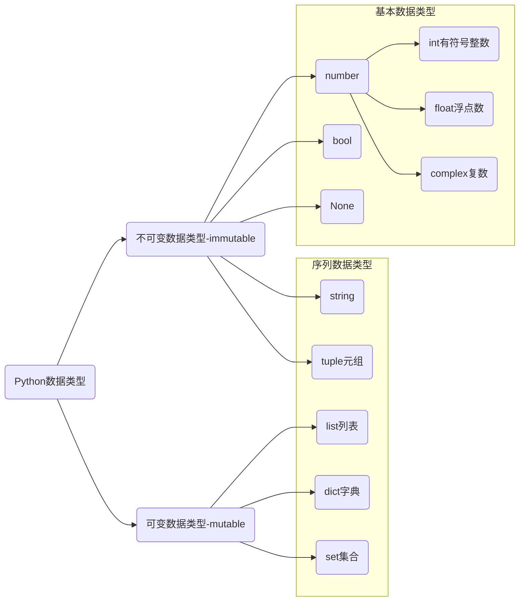

# 数据类型与语句

## Python中的数据类型

* complex 复数，主要用于科学计算，例如：平面场问题、波动问题、电感电容等问题。

Python 中内置了一些可同时存储多个数据的类型，这些类型统称为序列类型。

* 序列提供了一系列特有的操作方法。
* 序列类型分为可变序列和不可变序列。
* 序列类型是 Python 内置的数据类型和传统意义上的数据结构，堆、栈、链表等不同。

# 程序的三大流程

* 顺序 —— 从上向下，顺序执行代码。
* 分支 —— 根据条件判断，决定执行代码的分支。
* 循环 —— 让特定代码重复执行。

