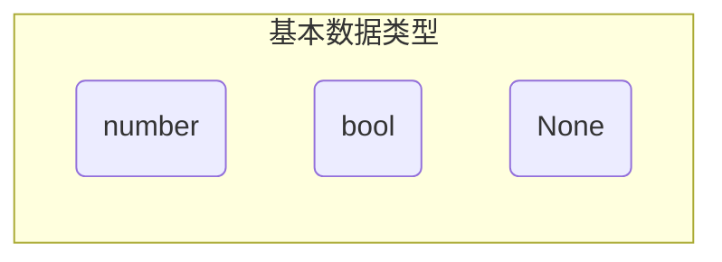
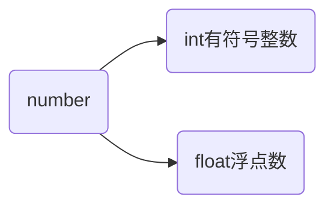

# 最简单的数据类型

数据类型决定了数据在程序中存储、读取和运算的方式。

```pyhon
pi = 3.14
print('Hello, Python!')
```

在Python中定义变量时不需要指定类型，Python解释器可以自动推导变量类型。

Python中最简单的数据类型，也称基本数据类型。



## 数值

数值类型是可以直接用于数学计算的数据类型。

定义数值型变量

```python
month = 6
pi = 3.14
type(month)
type(pi)
```

Python中的数值变量分为两类



> [!attention]
>
> 在Python 2.x中，整数的长度还分为`int/long`，Python 3.x中已取消。

**数字中的下划线**：字面量数字特别长可以可以使用`_`分割开。这种表示方法即适用于整数，也适用于浮点数。

```python
universe_age = 14_000_000_000
print(universe_age)
```

### 数值的运算

Python支持的常见数学运算如下

| 运算符 |  描述  | 实例                                       |
| :----: | :----: | ------------------------------------------ |
|  `+`   |   加   | 3 + 2 = 5                                  |
|  `-`   |   减   | 2 - 3 = -1                                 |
|  `*`   |   乘   | 3 * 2 = 6                                  |
|  `/`   |   除   | 3 / 2 = 0.5                                |
|  `//`  | 取整除 | 返回除法的整数部分（商） 3 // 2 输出结果 1 |
|  `%`   | 取余数 | 返回除法的余数 9 % 2 = 1                   |
|  `**`  |   幂   | 3 ** 2 = 9                                 |

#### 整数运算

```python
a = 3
b = 2
print(a + b)
print(b - a)
print(a * b)
print(a / b)
print(a // b)
print(a % b)
print(b ** 1000) # 其他语言计算会非常复杂
```

#### **浮点运算**

```python
a = 0.1
b = 0.2
print(a + b)
print(a * b)
print(a - b)
print(a / b)
```

> [!attention]
>
> `a+b`得到的计算结果为：0.30000000000000004。
>
> 计算机在模拟小数时做不到绝对的精准，所有编程语言都存在这种问题。

如果需要绝对的精确计算可以使用Python的`decimal`模块。

```python
from decimal import Decimal
print(Decimal('0.1') + Decimal('0.2')) # 注意 '0.1' 和 '0.2' 必须是字符串
```

`**`在浮点运算中可以当开方使用

```python
a = 2
print(2 ** 0.5)
```

#### **算数运算的优先级**

Python 中进行数学计算时，运算符的优先级和数学计算规范一致：

* 先乘除后加减
* 同级运算符是从左至右计算
* 可以使用`()`调整计算的优先级

算数运算的优先级排序

| 运算符     | 描述                   |
| ---------- | ---------------------- |
| `**`       | 幂 (最高优先级)        |
| `* / % //` | 乘、除、取余数、取整除 |
| `+ -`      | 加法、减法             |

```python
a = 2
b = 3
c = 5
print(a + b * c)
print((a + b) * c)
print(a ** a + c)
print(a ** (a + c))
```


## 布尔值

## `None`类型
