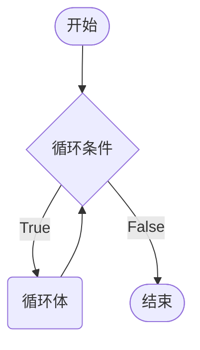
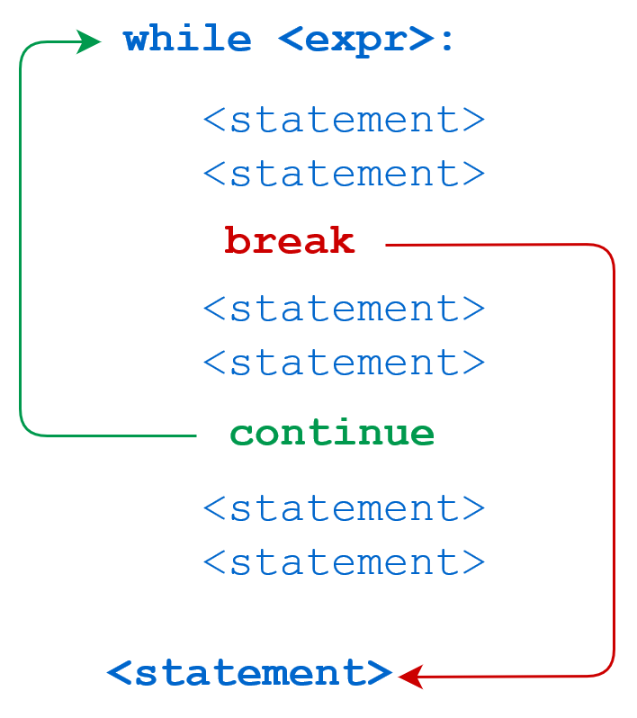
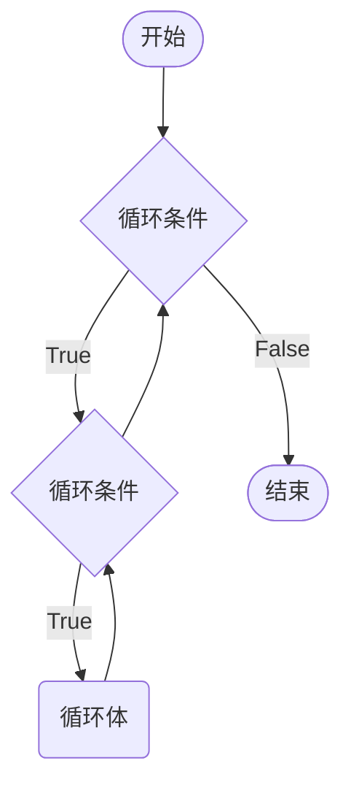
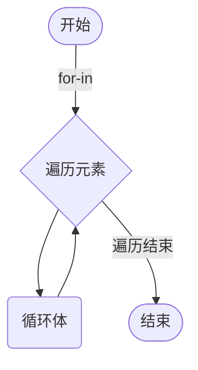

# 循环控制

循环就是让指定的代码块不断的运行，直到指定的条件不再满足为止。Python支持循环操作的关键是`while`和`for`。

## while 循环

```python
current_number = 0
while current_number < 5:
    print(current_number)
    current_number += 1
print(f'退出循环后: {current_number}')
```



`while`及循环语句通常被视为同一代码块。循环结束后，计数器依旧保留循环语句中最后一次执行的值。

如果忘记对`current_number`进行增加，程序会陷入死循环。

```python
current_number = 0
while current_number < 5:
    print(current_number)
print(f'退出循环后: {current_number}')
```

### 循环的应用

1. 利用循环进行统计计算，是循环的一个重要应用。

> [!tip]
>
> 计算 0 ~ 100 之间所有偶数和。

```python
even_sum = 0

i = 0
while i <= 100:
    if i % 2 == 0:
        even_sum += i
    i += 1 # i+=2 可以控制增量为2改写代码
print(f"0~100之间偶数和为{even_sum}")
```

> [!warning]
>
> 程序中的索引通常是从0开始计数，循环计数一般也从0开始。

2. 控制程序退出

```python
message = ''
while message != 'quit':
    message = input('请输入信息：')
    print(message)
```

3. 变量序列数据

**计算序列的长度**

Python中可以使用`len`来计算序列的长度包括：列表、元组和字符串等。

```python
sites = ['Google', 'Wiki', 'Weibo', 'Runoob', 'Baidu', 'Taobao']
colors = ('red', 'blue', 'yellow')
message = 'hello, python'

print(len(sites))
print(len(colors))
print(len(message))
```

`while`循环可以结合序列的长度类变量序列数据类型。

```python
sites = ['Google', 'Wiki', 'Weibo', 'Runoob', 'Baidu', 'Taobao']
i = 0
while i < len(sites):
    print(sites[i])
    i += 1
```

###  跳过循环

`break`和`continue`是专门在循环中使用的关键字：

* `break`跳出当前循环。
* `continue`从`continue`位置返回代码开头，跳过后续代码。




```python
sites = ['Google', 'Wiki', 'Weibo', 'Runoob', 'Baidu', 'Taobao']
i = 0
while i < len(sites):
    site = sites[i]
    if len(site) == 4:
        i += 1
        continue

    if site == 'Runoob':
        break

    print(site)
    i += 1
```

> [!warning]
>
> `break`和`continue`只针对当前所在循环有效。

### 循环嵌套

循环嵌套，就是一个循环中嵌套另一个循环。



> [!tip]
>
> [打印九九乘法表](https://jennifercodingworld.files.wordpress.com/2016/06/e4b998e6b395e8a1a8.jpeg)

```python
j = 1
while j <= 9:
    i = 1
    while i <= j:
        print(f'{i}*{j}={j*i}', end='\t')
        i += 1
    print()
    j += 1
```

## for 循环

Python中的`for`循环可以遍历任何可**迭代对象**，如：字符串、列表、元组等。




```python
sites = ['Google', 'Wiki', 'Weibo', 'Runoob', 'Baidu', 'Taobao']
for site in sites:
    print(site)

colors = ('red', 'blue', 'yellow')
for color in colors:
    print(color)

message = 'hello, python'
for char in message:
    print(char)
```

`break`和`continue`在`for`循环中页可以使用

```python
sites = ['Google', 'Wiki', 'Weibo', 'Runoob', 'Baidu', 'Taobao']
for site in sites:
    if len(site) == 4:
        continue

    if site == 'Runoob':
        break

    print(site)
```

### range 函数

`range()` 函数返回的是一个可迭代对象

```python
range(stop)
range(start, stop[, step])
```

* start: 计数从 start 开始。默认是从 0 开始。
* stop: 计数到 stop 结束，但不包括 stop。
* step：步长，默认为 1。

```py
for i in range(10):
    print(i * 2)
    
for i in range(0, 10, 2):
    print(i * 2)
```

## 循环和 else

for 和 while 可以和 else 配合使⽤用，else 代码表示当循环正常结束之后要执⾏的代码。

```python
# case break
aim = 20
aim_total = 100
i = total = 0
while i <= aim:
    if total >= aim_total:
        print(f'当 i == {i} 时，和为 {total} > {aim_total} ')
        break
    total += i
    i += 1
else:
    print(f'从 0 开始到 {aim} 到和为 {total} < {aim_total}')
    

# case continue
i = total = 0
aim = 100
while i < aim:
    if i % 2 != 0:
        i += 1
        continue
    total += i
    i += 1
else:
    print(f'从 0 开始到 {aim} 到偶数和为 {total}')
```

> [!warning]
>
> 只有执行 break 语句才表示循环异常退出。

```python
goods = [('安慕希', 1, 69.9), ('乐事薯片', 1, 7.9), ('格瓦斯', 1, 8)]
coupon = 100
total = 0
for item in goods:
    total += item[1] * item[2]
    if total > coupon:
        print('代金券金额不够')
        break
else:
    print(f'代金券剩余{coupon - total}')
```


