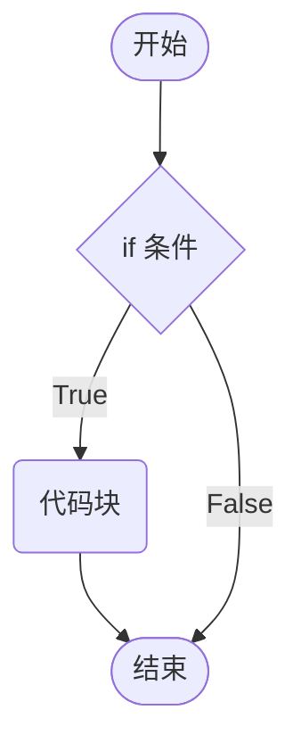
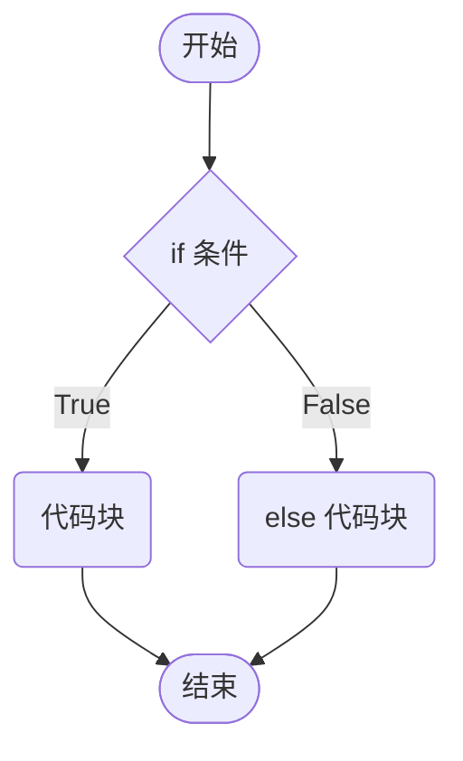
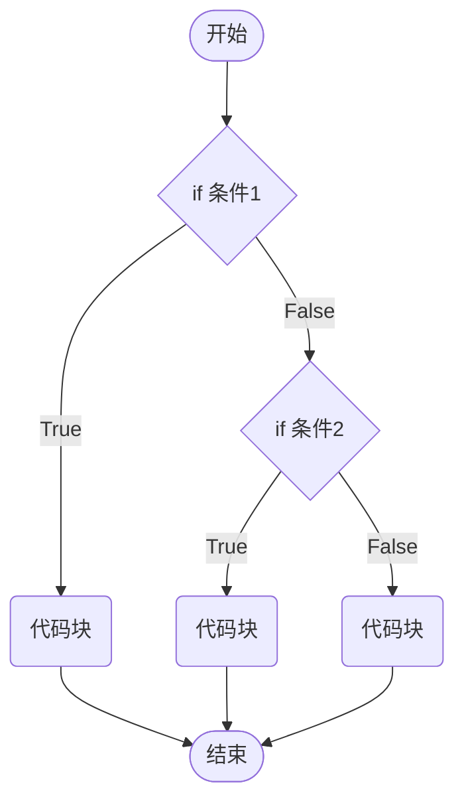

# 条件控制

> 有所为而有所不为。

## 条件语句

根据条件做出判断，并以一定的策略来应对，这是生活中极为常见的场景。

计算机中已条件语句来模拟上述的生活场景，**条件的定义**：

* 如果满足条件，才能做某件事情，
* 如果不满足条件，就做另外一件事情，或者什么也不做。

> 条件语句又被称为”分支语句“，正是条件语句，才让程序有了无穷的变化。

### if 语句

Python 中使用 `if` 语句，来实现条件的控制。

```python
if condition:
    statement_block

following_block
```

代码执行过程


```python
is_member = True
if is_member:
    print('您可以跳过片头广告')
    
print('安慕希赞助的奔跑吧.....')
```




>[!warning]
>
>1. Python 解释器会对 if 后面的表达式进行真值测试，即调用 bool 函数来获取表达式的布尔值。
>
>2. Python 中的代码块与其他语言中使用 {} 表示代码块不同，Python 中使用缩进来表示代码块。

```python
cart = ['安慕希一箱', '袜子两双']
if cart:  # 这里隐式调用了 bool(cart)
    print(f'您共购买{cart}，共消费......')
```

### else 语句

Python 中使用 `else` 语句，来实现不满足条件的操作。

```python
if condition:
    statement_block_1
else:
    statement_block_2
  
following_block
```




```python
is_member = False
if is_member:
    print('您可以跳过片头广告')
else:
    print('请您观看45秒广告.....')
    
print('安慕希赞助的奔跑吧.....')
```

### elif 语句

Python 中使用 `elif` 语句，来实现多种条件的操作。

```python
if condition_1:
    statement_block_1
elif condition_2:
    statement_block_2
else:
    statement_block_3
    
following_block
```



```python
member_level = 2

if member_level == 1:
    print('您可以跳过片头广告')
elif member_level == 2:
    print('您可以提前收看大结局')
else:
    print('请您观看45秒广告.....')

print('正片开始......')
```

> [!warning]
>
> 1. `else` 语句和 `elif` 不能单独使用，必须与 `if` 语句一起使用。
> 2. `if`、`elif` 和 `else` 组合在一起使用时，通常被看做一个代码块。
> 3. Python 中没有 `switch/case` 语句用于分支判断。

区间判断

```python
score = 90

if score >= 90:
    print('成绩优秀')
elif score >= 80: # 这里隐含了 score < 90 and score >= 80 的判断条件
    print('成绩良好')
elif score >= 60:
    print('成绩及格')
else:
    print('成绩不及格')
```

### pass 语句

Python 中 pass 不做任何事情，一般用做占位语句。

```python
member_level = 2

if member_level == 1:
    print('您可以跳过片头广告')
elif member_level == 2:
    pass
else:
    pass
```

### 三元表达式

三元表达式可以是一种简化版的条件语句

```python
is_member = False
member_hint = '您可以跳过片头广告'
not_member_hint = '请您观看45秒广告.....'

#      为真时的结果  if 判定条件   else 为假时的结果
play = member_hint if is_member else not_member_hint
print(play)
```

### 条件语句与逻辑运算

1. 与运算

```python
day_number = 3
if day_number >= 1 and day_number <= 5:
    print('今天是工作日')
else:
    print('今天是休息日')
```

2. 或运算

```python
day_number = 6
if day_number == 6 or day_number == 0:
    print('今天是休息日')
else:
    print('今天是工作日')
```

3. 非运算

```python
is_member = False
if not is_member:
    print('请您观看45秒广告.....')
```

> [!warning]
>
> 逻辑运算的返回值并不一定是 bool 值，但是由于逻辑运算经常与 if 语句搭配使用，程序员常常会误以为逻辑运算的结果是布尔值

```python
cart = ['安慕希一箱', '袜子两双']
day_number = 3
if cart and day_number: # 这里隐式调用 bool(cart and day_numbers)
    print(f'您共购买{cart}，不是周日就打折！')
```

## if 嵌套

在局部代码块中可嵌套 if 代码块。

```python
is_login = True
is_member = True
if is_login:
    if is_member:
        print('您可以跳过片头广告')
    else:
        print('请您观看45秒广告.....')
else:
    print('观看视频前请先登陆')
```

## 使用条件语句的注意事项

1. 省略零值判断，充分利用 `if` 语句后面真值测试的特性，简化条件表达式。

```python
day_number = 0
if day_number == 0:
    print('今天是星期日')
    
if not day_number:  
    print('今天是星期日')
    
cart = ['安慕希一箱', '袜子两双']
if cart != []:
    print(f'您共购买{cart}，共消费......')
    
if cart:
    print(f'您共购买{cart}，共消费......')
```

2. 使用字典优化分支代码

```python
day_number = 0
if day_number == 0:
    print('全家桶半价')
elif day_number == 1:
    print('麦辣鸡腿堡半价')
elif day_number == 2:
    print('麻辣鸡翅半价')
elif day_number == 3:
    print('草莓圣代第二份半价')
elif day_number == 4:
    print('可乐薯条免费增大')
elif day_number == 5:
    print('巨无霸半价')
elif day_number == 6:
    print('今日无优惠')
    
sale_map = {
    0: '全家桶半价',
    1: '麦辣鸡腿堡半价',
    2: '麻辣鸡翅半价',
    3: '草莓圣代第二份半价',
    4: '可乐薯条免费增大',
    5: '巨无霸半价',
    6: '今日无优惠'
}
day_number = 0
print(sale_map[0])
```

3. 尽量避免分支嵌套。当代码有多层分支嵌套后，可读性和可维护性就会直线下降，所以需要避免分支嵌套。常用的方法是使用**卫语句**来避免分支嵌套。
4. 当条件表达式过于复杂时，需要对表达式进行简化：
   * 摩根定律 not A or not B ==> not ( A and B)
   * 将表达式封装层函数。
5. 注意 and 和 or 的运算优先级，and 运算优先级高于 or。

```python
(True or False) and False # False
True or False and False # True
```

## 练习

**随机数的处理**

在 Python 中，要使用随机数，首先需要导入随机数的模块。

```python
import random # 首先需要导入随机数的模块工具包

c = random.randint(12, 20)  # 生成的随机数 12 <= n <= 20  
random.randint(20, 20)  # 结果永远是 20   
random.randint(20, 10)  # 该语句是错误的，下限必须小于上限
```

> [!tip]
>
> 1. 从控制台输入 —— 石头（1）／剪刀（2）／布（3）。
> 2. 电脑随机出拳，比较胜负。

```python
import random

# 从控制台输入要出的拳 —— 石头（1）／剪刀（2）／布（3）
player = int(input("请出拳 石头（1）／剪刀（2）／布（3）："))
computer = random.randint(1, 3)

print('=' * 50)
print('player: %d, computer: %d' % (player, computer))
print('=' * 50)
if ((player == 1 and computer == 2) or
    (player == 2 and computer == 3) or
    (player == 3 and computer == 1)):
    print("玩家获胜！！")
elif player == computer:
    print("平局！！！")
else:
    print("电脑获胜！！")
```

