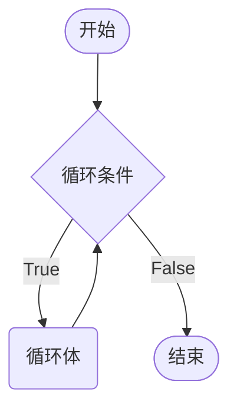
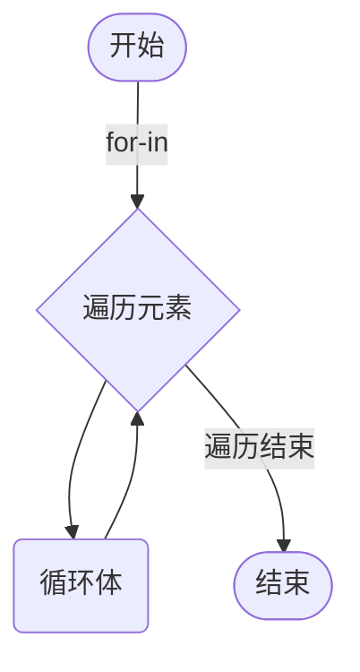
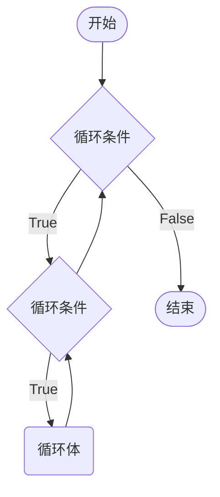

# 循环控制

> 日复一日，圈复一圈

循环的作用就是让指定的代码块，重复执行一定的次数。Python 中循环语法有两个形式：

* while 循环：在满足某个条件时保持循环，当条件不满足时循环停止。
* for ... in ... 循环：用于遍历某个可迭代对象（如：字符串、列表、元组等）

## while 循环

```python
while condition: # 条件为 Ture 执行循环，条件为 False 退出循环
    statement_block

following_block
```



```python
i = 1 # 计数器
while i <= 5:
    print(f"Hello, Python {i}")
    i += 1
print(f"循环结束后的 i = {i}")
```

> [!warning]
>
> 1. while 及循环语句通常被视为同一代码块。
> 2. 循环结束后，计数器依旧保留循环语句中最后一次执行的值。

### 循环计算

**程序中的计数原则：**程序计数法通常是从 0 开始计数。在编写程序时，应该尽量养成习，循环计数从 0 开始。

利用循环进行统计计算，是循环在程序开发中的一个重要应用。

> [!tip]
>
> 计算 0 ~ 100 之间所有偶数和。

```python
even_sum = 0

i = 0
while i <= 100:
    if i % 2 == 0:
        even_sum += i
    i += 1 # i+=2 可以控制增量为2改写代码
print(f"0~100之间偶数和为{even_sum}")
```

> [!attention]
>
> **死循环**：忘记在循环内部修改循环的判断条件，导致循环持续执行，程序无法终止。

##  break 和 continue 

break 和 continue 是专门在循环中使用的关键字：

* break 某一条件满足时，退出循环，不再执行后续重复的代码。
* continue 某一条件满足时，不执行后续重复的代码。


### break

在循环过程中，如果 某一个条件满足后，不再希望循环继续执行，可以使用 break 退出循环。

```python
aim = 20
aim_total = 100
i = total = 0
while i <= aim:
    if total >= aim_total:
        print(f'当 i == {i} 时，和为 {total} > {aim_total} ')
        break
    total += i
    i += 1
```

### continue

在循环过程中，如果某一个条件满足后，不希望执行循环代码，但是又不希望退出循环，可以使用 `continue`。

```python
i = 0
aim = 10
while i < aim:
    if i % 2 != 0:
        i += 1
        continue
    print(f'{i}')
    i += 1
```

> [!warning]
>
> break 和 continue 只针对当前所在循环有效。

## for 循环

Python for 循环可以遍历任何可迭代对象，如：字符串、列表、元组等。

```python
for <variable> in <sequence>:
    statement_block
```



### 字符串遍历

```python
school = '北方工业大学-理学院'
for i in school:
    print(i)

# break
for i in school:
    if i == '-':
        break
    print(i)

# continue
for i in school:
    if i == '-':
        continue
    print(i)
```

### 列表、元组和集合的遍历

```python
colors = ['red', 'green', 'blue', 'yellow', 'white', 'black']
for color in colors:
    print(color)
    
colors_tuple  = tuple(colors)
for color in colors_tuple:
    print(color)
    
colors_set = set(colors)
for color in colors_set:
    print(color)
```

### 字典的遍历

```python
student = {'name': '龙傲天', 'age': 20, 'is_male': True, 'height': 1.86 }
```

1. keys() 返回一个所有键组成的可迭代对象。

```python
print(student.keys()) # 可迭代对象类似于数组
for key in student.keys():
    print(student[key])
```

2. value() 返回一个所有值组成的可迭代对象。

```python
print(student.values())
for value in student.values():
    print(value)
```

3. items() 返回一个键值对组成的可迭代对象，每个键值对是一个元组。

```python
print(student.items())
for item  in student.items(): # 元组的拆包
    print(f'{item[0]} = {item[1]}')
```

### range 函数

range() 函数返回的是一个可迭代对象

```python
range(stop)
range(start, stop[, step])
```

* start: 计数从 start 开始。默认是从 0 开始。
* stop: 计数到 stop 结束，但不包括 stop。
* step：步长，默认为 1。

```py
for i in range(10):
    print(i * 2)
    
for i in range(0, 10, 2):
    print(i * 2)
```

## 循环嵌套

循环嵌套，就是一个循环中嵌套另一个循环。



> [!tip]
>
> [打印九九乘法表](https://jennifercodingworld.files.wordpress.com/2016/06/e4b998e6b395e8a1a8.jpeg)

```python
j = 1
while j <= 9:
    i = 1
    while i <= j:
        print(f'{i}*{j}={j*i}', end='\t')
        i += 1
    print()
    j += 1
```

## 循环和 else

for 和 while 可以和 else 配合使⽤用，else 代码表示当循环正常结束之后要执⾏的代码。

```python
# case break
aim = 20
aim_total = 100
i = total = 0
while i <= aim:
    if total >= aim_total:
        print(f'当 i == {i} 时，和为 {total} > {aim_total} ')
        break
    total += i
    i += 1
else:
    print(f'从 0 开始到 {aim} 到和为 {total} < {aim_total}')
    

# case continue
i = total = 0
aim = 100
while i < aim:
    if i % 2 != 0:
        i += 1
        continue
    total += i
    i += 1
else:
    print(f'从 0 开始到 {aim} 到偶数和为 {total}')
```

> [!warning]
>
> 只有执行 break 语句才表示循环异常退出。

```python
goods = [('安慕希', 1, 69.9), ('乐事薯片', 1, 7.9), ('格瓦斯', 1, 8)]
coupon = 100
total = 0
for item in goods:
    total += item[1] * item[2]
    if total > coupon:
        print('代金券金额不够')
        break
else:
    print(f'代金券剩余{coupon - total}')
```

