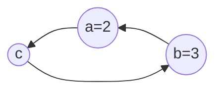

# 列表与元组

## 列表的操作

列表用于存储多个数据，常用的操作可以归类为：添加、删除、修改、读取等。

列表中的每个元素都对应唯一的索引值。

### 添加

1. `append()` 列表结尾追加数据。

```python
colors.append('green')
print(colors)
```

2. `extend()` 合并列表。

```python
colors = ['red', 'green', 'blue']
colors.append(['yellow', 'white', 'black'])
print(colors)

colors = ['red', 'green', 'blue']
colors.extend(['yellow', 'white', 'black'])
print(colors)
```

3. `insert()`

```python
# list.insert(index, obj)

colors = ['red', 'green', 'blue', 'yellow']
colors.insert(1, 'black')
print(colors)
```

### 删除

1. `del` 删除对象。

```python
del colors # 元素 del 在内存中去除
colors = ['red', 'green', 'blue', 'yellow', 'white', 'black']
del colors[0]
del(colors[0])
print(colors)
```

2. `pop()` 删除指定下标的数据，默认为最后一个，并返回该数据。

```python
colors = ['red', 'green', 'blue', 'yellow', 'white', 'black']
del_color = colors.pop(1) # 元素 pop 后还在依然存在 
print(del_color)
print(colors)
```

3. `remove()` 移除列表中某个数据的第一个匹配项。

```python
colors.remove('green')
```

4. `clear()` 清空列表

```python
colors.clear()
```

### 修改

1. 通过索引修改数组数据。

```python
colors = ['red', 'green', 'blue', 'yellow', 'white', 'black']
colors[2] = 'puple'
print(colors)
```

2. `reverse()` 逆置

```python
colors.reverse()
print(colors)
```

3. `sort(reverse=False)` 排序，reverse表示排序规则，`reverse = True` 降序， `reverse = False` 升序

```python
numbers = [1, 1, 5, 12, 19, 7, 13, 15]
numbers.sort()
numbers.sort(reverse=True)
print(numbers)
```

### 复制

`copy()`

```python
clone = colors.copy()
colors[0] = 'puple'
print(colors)
print(clone)
```

### 读取

1. 索引

```python
print(colors[0])
print(colors[-2])
```

2. `index()` 返回指定数据所在位置的下标，不存在抛出异常。

```python
print(colors.index('green', 0, 2)) 
```

3. `count()` 统计指定数据在当前列表中出现的次数。

```python
colors = ['red', 'green', 'blue', 'yellow', 'green', 'white', 'green', 'black']
print(colors.count('green'))
```

4. `len()` 获得列表中数据的个数。

```python
print(len(colors))
```

5. `in` 判断某个元素是否在序列，存储返回True，否则返回False。
6. `not in` 与上面情况相反

```python
print('blue' in colors)
print('blue' not in colors)

color = input('请输入您要搜索的颜色：')

if color in colors:
    print(f'您输入的颜色是{color}, 颜色已经存在')
else:
    print(f'您输入的颜色是{color}, 颜色不存在')
```

#### 拆包

```python
arr = [10, 20, 30]
a, b, c = arr # 元素数量超过变量数量时报错
print(f'a={a}, b={b}, c={c}')
print(arr)
```

## 二维列表

二维列表可以看做是矩阵。

```python
numbers = [[1, 2, 3, 4], [5, 6, 7, 8], [9, 10, 11, 12]]

print(numbers[0])
print(numbers[0][1])
```

> [!tip]
>
> 10个球随机分到3个盒子中，并格式化打印
>
> ```python
> import random
> 
> balls = [1, 2, 3, 4, 5, 6, 7, 8, 9, 10]
> boxes = [[], [], []]
> ```

## 元组的操作

### 读取

1. 索引

```python
print(tup[0])
tup[0] = 'Tiktok'
```

2. `index()`

```python
print(tup.index('Taobao'))
print(tup.index('Tiktok'))
```

3. `count()`

```python
print(tup.count('Wiki'))
```

4. `len()`

```python
print(len(tup))
```

> [!warning]
>
> 元组中混入列表数据，其中的列表可以修改。
>
> ```python
> group = (1, 2, ['tom', 'andy', 'hugh'], 3)
> print(group[2])  # 访问到列表
> 
> tuple2[2][0] = 'kim'
> print(group)
> ```

#### 拆包

```python
t1 = (10, 20, 30)
a, b, c = t1
print(f'a={a}, b={b}, c={c}')
print(t1)
```

##### 数据交换

交互数据的一般方法



```python
a = 2
b = 3

# 数据交换
c = a
a = b
b = c

print(a)
print(b) 
```

Python 中的数据交换，利用元组的定义与拆包特性。

```python
a, b = 2, 3
a, b = b, a

print(a)
print(b)
```

### 切片

元组切片后返回值是元组。

```python
sub = tup[0:3]
print(sub)
print(type(sub))
print(tup[-1:-4:-1])
```

