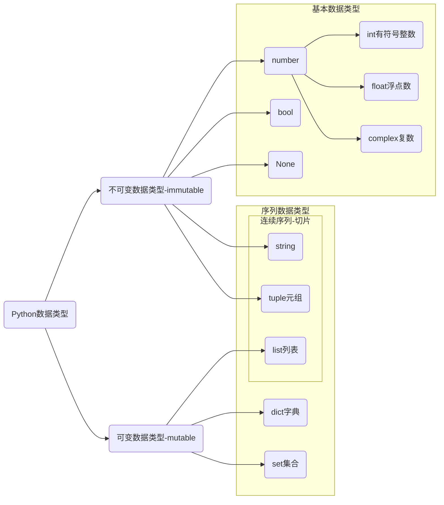

# 数据类型与程序流程

## Python中的数据类型



`complex`复数，主要用于科学计算，例如：平面场问题、波动问题、电感电容等问题。

上图列举了所有的Python数据类型，其它序列类型包括：`stirng`，`tuple`，`list`，`dict`和`set`。

* 序列提供了一系列特有的操作方法。
* 序列类型分为可变序列和不可变序列。
* 序列类型是Python内置的数据类型和传统意义上的数据结构，堆、栈、链表等不同。

| 名称     | 序列类型 | 是否可变             | 索引方式 | `False`布尔测试 | 切片操作 |
| -------- | -------- | -------------------- | -------- | --------------- | -------- |
| `string` | 连续     | 不可变，元素不可删除 | 序号     | `bool('')`      | 可以     |
| `tuple`  | 连续     | 不可变，元素不可删除 | 序号     | `bool(typle())` | 可以     |
| `list`   | 连续     | 可变，元素可删除     | 序号     | `bool([])`      | 可以     |
| `dict`   | 无序     | 可变，元素可删除     | 键       | `bool({})`      | 不可以   |
| `set`    | 无序     | 可变，元素可删除     | 不可索引 | `bool(set())`   | 不可以   |

1. 可以使用`len`读取序列长度。
2. 可以使用`for`遍历序列数据。
3. `del`可以删除整个序列，对于可变序列`del`可以删除元素。
4. `in`和`not in`判断元素是否在序列中。
5. 不同序列之间可以进行类型转换。

其它常用公共方法

| 函数          | 描述                                                         |
| ------------- | ------------------------------------------------------------ |
| `max()`       | 返回容器中元素最大值                                         |
| `min()`       | 返回容器中元素最小值                                         |
| `enumerate()` | 函数用于将一个可遍历的数据对象(如列表、元组或字符串)组合为一个索引序列，同时列出数据和数据下标，一般用在 for 循环当中。 |

1. `min()` 或 `max()`

```python
message = 'hello, world'
print(max(message))
print(min(message))

nums = [10, 20, 30, 40]
print(max(nums))
print(min(nums))

nums = set(nums)
print(max(nums))
print(min(nums))

letters = {'a': 1, 'b': 2, 'c': 3}
print(max(letters))
print(max(letters.values()))
print(min(letters))
print(min(letters.values()))
```

2. `enumerate()`函数用于将一个可遍历的数据对象（如列表、元组或字符串）组合为一个索引序列，同时列出数据和数据下标。

```python
colors = ['red', 'blue', 'yellow', 'green']

for i in enumerate(colors):
    print(i)

for index, color in enumerate(colors, start=2):
    print(f'索引是{index}, 对应的颜色是{color}')
    
colors = set(colors) # 变换集合后顺序会发生变化
for i in enumerate(colors):
    print(i)
    
person = {
  'name': 'Bob', 
  'age': 25, 
  'job': 'Dev', 
  'city': 'New York', 
  'email': 'bob@web.com'
}
for i in enumerate(person):
    print(i)
```

## 程序的三大流程

* 顺序—从上向下，顺序执行代码。
* 分支—根据条件判断，决定执行代码的分支。
* 循环—让特定代码重复执行。


1. Python中的分支结构只有`if elif else`。
1. Python中的循环结构有`while`和`for`。

## 综合练习

> [!tip]
>
> 统计文章中的一段使用了多少个汉字和每个汉字出现的次数。
>
> [文章链接](https://baijiahao.baidu.com/s?id=1720661522278169835&wfr=spider&for=pc)

```python
docs = '''
黄河安澜是中华儿女的千年期盼。
近年来，我走遍了黄河上中下游9省区。
无论是黄河长江“母亲河”，还是碧波荡漾的青海湖、逶迤磅礴的雅鲁藏布江；
无论是南水北调的世纪工程，还是塞罕坝林场的“绿色地图”；
无论是云南大象北上南归，还是藏羚羊繁衍迁徙……这些都昭示着，人不负青山，青山定不负人。
'''

signs = ['。', '；', '“', '”', '，', '……', '、', '9', '\n']

result = docs
for sign in signs:
    result = result.replace(sign, '')

chars = set(result)
print(f'字符数量为: {len(chars)}')

max_num = 0
max_char = ''
for char in chars:
    num = result.count(char)
    print(f'字符： {char}, 使用了: {num} 次')
    if num > max_num:
        max_char = char
        max_num = num

print(f'使用最多的字符是: {max_char}, 次数是: {max_num}')
```


