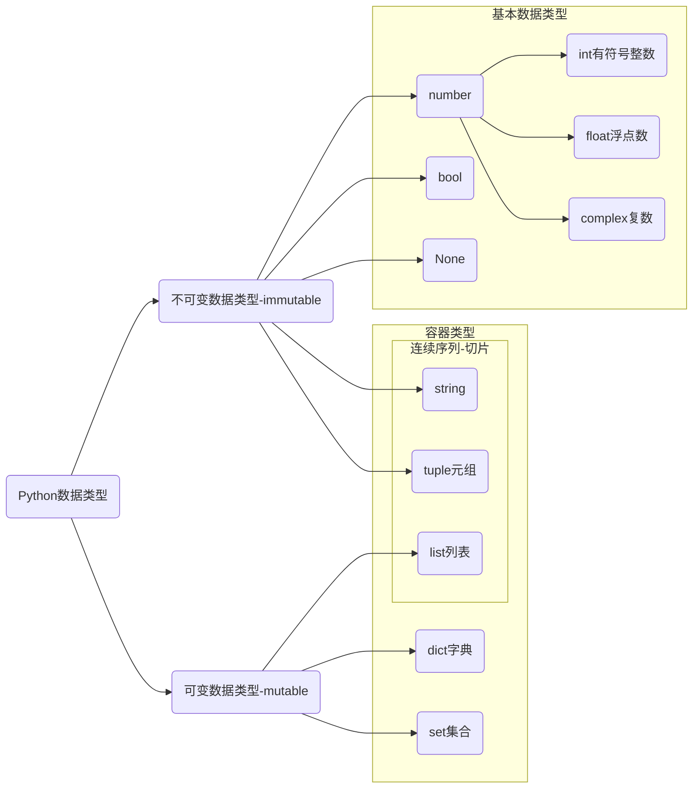
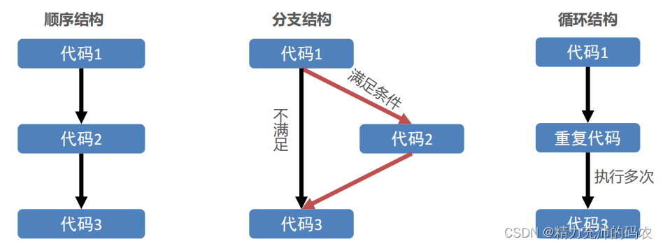

# 数据类型与程序流程

## Python中的数据类型


```mermaid
graph LR
a(Python数据类型)-->b(不可变数据类型-immutable)
b-->c(number)
b-->bool(bool)
b-->none(None)
c-->int(int有符号整数)
c-->float(float浮点数)
c-->cpx(complex复数)
a-->d(可变数据类型-mutable)
b-->str(string)
b-->tup(tuple元组)
d-->list(list列表)
d-->dict(dict字典)
d-->set(set集合)
subgraph 容器类型
	subgraph 连续序列-切片
    str
    tup
    list
   end
dict
set
end
subgraph 基本数据类型
c
bool
int
float
cpx
none
end
```

`complex`复数，主要用于科学计算，例如：平面场问题、波动问题、电感电容等问题。

上图列举了所有的Python数据类型，其它容器类型包括：`stirng`，`tuple`，`list`，`dict`和`set`。

* 序列提供了一系列特有的操作方法。
* 序列类型分为可变序列和不可变序列。
* 序列类型是Python内置的数据类型和传统意义上的数据结构，堆、栈、链表等不同。

## 内置函数

| 名称     | 序列类型 | 是否可变             | 索引方式 | `False`布尔测试 | 切片操作 |
| -------- | -------- | -------------------- | -------- | --------------- | -------- |
| `string` | 连续     | 不可变，元素不可删除 | 序号     | `bool('')`      | 可以     |
| `tuple`  | 连续     | 不可变，元素不可删除 | 序号     | `bool(typle())` | 可以     |
| `list`   | 连续     | 可变，元素可删除     | 序号     | `bool([])`      | 可以     |
| `dict`   | 无序     | 可变，元素可删除     | 键       | `bool({})`      | 不可以   |
| `set`    | 无序     | 可变，元素可删除     | 不可索引 | `bool(set())`   | 不可以   |

序列数据类型的常见操作：

1. 可以使用`len`读取序列长度。
2. 可以使用`for`遍历序列数据。
3. `del`可以删除整个序列，对于可变序列`del`可以删除元素。
4. `in`和`not in`判断元素是否在序列中。
5. 不同序列之间可以进行类型转换。

其它常用公共方法

| 函数          | 描述                                                         |
| ------------- | ------------------------------------------------------------ |
| `max()`       | 返回容器中元素最大值                                         |
| `min()`       | 返回容器中元素最小值                                         |
| `enumerate()` | 函数用于将一个可遍历的数据对象(如列表、元组或字符串)组合为一个索引序列，同时列出数据和数据下标，一般用在 for 循环当中。 |

1. `min()` 或 `max()`

```python
nums = [10, 20, 30, 40]
print(max(nums))
print(min(nums))

letters = {'a': 1, 'b': 2, 'c': 3}
print(max(letters))
print(max(letters.values()))
print(min(letters))
print(min(letters.values()))
```

2. `enumerate()`函数用于将一个可遍历的数据对象（如列表、元组或字符串）组合为一个索引序列，同时列出数据和数据下标。

```python
colors = ['red', 'blue', 'yellow', 'green']

for i in enumerate(colors):
    print(i)
    
person = {
    'name': 'Bob',
    'age': 25,
    'job': 'Dev',
    'city': 'New York',
    'email': 'bob@web.com'
}

for index, item in enumerate(person, start=2):
    print(index, item)

```

[Python的内置函数列表](https://docs.python.org/zh-cn/3.9/library/functions.html#built-in-functions)

## 程序的三大流程

* 顺序—从上向下，顺序执行代码。
* 分支—根据条件判断，决定执行代码的分支。
* 循环—让特定代码重复执行。



1. Python中的分支结构只有`if elif else`。
1. Python中的循环结构有`while`和`for`。

## 练习

1. 给你三个集合，输出在前两个集合中都存在，但不在第三个集合中的元素。
2. 输入一个正整数`n`，输出元素值不超过`n`的三元组中，能组成三角形的三条边边长的元组。
3. 输入两个数字，求两个数的最小公倍数和最大公约数。


