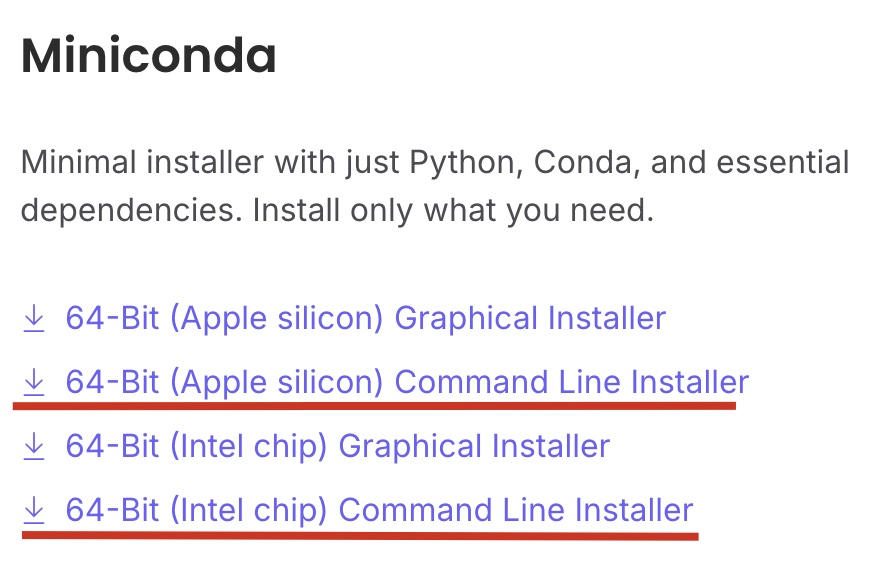

# 搭建Python的开发环境

## 课程中使用的开发工具

1. [Anaconda](https://www.anaconda.com/)是一个开源的Python发行版本，包括一系列安装好的开发工具包，致力于简化软件包管理系统和部署。
2. [Visual Studio Code（简称 VSCode）](https://code.visualstudio.com/)是微软开发的一款免费、开源的代码编辑器。支持多种编程语言开发如：Python、C/C++等。

## 开发工具安装

### Anaconda

> [!warning]
>
>  Python2.x版本与3.x版本无法兼容，本课程使用的Python的版本为3.x。

安装Python 3.x版的Anaconda（[下载](https://www.anaconda.com/download/success)），推荐安装Miniconda的Command Line版本。



下载后为脚本文件`Miniconda3-latest-MacOSX-x86_64.sh`，需要在命令行中执行

1. 修改脚本文件的类型

```shell
chmod +x ./Miniconda3-latest-MacOSX-x86_64.sh
```

2. 执行脚本文件

```shell
./Miniconda3-latest-MacOSX-x86_64.sh
```

3. 根据命令行提示，输入回车

```shell
Welcome to Miniconda3 py313_25.7.0-2

In order to continue the installation process, please review the license
agreement.
Please, press ENTER to continue
>>> 
```

4. 根据命令行提示，输入`yes`命令

```shell
Do you accept the license terms? [yes|no]
>>> 
```

5. 根据命令行提示，输入需要安装的目录


### TRAE

[TRAE](https://www.trae.com.cn/)可以打造成Python集成开发环境。

**集成开发环境**（IDE，Integrated Development Environment）——集成了开发软件需要的所有工具，一般包括：

* 图形用户界面
* 代码编辑器（支持代码补全/自动缩进）
* 编译器/解释器
* 调试器（断点/单步执行）

Trae IDE与AI深度集成，提供智能问答、代码自动补全以及基于Agent的AI自动编程能力。使用Trae开发项目时，你可以与AI灵活协作，提升开发效率。[官方使用教程](https://docs.trae.com.cn/ide/what-is-trae?_lang=zh)

安装TRAE后打开程序


在电脑上新建一个文件夹，使用TRAE打开


选择Python解释器


配置Python解释器


