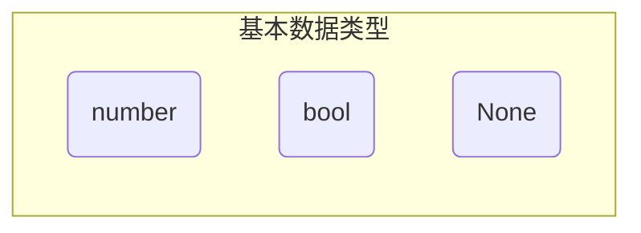
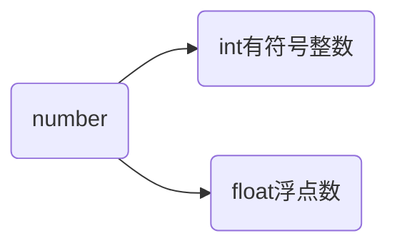

# 简单数据类型

数据类型决定了数据在程序中存储、读取和运算的方式。

> [!warning]
>
> 在Python中定义变量时不需要显示指定数据类型，Python解释器可以自动推导变量类型。

Python中最简单的数据类型，也称基本数据类型。



## 数值

数值类型是可以直接用于数学计算的数据类型。

```python
# 定义数值型变量
month = 6
pi = 3.14
```

Python中的数值变量分为两类



> [!warning]
>
> 在Python 2.x中，整数的长度还分为`int/long`，Python 3.x中已取消。

**数字中的下划线**：字面量数字特别长可以可以使用`_`分割开。这种表示方法即适用于整数，也适用于浮点数。

```python
universe_age = 14_000_000_000
print(universe_age)
```

### 数值的运算

Python支持的常见数学运算如下

| 运算符 |  描述  | 实例                                       |
| :----: | :----: | ------------------------------------------ |
|  `+`   |   加   | 3 + 2 = 5                                  |
|  `-`   |   减   | 2 - 3 = -1                                 |
|  `*`   |   乘   | 3 * 2 = 6                                  |
|  `/`   |   除   | 3 / 2 = 0.5                                |
|  `//`  | 取整除 | 返回除法的整数部分（商） 3 // 2 输出结果 1 |
|  `%`   | 取余数 | 返回除法的余数 9 % 2 = 1                   |
|  `**`  |   幂   | 3 ** 2 = 9                                 |

整数运算

```python
a = 3
b = 2
print(a + b)
print(b - a)
print(a * b)
print(a / b)
print(a // b)
print(a % b)
print(b ** 1000) # 其他语言计算会非常复杂
```

浮点运算

```python
a = 0.1
b = 0.2
print(a + b)
print(a * b)
print(a - b)
print(a / b)
```

> [!warning]
>
> `a+b`得到的计算结果为：0.30000000000000004，计算机在模拟小数时做不到绝对的精准，所有编程语言都存在这种问题。

如果需要绝对的精确计算可以使用Python的`decimal`模块。

```python
from decimal import Decimal

# 注意 '0.1' 和 '0.2' 必须是字符串
print(Decimal('0.1') + Decimal('0.2'))
```

`**`在浮点运算中可以当开方使用

```python
a = 2
print(2 ** 0.5)
```

Python中进行数学计算时，运算符的优先级和数学计算规范一致：

* 先乘除后加减
* 同级运算符是从左至右计算
* 可以使用`()`调整计算的优先级

算数运算的优先级排序

| 运算符     | 描述                   |
| ---------- | ---------------------- |
| `**`       | 幂 (最高优先级)        |
| `* / % //` | 乘、除、取余数、取整除 |
| `+ -`      | 加法、减法             |

$$
a =\displaystyle{\frac{\displaystyle{\frac{2^3-1}{5+6}}}{5-\displaystyle{\frac{3}{4}}}}
$$

```python
a = ((2 ** 3 - 1) / (5 + 6)) / (5 - 3 / 4)
print(a)
```

### 赋值运算符

在Python中，除`=`可以给变量赋值外，还提供了一系列的与算术运算符对应的赋值运算符，来简化代码的编写。观察如下代码

```python
num = 3
num = num + 2
print(num)
```

上面的代码可以使用如下符合进行简化

| 运算符 | 描述                   | 实例                                  |
| ------ | ---------------------- | ------------------------------------- |
| `=`    | 简单的赋值运算符       | c = a + b 将 a + b 的运算结果赋值为 c |
| `+=`   | 加法赋值运算符         | c += a 等效于 c = c + a               |
| `-=`   | 减法赋值运算符         | c -= a 等效于 c = c - a               |
| `*=`   | 乘法赋值运算符         | c *= a 等效于 c = c * a               |
| `/=`   | 除法赋值运算符         | c /= a 等效于 c = c / a               |
| `//=`  | 取整除赋值运算符       | c //= a 等效于 c = c // a             |
| `%=`   | 取模（余数）赋值运算符 | c %= a 等效于 c = c % a               |
| `**=`  | 幂赋值运算符           | c \**= a 等效于 c = c ** a            |

```python
a = 2
b = 3

b *= a
b -= b
b += a
b **= a
```

### 关系运算符

用于数值的比较，条件成立返回`True`，否则返回`False`。

| 运算符 | 描述                                         |
| ------ | -------------------------------------------- |
| `==`   | 检查两个操作数的值是否相等。                 |
| `!=`   | 检查两个操作数的值是否不相等。               |
| `>`    | 检查左操作数的值是否大于右操作数的值。       |
| `<`    | 检查左操作数的值是否 小于右操作数的值。      |
| `>=`   | 检查左操作数的值是否大于或等于右操作数的值。 |
| `<=`   | 检查左操作数的值是否小于或等于右操作数的值。 |

```py
age = 18
print(age == 18)
print(age > 19)
print(age < 21)
```

## 布尔值

布尔值是用来表示"真假"的数据类型，只有两个值`True`和`False`。

```python
is_male = True
print(is_male)
```

Python中布尔值可以看做整形的子类型，可以直接与数值类型进行算数运算。

* `True`对应的数字是1
* `False`对应的数字是0

```python
a = 3
b = True
print(a * b)
```

## `None`类型

`None`表示没有值或空，用于表示一个缺失的值或者在需要占位符时使用。

```python
# 用来初始化变量，表示该变量当前没有任何值。
massage = None
print(f'massage的类型是：{type(massage)}')
```

### `type`的使用

type可以用来检测数据类型。

```python
age = 18
print(f'age的类型是：{type(age)}')
height = 1.85
print(f'height的类型是：{type(height)}')
is_male = True
print(f'is_male的类型是：{type(is_male)}')
weight = None
print(f'weight的类型是：{type(weight)}')
```

## 位运算（了解）

用于二进制编码运算

* `&`按位与
* `|`按位或
* `^`按位异或
* `~`按位取反
* `<<` 按位左移
* `>>`按位右移
