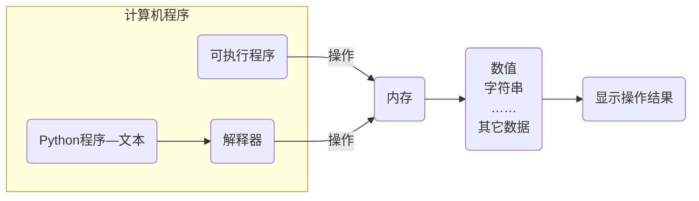
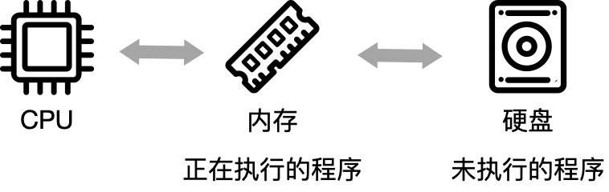
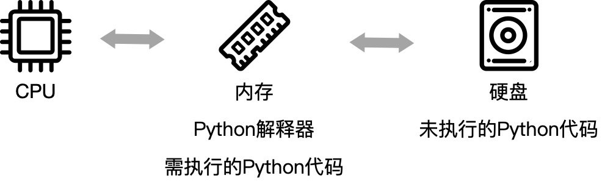
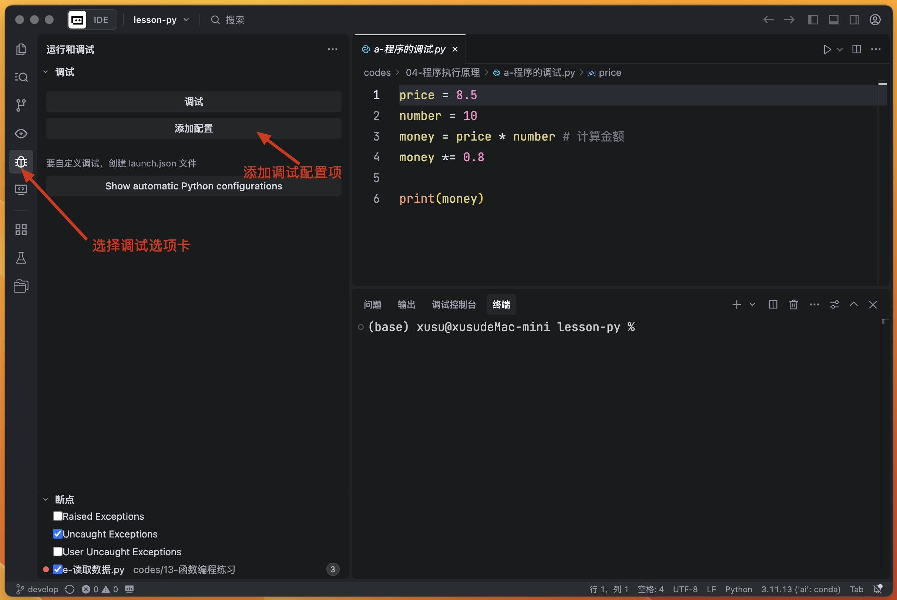
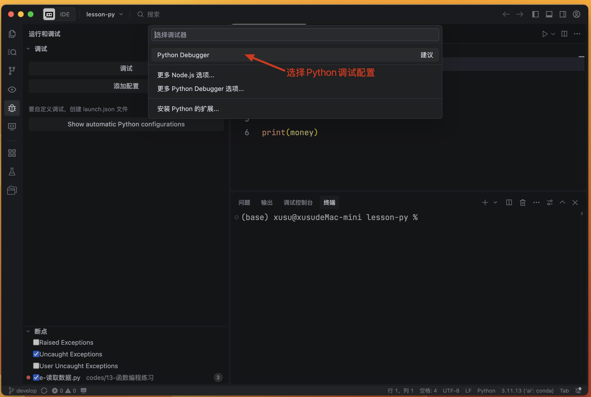
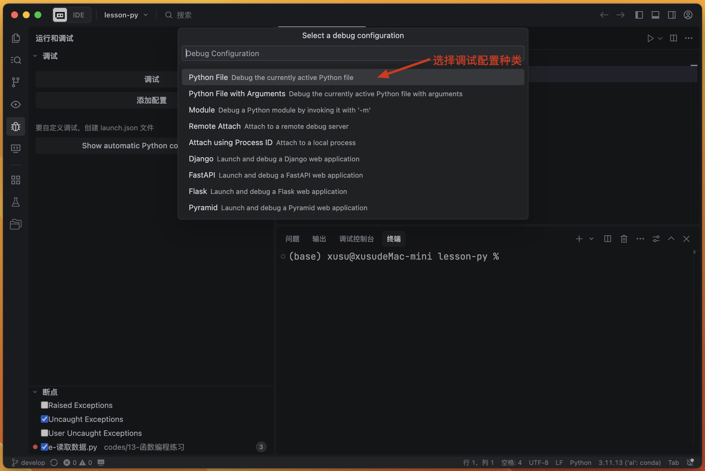
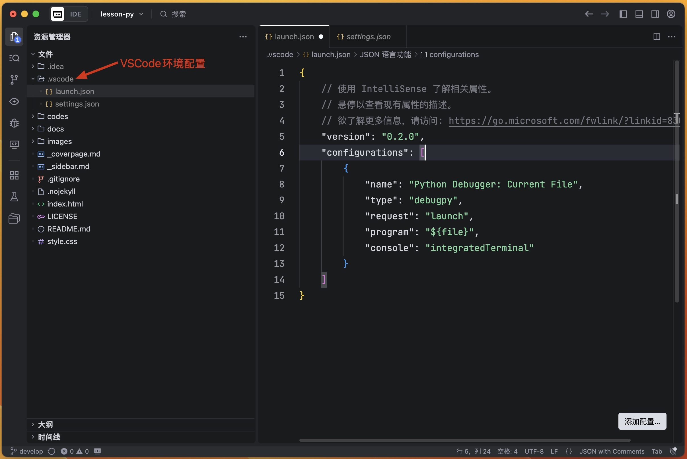
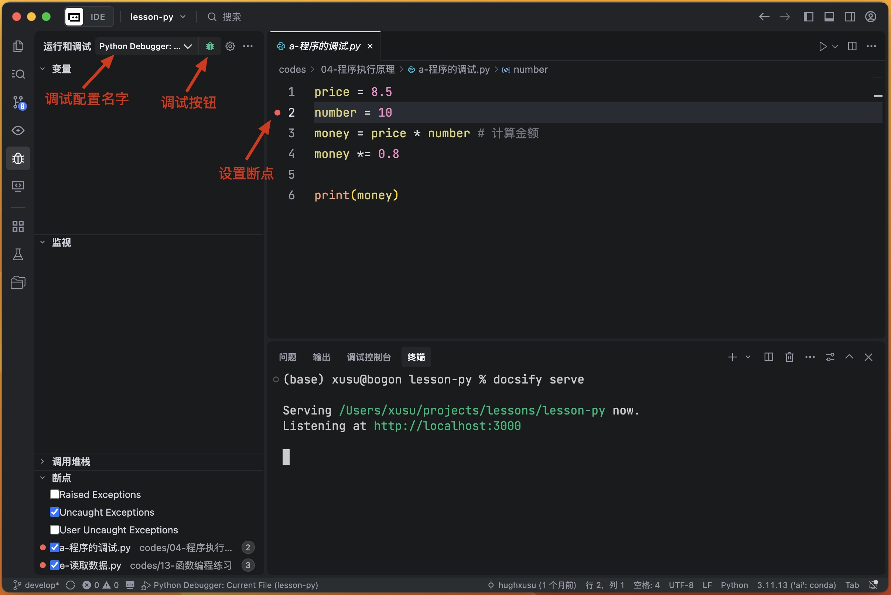
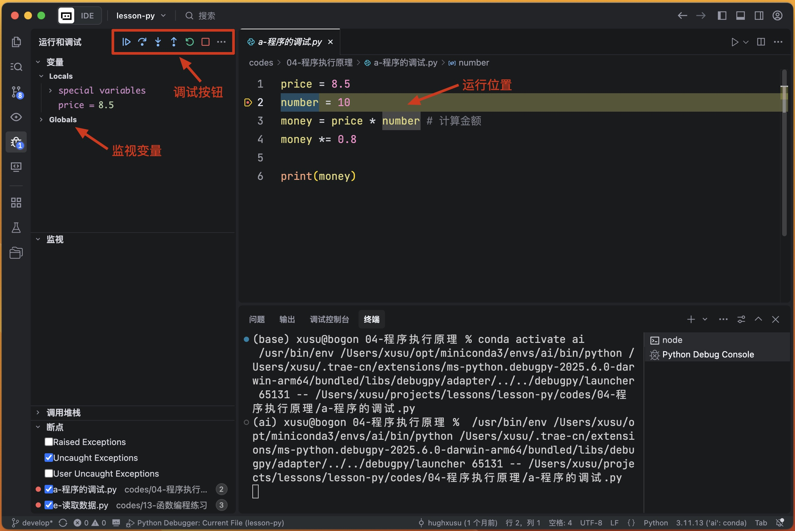

# 程序执行原理

## 计算机程序的本质

计算机程序的本质是对数据的处理和操作


```mermaid
graph LR
e(可执行程序)--操作-->b(内存)-->c(数值 \n 字符串\n …… \n 其它数据)-->h(显示操作结果)
f(Python程序—文本)-->g(解释器)--操作-->b
subgraph 计算机程序
e
f
g
end
```

## 计算机的三大件

计算机中包含有较多的硬件，但执行程序的三个核心硬件是：

1. CPU
   * 中央处理器，是一块超大规模的集成电路
   * 负责处理数据和计算
2. 内存
   * 临时存储数据（断电之后，数据会消失）
   * 速度快、空间小（单位价格高）
3. 硬盘
   * 永久存储数据
   * 速度慢、空间大（单位价格低）

## 程序执行的原理



1. 程序运行之前，程序是保存在硬盘中的。
2. 当要运行一个程序时：
   * 操作系统会首先让CPU把程序复制到内存中。
   * CPU执行内存中的程序代码。

### 程序在内存中的运行过程


## 编译语言执行过程

在Trae中创建一个`hello.c`文件，输入如下代码

```c
# include <stdio.h>

int main() {
    printf("hello, world");
    return 0;
}
```

执行编译过程

## Python 程序执行过程



1. 操作系统控制CPU，首先把Python解释器的程序复制到内存中。
2. Python解释器根据语法规则，从上向下让CPU翻译`.py`文件中的代码。
3. CPU一行行的执行翻译完成的代码。

### Python 解释器的大小

```shell
which python | xargs ls -lh
```

## 程序的调试

在Trae中调试如下代码

```python
price = 8.5
number = 10
money = price * number # 计算金额
money *= 0.8

print(money)
```

打开调试选择



选择调试配置



配置Python调试类型



配置调试类型后，会在产生一个`.vscode`隐藏文件夹，保存设置文件



设置文件说明

| 文件            | 生效场景         | 配置内容                                       |
| --------------- | ---------------- | ---------------------------------------------- |
| `launch.json`   | 调试时           | 调试器类型、程序入口、cwd、参数、环境变量      |
| `settings.json` | 编辑器和插件行为 | 解释器路径、运行目录、格式化器、Lint、终端行为 |

根据调试配置项执行调试过程



跟踪调试过程

