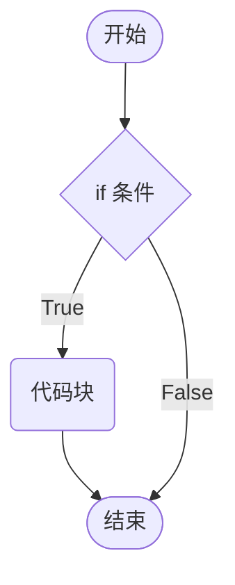

# 条件控制

## 条件测试

表达式计算得到的结果等价于`True`或`False`，这种表达式称为条件测试。将一个变量与特定的值进行比较，如：

* 数值间关系元素符，`==`、`!=`、`>=`等等。
* 比较字符串是否相等。

### 布尔值的转换

[`bool(x)`](https://docs.python.org/zh-cn/3.9/library/functions.html#bool)将`x`转换到一个布尔类型，`x`可以是任意数据类型。

```python
# True
print(bool(10))
print(bool('python'))
print(bool(' '))
 
# False
print(bool(0))
print(bool(None))
print(bool(''))
```

### 逻辑运算

用于检查多个条件，逻辑运算包括：与、或和非

| 名称 | 运算符 | 逻辑表达式 | 描述                                                         |
| ---- | ------ | ---------- | ------------------------------------------------------------ |
| 与   | `and`  | `x and y`  | 如果`x`为`False`，`x and y`返回`x`的值，否则返回`y`的值。    |
| 或   | `or`   | `x or y`   | 如果`x`是`True`，返回`x`的值，否则它返回`y`的值。            |
| 非   | `not`  | `not x`    | 如果`x`为`True`，返回`False`。如果 x 为`False`，它返回`True`。 |

```python
# 逻辑与
day_number = 3
print(day_number >= 1 and day_number <= 5)

# 逻辑或
day_number = 6
print(day_number == 6 or day_number == 0)

# 逻辑非
is_male = True
print(not is_male)
```

> [!warning]
>
> `day_number >= 1 and day_number <= 5` $\rightarrow$ `1 <= day_number <= 5`

`and`和`or`的短路，根据左边能得到整个式子的结果，因此没必要再判断右边。

* `and`左边为 `False`，则短路。

```python
print(20 and True)
print(20 and False)
print(20 and '')
print(20 and 100)
print(None and 100)
```

> [!warning]
>
> **与和或**返回的是`true`或`false`的等价值，不直接返回`true`和`false`。

* `or`左边为`True`，则短路。

```python
print(False or 100)
print(20 or 'python')
print(None or 'python')
```

## 条件语句

条件语句是通过检查一系列条件，并据此决定采取什么措施。条件语句又被称为分支语句。

Python中使用`if`语句，来实现条件的控制，代码执行过程如下：


### `if`语句

```python
in_str = input('请输需要选择的功能序号: ')
if in_str.isdigit():
    print('输入的是数字')
```

Python解释器会对`if`后面的表达式进行条件测试，即隐式调用`bool`函数来获取表达式的布尔值。

```python
if in_str.isdigit(): # 等价于 if bool(in_str.isdigit())
```




>[!warning]
>
>Python中的代码块与其他语言中使用`{}`表示代码块不同，Python中使用缩进来表示代码块。

### `else`语句

Python中使用`else`语句，来实现不满足条件的操作。


```python
in_str = input('请输需要选择的功能序号: ')
if in_str.isdigit():
    print('输入的是数字')
else:
    print('输入的不是数字')
```

### `elif`语句

Python中使用`elif`语句，来实现多种条件的操作。

```python
time = int(input('请输入当前时间：'))
if time > 5 and time < 8:
    print('亲，早上好！')
elif time < 12:              
    print('亲，上午好！')
elif time < 13:
    print('亲，中午休息一会吧！')
elif time < 17:
    print('亲，下午好！')
elif time < 18:
    print('亲，下班了！')
elif time < 23:
    print('亲，晚上好！')
else:
    print('亲，深夜了，早点休息吧！')
```


> [!warning]
>
> 1. `else`语句和`elif`不能单独使用，必须与`if`语句一起使用。
> 2. `if`、`elif`和`else`组合在一起使用时，通常被看做一个代码块。
> 3. Python中没有`switch/case`语句用于分支判断。

利用程序从上向下的执行特点，可以实现区间判断。

```python
if time > 5 and time < 8:
    print('亲，早上好！')
elif time < 12:											# 这里隐含了 time >= 8 and time < 12 的判断条件
    print('亲，上午好！')
elif time < 13:
    print('亲，中午休息一会吧！')
elif time < 17:
    print('亲，下午好！')
elif time < 18:
    print('亲，下班了！')
elif time < 23:
    print('亲，晚上好！')
else:
    print('亲，深夜了，早点休息吧！')
```

### `pass`语句

Python中`pass`不做任何事情，一般用做占位语句。

```python
choice = int(input('请输需要选择的功能序号: '))
if choice == 0:
    print('退出系统')
elif choice == 1:
    pass
elif choice == 2:
    pass
else:
    print('功能选择不存在')
```

### 条件语句与逻辑运算

逻辑运算与`if`配合使用，相当于进行条件测试。

1. 与运算

```python
day_number = int(input('请输今天是周几: '))
# 这里隐式调用bool(day_number >= 1 and day_number <= 5)
if day_number >= 1 and day_number <= 5:
    print('今天是工作日')
else:
    print('今天是休息日')
```

2. 或运算

```python
day_number = int(input('请输今天是周几: '))
if day_number == 6 or day_number == 0:
    print('今天是休息日')
else:
    print('今天是工作日')
```

3. 非运算

```python
is_admin = False
if not is_admin:
    print('用户不是管理员')
```

### `if`嵌套

在局部代码块中可嵌套`if`代码块。

```python
in_str = input('请输需要选择的功能序号: ')
if in_str.isdigit():
    choice = int(in_str)
    if choice == 0:
        print('退出系统')
    elif choice == 1:
        print('添加用户')
    elif choice == 2:
        print('删除用户')
else:
    print('输入的不是数字')
```

### 使用条件语句的注意事项

1. 省略零值判断，充分利用`if`语句后面真值测试的特性，简化条件表达式。

```python
day_number = 0
if day_number == 0:
    print('今天是星期日')
    
if not day_number:  
    print('今天是星期日')
    
error = '操作数据不能为空'
if error != '':
    print(error)
    
if error:
    print(error)
```

3. 尽量避免分支嵌套。当代码有多层分支嵌套后，可读性和可维护性就会直线下降，所以需要避免分支嵌套。常用的方法是使用**卫语句**来避免分支嵌套。
4. 当条件表达式过于复杂时，需要对表达式进行简化：
   * 摩根定律 not A or not B $\rightarrow$ not ( A and B)
   * 将表达式封装成函数。

## 三元表达式

三元表达式可以是一种简化版的条件语句。

```python
is_error = False
error_hint = '程序数据错误'
hint = '程序正常'

#        为真时的结果 if 判定条件  else 为假时的结果
result = error_hint if is_error else hint
print(result)
```

## 运算符的优先级

运算符的结合性：先执行左边的叫左结合性，先执行右边的叫右结合性。

* Python 中大部分运算符都具有左结合性，也就是从左到右执行。
* 乘方运算符、单目运算符、赋值运算符和三目运算符例外，它们具有右结合性，也就是从右向左执行。

以下表格的算数优先级由高到最低顺序排列。

| 运算符                     | 描述                   |
| -------------------------- | ---------------------- |
| `**`                       | 幂 (最高优先级)        |
| `* / % //`                 | 乘、除、取余数、取整除 |
| `+ -`                      | 加法、减法             |
| `<= < > >=`                | 比较运算符             |
| `== !=`                    | 等于运算符             |
| `= %= /= //= -= += *= **=` | 赋值运算符             |
| `not or and`               | 逻辑运算符             |

> [!warning]
>
> 注意`and`和`or`的运算优先级，`and`运算优先级高于`or`。
>
> ```python
> (True or False) and False # False
> True or False and False # True
> ```

## 练习

**随机数的处理**：在Python中，要使用随机数，首先需要导入随机数的模块。

```python
import random # 首先需要导入随机数的模块工具包

c = random.randint(1, 3)  # 生成的随机数 12 <= n <= 20
print(c)
  
print(random.randint(20, 20)) # 结果永远是 20  
print(random.randint(20, 10))  # 该语句是错误的，下限必须小于上限
```

> [!tip]
>
> 1. 从控制台输入 —— 石头（1）／剪刀（2）／布（3）。
> 2. 电脑随机出拳，比较胜负。

```python
import random

# 从控制台输入要出的拳 —— 石头（1）／剪刀（2）／布（3）
player = int(input("请出拳 石头（1）／剪刀（2）／布（3）："))
computer = random.randint(1, 3)

print('=' * 50)
print('player: %d, computer: %d' % (player, computer))
print('=' * 50)
if ((player == 1 and computer == 2) or
    (player == 2 and computer == 3) or
    (player == 3 and computer == 1)):
    print("玩家获胜！！")
elif player == computer:
    print("平局！！！")
else:
    print("电脑获胜！！")
```
