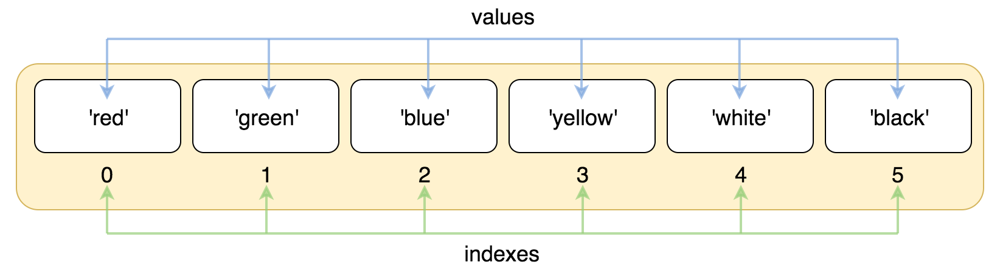
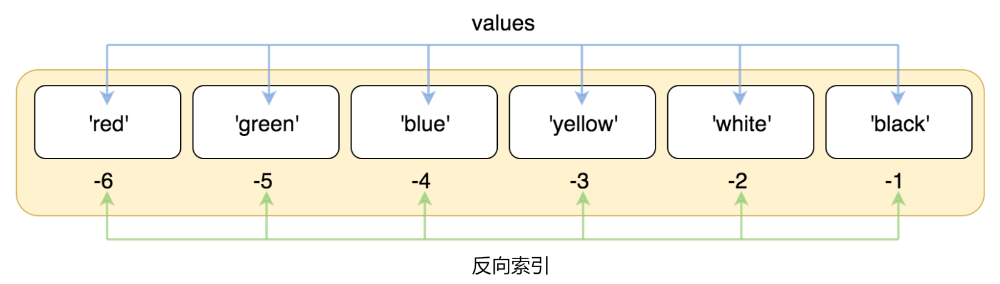
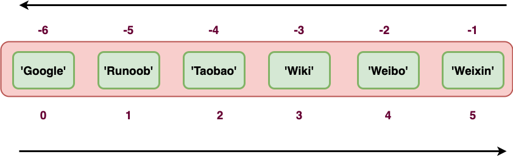
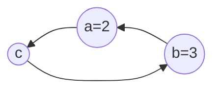
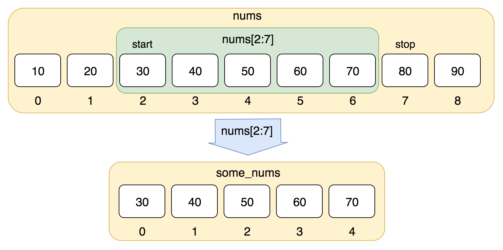

# 列表与元组

## 列表

列表（[`list`](https://docs.python.org/zh-cn/3.9/library/stdtypes.html#sequence-types-list-tuple-range)）是有序的元素集合。

```python
colors = ['red', 'green', 'blue', 'yellow', 'white', 'black']
print(colors)
students = ['Bob', 25, 'bob@web.com']
print(students)


# 使用关键字创建列表
sentence = list('对酒当歌，人生几何。')
print(sentence)

# 创建空列表
one = []
print(one)
two = list()
print(two)

# 列表的布尔测试: 空列表为False，其它为True
print(bool(one))
print(bool(colors))

flag = False
print(flag or colors)
print(one and colors)
```

### 访问列表元素

列表中的每个元素都对应唯一的索引值。



1. 元素：列表中保存的每个数据称为元素。
2. 下标：列表中数据的编号，列表的下标从0开始。
3. 列表中的各个值可以像变量一样使用。

```python
print(colors[0])
print(colors[1])
print(colors[0].upper())
```

Python还支持反向索引。



```python
print(colors[-2])
```

### 修改元素

修改列表中元素也通过索引方式进行。

```python
colors[1] = 'purple'
print(colors)
```

### 添加元素

列表为可变数据类型，添加元素会改变原变量。

`append(obj)`在列表结尾追加数据。

```python
colors.append('green')
print(colors)
```

`insert(index, obj)`可以在列表的任意位置添加新元素。`index`为插入数据的索引位置。

```python
colors.insert(1, 'pink')
print(colors)
```

### 删除元素

1. `del`删除对象，`del`方法时在内存中移除数据。

```python
del colors[0]
print(colors)

del colors
print(colors)
```

2. `pop(index=-1)`删除指定下标的数据，默认为最后一个，并返回该数据。

```python
del_color = colors.pop(1) # pop后元素还在依然存在 
print(del_color)
print(colors)
```

### 列表的拼接

1. `extend(seq)`在列表末尾一次性追加另一个序列中的多个值。

```python
colors = ['red', 'green', 'blue', 'yellow', 'white', 'black']
colors.append(['purple', 'pink'])
print(colors)

colors = ['red', 'green', 'blue', 'yellow', 'white', 'black']
colors.extend(['purple', 'pink'])
print(colors)
```

2. 使用算数运算符拼接列表。

```python
colors = ['red', 'green', 'blue', 'yellow', 'white', 'black']
print(colors)
short_colors = ['purple', 'pink']
print(short_colors)

colors_all = colors + short_colors
print(colors_all)

colors += short_colors
print(colors)
```

### 列表的其他函数

列表操作还有其他函数，如：`reverse()`、`sort()`、`count()`、`copy()`等。

### 二维列表

二维列表可以看做是矩阵。

```python
numbers = [[1, 2, 3, 4], [5, 6, 7, 8], [9, 10, 11, 12]]
print(numbers[0])
print(numbers[0][1])
```

## 元组

元组是一种有序不可变容器，特性与列表类似。

```python
sites = ('Google', 'Runoob', 'Wiki', 'Taobao', 'Wiki', 'Weibo', 'Weixin')
print(sites)
print(type(sites))

sites = ('Google',) # 单个数据元组，必须加 ',' 否则解释器会把 () 当优先运算符处理。
print(sites)

sites = 'Google', 'Runoob', 'Wiki' # 元组定义的简化写法
print(sites)
```

> [!warning]
>
> 由于元组是不可变容器，定义后不能修改，空元组没有实际意义。

### 访问元组元素

元组和列表类似，可以使用索引来访问。



```python
print(sites[0])
print(sites[-2]) # 同样支持逆序索引
```

### 元组的操作

元组中的数据不可变，所以元组没有添加和删除操作，也不能修改元素。

```python
sites[0] = 'facebook'
```

### 元组的拼接

可以使用算数运算符拼接元组。

```python
sites = ('Google', 'Runoob', 'Wiki', 'Taobao', 'Wiki', 'Weibo', 'Weixin')
short_sites = ('Tiktok', 'Facebook')
all_sites = sites + short_sites
print(all_sites)
print(type(all_sites))

sites += short_sites
print(sites)
```

## 打包与拆包

打包是定义元组的一种方式。

```python
sites = 'Google', 'Runoob', 'Wiki'
print(sites)
```

当`*`放在变量前时也可以打包

```python
sites, *rest =  'Google', 'Runoob', 'Wiki', 'Taobao', 'Apple'
print(sites)
print(rest)
```

* `*`表示将剩余的值全部打包到`*rest`中。

拆包可以将元组的值，赋给不同的变量。

```python
a, b, c = sites
print(a)
print(b)
print(c)
```

> [!caution]
>
> 拆包时变量的数量，应该与元组的数量相等，如果数量不相等会报错。

### 拆包的应用

1. 同时赋值多个变量。

```python
a, b, c = 'Google', 'Runoob', 'Wiki'
print(a)
```

2. 交换数据。

一般语言，数据交换需要定义中间变量。


```mermaid
graph RL
b((b=3))-->a
c-->b
a((a=2))-->c((c))
```

```python
a = 'Google'
b = 'Wiki'

c = a
a = b
b = c
```

Python中的数据交换，可以利用打包与拆包特性。

```python
a, b = 'Google', 'Wiki'
print(f'a={a}, b={b}')

a, b = b, a
print(f'a={a}, b={b}')
```

## 切片

连续存储的数据类型，包括：列表、元组和字符串，都支持切片操作，切片就是截取连续数据中的一段。

```python
numbers = [10, 20, 30, 40, 50, 60, 70, 80, 90]
sub = numbers[2:7]
print(sub)
print(type(sub))
```



切片操作的基本形式`numbers[begin:end:step]`

* `begin`切片操作的开始位置包含在切片范围内。不写为序列开始位置。
* `end`切片操作的结束位置，不包含在切片范围内。不写为序列结束位置。
* 步长是选取间隔，默认步长为1。

```python
sub = numbers[:7]
print(sub)

sub = numbers[2:]
print(sub)

sub = numbers[2:7:2]
print(sub)
```

* 切片操作的参数全部支持负数，负数的步长是从右向左计算。

```python
sub = numbers[::-1] # 数组逆序
print(sub)
```

## 序列模式匹配

可以使用`match-case`从匹配列表、元组等序列的结构，并从中提取变量。

```python
command = ["move", "10", "20"]

match command:
    case ["quit"]:
        print("Goodbye!")
    case ["move", x, y]:
        print(f"Moving to {x}, {y}")
    case ["drop", *items]:  # 使用 * 匹配剩余的所有元素
        print(f"Dropping: {items}")
```

* `["move", x, y]:`匹配`move`后将变量赋值给`x`和`y`。
* `["drop", *items]`匹配`drop`后，将数组中的其它值赋值给`*item`。

## 练习

1. 将两个列表组成一个二维列表。
2. 对列表中的数据排序，分别使用升序和降序。
3. 用户输入两个变量，将这两个变量组成元组，并打印。
