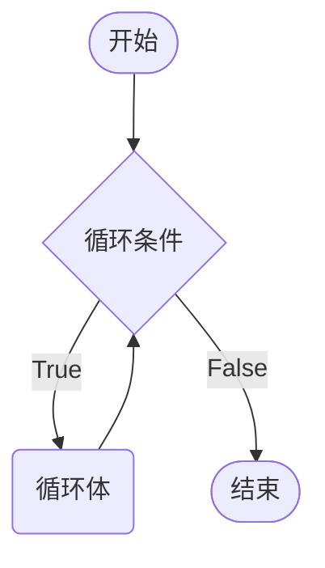
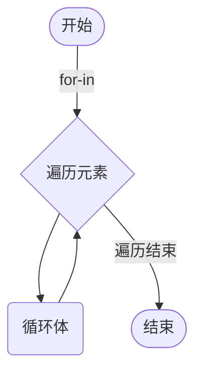
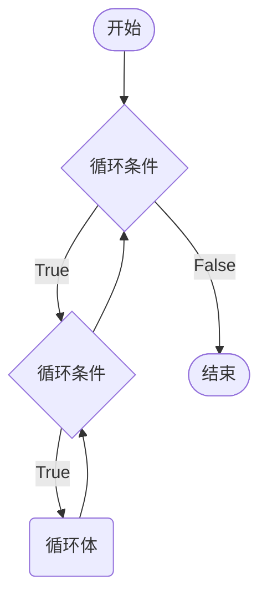

# 循环控制

循环就是让指定的代码块不断的运行，直到指定的条件不再满足为止。Python支持循环操作的关键是`while`和`for`。

## `while`循环

```python
current_number = 0
while current_number < 5:
    print(current_number)
    current_number += 1
print(f'退出循环后: {current_number}')
```



`while`语句及循环体，通常被视为同一代码块。循环结束后，计数器依旧保留循环语句中最后一次执行的值。

如果忘记对`current_number`进行增加，程序会陷入死循环。

```python
current_number = 0
while current_number < 5:
    print(current_number)
print(f'退出循环后: {current_number}')
```

### 循环的应用

1. 利用循环进行统计计算

> [!tip]
>
> 计算 0 ~ 100 之间所有偶数和。

```python
even_sum = 0

i = 0
while i <= 100:
    if i % 2 == 0:
        even_sum += i
    i += 1 # i+=2 可以控制增量为2改写代码
print(f"0~100之间偶数和为{even_sum}")
```

> [!warning]
>
> 程序中的索引通常是从0开始计数，循环计数一般也从0开始。

2. 程序执行控制

```python
message = ''
while message != 'quit':
    message = input('请输入信息：')
    print(message)
```

3. 遍历序列数据

**计算序列的长度**

Python中使用[`len`](https://docs.python.org/zh-cn/3.9/library/functions.html#len)，来计算序列的长度包括：列表、元组和字符串等。

```python
sites = ['Google', 'Wiki', 'Weibo', 'Runoob', 'Baidu', 'Taobao']
colors = ('red', 'blue', 'yellow')
message = 'hello, python'

print(len(sites))
print(len(colors))
print(len(message))
```

`while`循环，可以结合序列的长度，遍历序列中的数据。

```python
i = 0
while i < len(sites):
    print(sites[i])
    i += 1
```

###  跳过循环

`break`和`continue`用于跳过循环：

* `break`满足一定条件时退出循环，不再执行后续重复的代码。
* `continue`跳过后续代码，进入下一次循环。


```python
sites = ['Google', 'Wiki', 'Weibo', 'Runoob', 'Baidu', 'Taobao']
i = 0
while i < len(sites):
    site = sites[i]

    if len(site) != 4:
        i += 1
        continue

    print(f'Hello, {site}')

    if site == 'Runoob':
        break
    i += 1

print('Done')
```

> [!warning]
>
> `break`和`continue`只针对当前所在循环有效。

## `for`循环

Python中的`for`循环可以遍历任何可**迭代对象**，如：字符串、列表、元组等。



```python
sites = ['Google', 'Wiki', 'Weibo', 'Runoob', 'Baidu', 'Taobao']
for site in sites:
    print(site)

colors = ('red', 'blue', 'yellow')
for color in colors:
    print(color)

message = 'hello, python'
for char in message:
    print(char)
```

`break`和`continue`在`for`循环中页可以使用

```python
sites = ['Google', 'Wiki', 'Weibo', 'Runoob', 'Baidu']
for site in sites:

    if len(site) != 4:
        continue

    print(f'Hello, {site}')

    if site == 'Runoob':
        break

print('Done')
```


> [!tip]
>
> 10个球随机分到3个盒子中，并格式化打印

```python
import random

balls = [1, 2, 3, 4, 5, 6, 7, 8, 9, 10]
boxes = [[], [], []]

for one in balls:
    index = random.randint(0, 2)
    box = boxes[index]
    box.append(one)

for row in boxes:
    for ball in row:
        print(ball, end='\t')
    print()
```

### 成员运算符

`in`是Python语言的成员运算符，除了可以与`for`结合使用外，还可以用来判断元素是否在序列中。

|  运算符  |      描述      |
| :------: | :------------: |
|   `in`   |  元素是否存在  |
| `not in` | 元素是否不存在 |

```python
sites = ['Google', 'Wiki', 'Weibo', 'Runoob', 'Baidu', 'Taobao']
colors = ('red', 'blue', 'yellow')
message = 'hello, python'

print('Wiki' in sites)
print('Wiki' not in sites)
print('red' in colors)
print('ll' in message)
```

### `range`函数

`range(start, stop[, step])`函数返回的是一个可迭代对象。

* `start`计数从`start`开始，默认值是0。
* `stop`计数到`stop`结束，但不包括`stop`。
* `step`步长，默认为 1。

```py
for i in range(10):
    print(i * 2)
    
for i in range(2, 10, 2):
    print(i * 2)
```

### 循环嵌套

循环嵌套，就是一个循环中嵌套另一个循环。



```python
for _ in range(3):
    for _ in range(4):
        print('⭐️', end='')
    print()
```

* 使用`_`表示循环中不需要获得序列元素的值。

> [!tip]
>
> 打印九九乘法表。


```python
for i in range(1, 10):
    for j in range(1, i + 1):
        print(f'{i}*{j}={i*j}', end='\t')
    print()
```

## 循环和`else`

`for`和`while`可以与`else`配合使⽤，`else`代码表示当循环正常结束之后要执⾏的代码。

```python
sites = ['Google', 'Wiki', 'Weibo', 'Runoob', 'Baidu', 'Taobao']
i = 0
while i < len(sites):
    site = sites[i]
    if len(site) == 4:
        i += 1
        continue
    if site == 'Runoob':
        break
    print(site)
    i += 1
else:
    print('循环结束')

for site in sites:
    if len(site) == 4:
        continue
    if site == 'Runoob':
        break
    print(site)
else:
    print('循环结束')
```

> [!warning]
>
> 只有执行`break`语句才表示循环异常退出。

## 推导式

列表生成式，也称为推导式，是Python特有的语法，用一个表达式创建一个有规律序列。可以生成列表和元组。

### 列表推导式

```python
nums = [i for i in range(11)]
print(type(nums))
print(nums)

powers = [i**2 for i in range(11)]
print(powers)

evens = [i for i in range(0, 11, 2)]
print(evens)
```

推导式中使用`if` 

```python
sites = ['Google', 'Wiki', 'Weibo', 'Runoob', 'Baidu', 'Taobao']
sub = [site for site in sites if len(site) > 5]
print(sub)
```

列表推导式嵌套

```python
groups = [(i, j) for i in range(1, 3) for j in range(3)]
print(groups)

# 生成一个九九乘法表的列表推导式
nums = [i*j for j in range(1, 10) for i in range(1, j+1)]
print(nums)
```

### 元组推导式

元组推导式返回的结果是一个生成器对象。

```python
evens = (i for i in range(0, 11, 2))
print(type(evens))
print(evens)

result = tuple(evens)
print(type(result))
print(result) 
```
