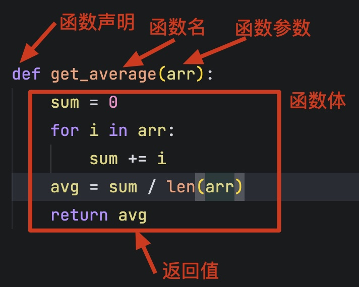
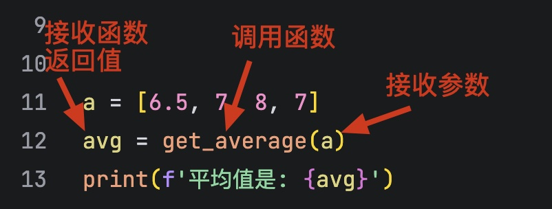
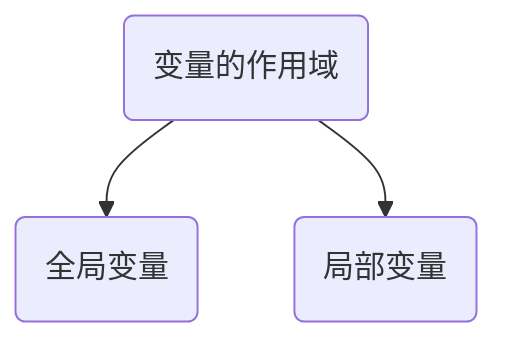

# 认识函数

计算两个数组的平均值

```python
a = [6.5, 7, 8, 7]
b = [9.5, 7.5, 8, 8, 7]
```

平均值计算代码如下

```python
a = [6.5, 7, 8, 7]
sum = 0
for i in a:
    sum += i
avg = sum / len(a)
print(f'平均值是: {avg}')
```

> [!note]
>
> 如果要计算10个数组中数组的平均值，是否将上面的代码重复10遍？

函数：组织好的、可重复使用的、用来实现单一或关联功能的代码段。

## 函数的基本使用

### 声明与调用

函数是带名字代码段，可以完成特定的功能，定义平均值计算函数



1. 定义函数时首先应该声明函数，Python使用`def`关键字来声明函数
2. 函数名由程序员指定，函数名命名规范
   * 和变量命名规则一致。
   * 尽量小驼峰式命名法。
   * 前缀应该为动词，如：can、has、is、get、set、load等。
3. 函数的参数可以理解为一个已知变量，在函数体里使用。
4. 缩进的部分为代码块，整个代码块称为函数体。
5. `return`表是函数的返回值，把函数的处理结果返回给调用者。

要函数执行特定功能时，需主动调用。



1. 函数调用时需要主动传入参数。
2. 函数调用后返回的结果需要变量接收。

同一函数可以在不同位置多次调用。

```python
b = [9.5, 7.5, 8, 8, 7]
avg = get_average(b)
print(f'平均值是: {avg}')
```

### 函数的返回值

在定义函数时，可以省略返回值。

```python
def get_average(arr):
    sum = 0
    for i in arr:
        sum += i
    avg = sum / len(arr)
    print(f'平均值是: {avg}')
    

a = [6.5, 7, 8, 7]
avg = get_average(a)
print(f'返回值为: {avg}')
```

* 没有`return`即省略了返回值，这种情况函数默认返回值为`None`。

### 函数的参数

在定义函数时，可以没有参数。

```python
def greet():
    print(f"Hello, world!")

greet()
```

### 为函数添加说明

使用 `help` 来查看函数的说明

```python
help(len)
```

为自定义函数添加说明文档

```python
def get_average(arr):
    '''
    计算数组的平均值
    :param arr: 输入的数组
    :return: 数组的平均值
    '''
    sum = 0
    for i in arr:
        sum += i
    avg = sum / len(arr)
    return avg

help(get_average)
```

## 函数的嵌套调用

函数之间可以相互调用

```python
def round_area(r):
    return 3.14 * r ** 2

def cylinder(r, h):
    return round_area(r) * h

print(f'半径为5的圆的面积是: {round_area(5)}')
print(f'半径为5, 高为10的圆柱体体积是: {cylinder(5, 10)}')
```

## 变量的作用域

变量作用域指的是变量生效的范围。



1. 全局变量，指的是在函数体内、外都能生效的变量。
2. 局部变量是定义在函数体内部的变量，即只在函数体内部生效。

### 全局变量与局部变量

```python
# 全局变量
pi = 3.1415926 

def round_area(r):
    # 局部变量
    area = pi * r ** 2
    return area

result = round_area(5)
print(f'半径为5的圆的面积是: {result}')
print(area)

```

> [!warning]
>
> 全局变量可以用于多个函数之间数据传递。

`for`循环中的变量为全局变量

```python
for i in range(3):
    print(i)

print(i)
```

### 修改全局变量

观察如下代码结果

```python
pi = 3.1415926 

def round_area(r):
    pi = 3.14
    area = pi * r ** 2
    return area

result = round_area(1)
print(f'半径为5的圆的面积是: {result}')
print(f'全局变量 pi = {pi}')
```

* 直接在函数体内修改全局变量，相当于定义了一个局部变量，只在本函数内生效。

使用`globle`关键字，可以在函数内修改全局变量的值。

```python
pi = 3.1415926 

def round_area(r):
    global pi
    pi = 3.14
    area = pi * r ** 2
    return area

result = round_area(1)
print(f'半径为5的圆的面积是: {result}')
print(f'全局变量 pi = {pi}')
```

