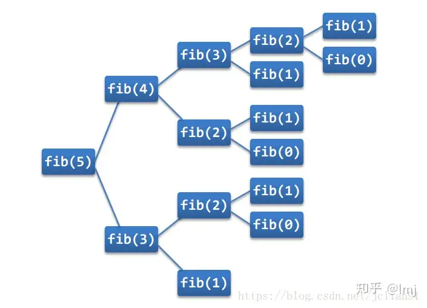

# 几种特殊函数

## 递归函数

递归是一种编程思想，函数内部自己调用自己。使用递归方法需要满足三个条件：

1. 要解决的问题可以转化⼀个或多个⼦问题来求解，⽽这些⼦问题的求解⽅法与原问题完全相同，只是在数量规模上不同。
2. 递归调⽤的次数必须是有限的。
3. 必须有结束递归的条件来终⽌递归。

斐波那契数列
$$
f(n) =
\begin{cases} 
0,  & n=0 \\
1, & n=1 \\
f(n-1) + f(n-2), & n \geqslant 2, n\in N^* \\
\end{cases}
$$

| 位置 | 0    | 1    | 2    | 3    | 4    | 5    | 6    | 7    | 8    | 9    | 10   |
| ---- | ---- | ---- | ---- | ---- | ---- | ---- | ---- | ---- | ---- | ---- | ---- |
| 值   | 0    | 1    | 1    | 2    | 3    | 5    | 8    | 13   | 21   | 34   | 55   |

使用递归来实现斐波那契数列

```python
def fib(n):
    if n == 0:
        return 0
    elif n == 1:
        return 1
    else:
        return fib(n - 2) + fib(n - 1)

print(fib(5))
```



Python中递归调用的深度是1000层

```python
import sys
print(sys.getrecursionlimit())
```

递归算法都可以使用循环来代替

```python
def fib(n):
    a, b = 0, 1
    for i in range(n):
        a, b = b, a + b

    return a
```

> [!warning]
>
> Python语言中对递归限制较多，尽可能使用循环来代替递归。

## 匿名函数

Python 使用`lambda`来创建匿名函数。

* `lambda`表达式的参数形式和一般函数相同。
* `lambda`的主体是一个表达式，而不是一个代码块，只能返回一个表达式的值。
* `lambda`函数拥有自己的命名空间，且不能访问自己参数列表之外或全局命名空间里的参数。

### 基本语法

```python
lambda args: expression
```

使用实例

```python
square = lambda x: x ** 2
print(type(square))
print(square(2))

# 等价于
def square(x):
    return x ** 2
print(square(2))
```

* `lambda`参数形式：无参数、顺序参数、关键字参数、默认参数和可变参数。

### `lambda`应用

1. 三目运算符与`lambda`相关结合

```python
max = lambda a, b: a if a > b else b
print(max(5, 3))
```

2. 数组排序

```python
students = [
    {'name': 'Tom', 'age': 20},
    {'name': 'Jack', 'age': 18},
    {'name': 'Mike', 'age': 22}
]

# 按age值升序排列
students.sort(key=lambda x: x['age'])
print(students)

# 按age值降序排列
students.sort(key=lambda x: x['age'], reverse=True)
print(students)
```

## 函数作为参数

在Python中函数名本身也是变量，所以可以将函数名作为另外一个函数的参数。函数作为参数是**高阶函数**的一种。

```python
from math import sin

print(abs(-5))
print(sin(-5))

def add(x, y, f):
    return f(x) + f(y)

print(add(-5, 6, abs))
print(add(-5, 6, sin))
```

## 文件操作

文件：存储在某种长期储存设备或临时储存装置中的一段数据流。

### 文件操作步骤

1. 打开文件。
2. 对文件进行读写操作。
3. 关闭文件。

#### 打开一个文件

在Python，使用`open`函数，可以打开一个已经存在的文件，或者创建一个新文件。

```python
f = open(name, mode)
```

* `f`是`open`函数的文件对象，这里`open`函数返回了一个对象。
* `name`是要打开目标文件的文件名（可以使用绝对路径或相对路径）。
* `mode`是文件的打开模式：只读、写入、追加等。

| 模式 | 描述                                                         |
| :--: | ------------------------------------------------------------ |
|  r   | 1. 以只读方式打开文件。<br/>2. 文件的指针将会放在文件的开头。 |
|  rb  | 1. 以二进制格式打开一个文件用于只读。<br/>2. 文件指针将会放在文件的开头。 |
|  w   | 1. 打开一个文件只用于写入。<br/>2. 如果该文件已存在则打开文件，并从头开始编辑，即原有内容会被删除。<br/>3. 如果该文件不存在，创建新文件。 |
|  wb  | 1. 以二进制格式打开一个文件只用于写入。<br/>2. 如果该文件已存在则打开文件，并从头开始编辑，即原有内容会被删除。<br/>3. 如果该文件不存在，创建新文件。 |

* 其他参数：`r+`、`rb+`、`w+`、`a`等。

```python
f = open('docs.txt', 'w')
```

#### 关闭文件

```python
f.close()
```

> [!caution]
>
> 文件使用完后必须关闭，因为文件对象会占用操作系统的资源，并且操作系统同一时间能打开的文件数量也是有限的。

#### 文件的读写

1. 写入文件

```python
f = open('凉州词.txt', 'w')

txt = '''
葡萄美酒夜光杯，
欲饮琵琶马上催。
醉卧沙场君莫笑，
古来征战几人回？
'''

f.write(txt)
f.close()
```

2. 读文件：`f.read(num)`从文件中读数据。`num`读取的数据的长度（单位是字节），默认读取文件中所有的数据。

```python
f = open('凉州词.txt', 'r')
txt = f.read()
print(txt)
f.close()
```

* 以只读模式打开的文件对象，不可以写入。

### 海象运算符

在Python 3.8中引入的海象运算符`:=`，允许在表达式内部进行变量赋值。海象运算符最常用的形式是，简化循环

```python
f = open('凉州词.txt', 'r')
while line := f.readline():
    print(line, end='')
    print('-' * 20)
f.close()
```

* `f.readline()`一次读取一行内容。
* `line := f.readline()`在`while`循环中直接定义变量`line`的同时对其进行赋值。

海象运算符还可以用于列表推到式

```python
data = [5, 12, 8, 15]
results = [y for x in data if (y := x*x) > 100]
print(results)
```

## 文件路径

在本地查询文件路径有两种方式，相对路径和绝对路径。

1. 相对路径：从程序所在的目录位置开始查找。
   * 同级目录：`./`
   * 下级目录：`./文件夹名称/`
   * 上级目录：`../`

2. 绝对路径：绝对路径从系统的根文件夹位置开始查找。

```shell
/home/eric/data_files/text_files/docs.txt
```

### 文件和文件夹操作

Python中`os`模块提供了与操作系统进行交互的接口，可以实现一下文件和文件夹的操作。

## 练习

1. 复制文件：输入一个文件名，将文件复制一份。
2. 假设你正在爬楼梯。需要n阶你才能到达楼顶。每次你可以爬1或2个台阶。你有多少种不同的方法可以爬到楼顶呢？
3. 定义一个一元二次多项式函数，输入a、b、c参数，返回lambda函数，可以计算多项式结果。

