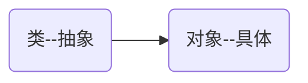

# 面向对象

面向对象编程是一种抽象化的编程思想。将一系列业务逻辑抽象称为一个模型，这个模型具备通用的特征和行为。同时，可以根据这个模型创建对象，对象用于存储数据或承载算法逻辑等。



## 类和对象

### 类的定义

> [!note]
>
> 思考一个常见的应用，任务清单，任务清单中，每一个条目应该包括：
>
> 1. 任务的状态
> 2. 任务的描述
> 3. 显示当前任务信息  

使用程序模拟上面的功能

```python
class TodoItem:
    def __init__(self, desc):
        self.desc = desc
        self.is_completed = False

    def show(self):
        status = '✅' if self.is_completed else '⭕️'
        print(f'{status} \t {self.desc}')
```

* `class`关键字用于定义类。
* 根据PEP8规范，类名通常使用大驼峰式命名法。

### 创建对象

对象（object）也称为实例（instance），是通过类创建的，创建对象的过程成为实例化。

```python
item = TodoItem('学习Python')
print(item)
```

* 创建了一个`item`实例。

### 类的组成

1. 类的属性对应于事物的特征，用来保存一个对象的数据，本质是对象的一个变量。`TodoItem`类中包属性：`desc`和`is_completed`。访问实例属性操作如下。

```python
print(f'item->desc: {item.desc}')
print(f'item->is_completed: {item.is_completed}')
```

2. 类的方法对应于事物的行为，本质是对象的一个函数。`TodoItem`类中包方法：`__init__`和`show`。

```python
item.show()
```

3. `__init__`是一个特殊方法，每当使用类来创建新的实例时，该方法会被自动调用。

```python
class TodoItem:
    def __init__(self):
        print(f'初始化会自动调用 __init__ 方法')

item = TodoItem()
```

4. `self`参数。每个方法定义时第一个参数都为`self`，该参数是一个指向实例的引用。

```python
class TodoItem:
    def __init__(self, desc):
        self.desc = desc
        self.is_completed = False
        print(f'__init__的self的id为{id(self)}')

    def show(self):
        status = '✅' if self.is_completed else '⭕️'
        print(f'{status} \t {self.desc}')
        print(f'show的self的id为{id(self)}')

item = TodoItem('学习Python')
item.show()
print(f'item的id为{id(item)}')
```

* 在初始化函数中执行`self.name = name`，可以将数据与实例进行关联。
* 在方法`sit`中执行`self.name.title()`，可以读取实例中的数据。

> [!warning]
>
> Python中的`self`参数类似于C++中的`this`指针，只不过在Python中是显示传递的。

Python中使用`is`运算符来比较两个实例是否为统一对象，`is`检查的是内存中的地址是否相同。

```python
class TodoItem:
    def __init__(self, desc):
        self.desc = desc
        self.is_completed = False

    def show(self):
        status = '✅' if self.is_completed else '⭕️'
        print(f'{status} \t {self.desc}')
    
item_1 = TodoItem('学习Python')
item_2 = TodoItem('学习JavaScript')
item_3 = item_1
print(f'item_3 is item_1: {item_3 is item_1}')
print(f'item_3 is item_2: {item_3 is item_2}')
```

Python中`is`判断内存地址是否相等，`==`判断两个对象的值是否相等。

```python
item_1 = TodoItem('学习Python')
item_2 = TodoItem('学习Python')
item_3 = item_1
print(f'item_3 == item_1: {item_3 == item_1}')
print(f'item_3 == item_2: {item_3 == item_2}')
```

不可变数据的比较

```python
a = 1024
b = 1024
print(f'a is b: {a is b}')
print(f'a == b: {a == b}')
```

可变数据类型的比较

```python
a = [1024, 2048]
b = [1024, 2048]
print(f'a is b: {a is b}')
print(f'a == b: {a == b}')
```

## 属性值的访问与修改

属性值的访问与修改分为：内部和外部两种情况。

1. 内部是指在定义类的过程中，对属性的操作。
2. 外部是指通过对象，对属性的操作。

### 属性值的访问

1. 在类内部读取属性，需要借助`self`变量。

```python
def show(self):
    status = '✅' if self.is_completed else '⭕️'
    print(f'{status} \t {self.desc}')
```

* 类的内部读取属性主要是在方法中使用，用于完成特殊的操作或算法。

2. 在类外部读取属性，是通过实例。

```python
item = TodoItem('学习Python')
print(f'item->desc: {item.desc}')
print(f'item->is_completed: {item.is_completed}')
```

### 属性值修改

1. 在函数初始化时可以对属性赋值，也可以为属性指定默认值。

```python
def __init__(self, desc):
    self.desc = desc
    self.is_completed = False
```

也可以使用默认参数，对属性进行初始化。

```python
class TodoItem:
    def __init__(self, desc='无'):
        self.desc = desc
        self.is_completed = False

item = TodoItem()
print(f'item->desc: {item.desc}')
```

2. 直接修改属性值。

```python
class TodoItem:
    def __init__(self, desc):
        self.desc = desc
        self.is_completed = False

    def show(self):
        status = '✅' if self.is_completed else '⭕️'
        print(f'{status}  {self.desc}')

item = TodoItem('学习Python')
item.show()
item.is_completed = True
item.show()
```

3. 通过特定方法修改属性值。使用特定方法修改属性值，可以在方法中添加一些逻辑。

```python
class TodoItem:
    def __init__(self, desc):
        self.desc = desc
        self.is_completed = False

    def toggle_completed(self):
        self.is_completed = not self.is_completed

    def show(self):
        status = '✅' if self.is_completed else '⭕️'
        print(f'{status}  {self.desc}')

item = TodoItem('学习Python')
item.is_completed = True
item.show()
item.toggle_completed()
item.show()
```

### 私有属性

私有属性和方法只能在类的内部访问，不能在类的外部访问。属性前添加`__`，为私有属性。

```python
class TodoItem:
    def __init__(self, desc):
        self.desc = desc
        self.__is_completed = False

    def toggle_completed(self):
        self.__is_completed = not self.__is_completed

    def show(self):
        status = '✅' if self.__is_completed else '⭕️'
        print(f'{status}  {self.desc}')

item = TodoItem('学习Python')
item.show()
item.toggle_completed()
item.show()
```

外部访问和修改私有属性

```python
print(f'item.__is_completed: {item.__is_completed}')
item.__is_completed = True
```

### 私有方法

私有方法与私有属性类似，也只能在类的内部访问，不能在类的外部访问。方法前添加`__`，为私有方法。

```python
class TodoItem:
    def __init__(self, desc):
        self.__desc = self.__validate_desc(desc)
        self.__is_completed = False

    def toggle_completed(self):
        self.__is_completed = not self.__is_completed

    def show(self):
        status = '✅' if self.__is_completed else '⭕️'
        print(f'{status}  {self.__desc}')

    def __validate_desc(self, desc):
        if not isinstance(desc, str):
            desc = '无'
        if len(desc.strip()) == 0:
            desc = '无'
        if len(desc) > 100:
            desc = desc[:100]
        return desc

    def get_desc(self):
        return self.__desc

    def set_desc(self, desc):
        self.__desc = self.__validate_desc(desc)
        
item = TodoItem(123456)
item.show()
```

私有方法不能通过实例直接访问，只能在定义类的内部访问

```python
item = TodoItem(123456)
item.__validate_desc('学习Python')
```

## 内置属性和方法

在Python中，一些具有特殊功能的变量和函数，被称为内置属性和方法，如：`__init__`。

### `__str__()`

当使用`print`输出对象的时候，默认打印对象的内存地址。如果类定义了该方法，那么就会打印从在这个方法中 `return`的数据。

```python
class TodoItem:
    def __init__(self, desc):
        self.desc = desc
        self.is_completed = False

    def __str__(self):
        return f'{"✅" if self.is_completed else "⭕️"}  {self.desc}'

item = TodoItem('学习Python')
print(item)
```

### `__del__()`

当删除对象时，python解释器也会默认调用该方法。

```python
class Camera:
    def __init__(self):
        print('1. 使用电脑的摄像头')

    def __del__(self):
        print('4. 关闭电脑的摄像头')
    
my_new_camera = Camera()
print('2. 采集图像')
print('3. 处理图像')

my_new_camera = Camera()
print('2. 采集图像')
del my_new_camera
print('3. 处理图像')
```

### `__dict__`

* 实例的`__dict__`，保存着当前实例的所有数据。
* 类的`__dict__`，保存着类的文档、方法等所有数据。

```python
item = TodoItem('学习Python')
print(item.__dict__)
print(TodoItem.__dict__)
```

> [!warning]
>
> 魔法属性和方法虽然也以`__`开始，但并不是私有的，也可以直接调用。

## 其它语法

### 动态语言

python是动态语言，它是一类在运行时可以改变其结构的语言：

* 运行的过程中可以改变变量的类型。
* 运行的过程中给对象绑定属性和方法
* 运行的过程中给类绑定属性和方法

```python
item1 = TodoItem('学习Python')
item1.note = '需要先学习基础语法'
print(item1.note)

item2 = TodoItem('学习JavaScript')
print(item2.note)
```

> [!attention]
>
> Python编程语言的动态特性，只在高阶框架中有应，一般定义类中**不推荐**这种方法。

### 类属性

类属性就是类的所有实例对象共同拥有属性，类属性可以使用类对象或实例对象访问。

```python
class TodoItem:
    item_count = 0

    def __init__(self, desc):
        self.desc = desc
        self.is_completed = False
        TodoItem.item_count += 1

    def __str__(self):
        return f'{"✅" if self.is_completed else "⭕️"}  {self.desc}'

item1 = TodoItem('学习Python')
item2 = TodoItem('学习JavaScript')
print(f'当前待办事项数量: {TodoItem.item_count}')
```

* 类属性访问和修改的正确方式都是通过类名`TodoItem`

通过实例也可以访问类属性

```python
item1 = TodoItem('学习Python')
item2 = TodoItem('学习JavaScript')
print(f'当前待办事项数量: {item1.item_count}')
```

通过实例访问类属性，相当于给对象添加新的属性覆盖类属性。

```python
item1 = TodoItem('学习Python')
item1.item_count = 10
print(f'item1.item_count: {item1.item_count}')
item2 = TodoItem('学习JavaScript')
print(f'item2.item_count: {item2.item_count}')
print(f'TodoItem.item_count: {TodoItem.item_count}')
```

### 类方法

类方法就是类的所有实例对象，共享的方法，类方法一般和类属性配合使用。

```python
class TodoItem:
    item_count = 0

    def __init__(self, desc):
        self.desc = desc
        self.is_completed = False
        TodoItem.item_count += 1

    def __str__(self):
        return f'{"✅" if self.is_completed else "⭕️"}  {self.desc}'

    @classmethod
    def get_item_count(cls):
        return cls.item_count

    @classmethod
    def set_item_count(cls, count):
        cls.item_count = count


item1 = TodoItem('学习Python')
item1.set_item_count(10)
print(f'item1.get_item_count: {item1.get_item_count()}')
print(f'TodoItem.item_count: {TodoItem.item_count}')
```

* `@classmethod`定义类方法的装饰器。
* 类方法中传入的第一个参数为`cls`表示类本身。
* 类方法可以直接通过实例变量访问，而不会添加方法。

```python
item1 = TodoItem('学习Python')
TodoItem.set_item_count(10)
print(f'item1.get_item_count: {item1.get_item_count()}')
print(f'TodoItem.item_count: {TodoItem.item_count}')
```

* 类方法可以直接通过类进行访问。

