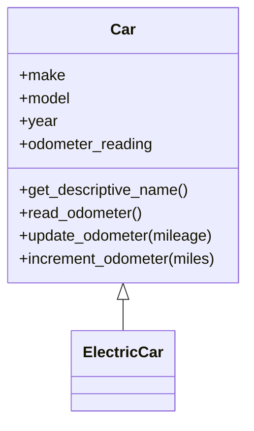
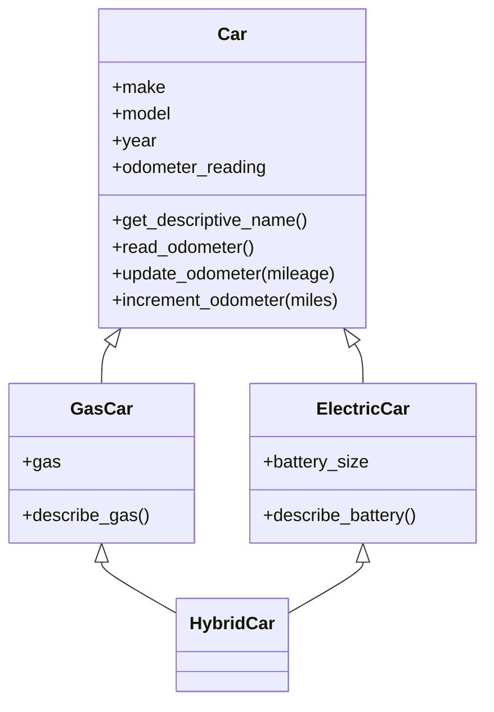
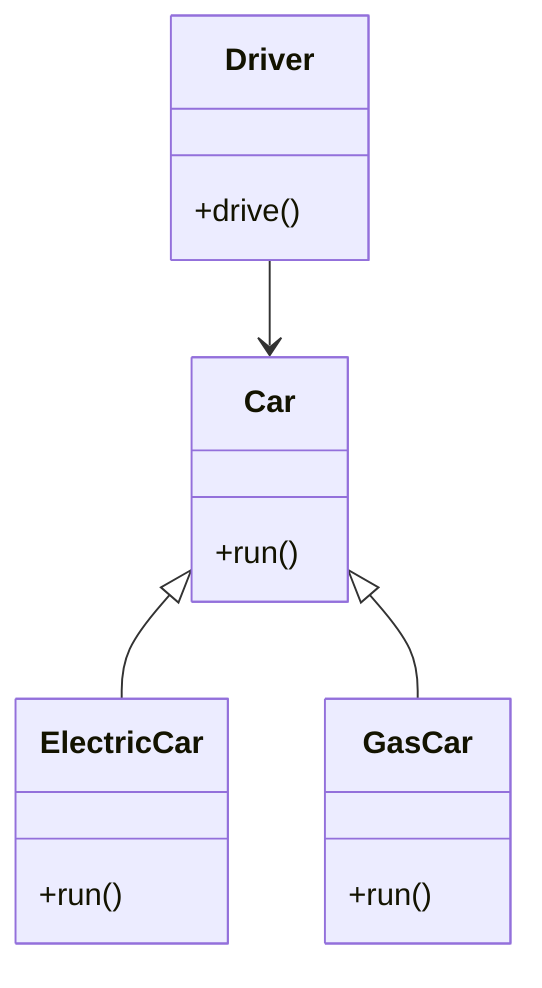

# 面向对象的特性

## 继承

### 继承的基本概念

如果编写一个新的类，承载了既有类的属性和方法。不需要从头开始编写，可以使用继承。新的类称为子类，而被继承的类称为基类、父类或超类。

定义一个汽车的父类

```python
class Car:
    def __init__(self, make, model, year):
        self.make = make
        self.model = model
        self.year = year
        self.odometer_reading = 0
        
    def get_descriptive_name(self):
        long_name = f"{self.year} {self.make} {self.model}"
        return long_name.title()
    
    def read_odometer(self):
        print(f"This car has {self.odometer_reading} miles on it.")
        
    def update_odometer(self, mileage):
        if mileage >= self.odometer_reading:
            self.odometer_reading = mileage
        else:
            print("You can't roll back an odometer!")
            
    def increment_odometer(self, miles):
        self.odometer_reading += miles
```

定义一个电动汽车来继承汽车类

```python
class ElectricCar(Car):
    def __init__(self, make, model, year):
        super().__init__(make, model, year)
```

汽车类和电动汽车类的关系图如下：



子类继承了父类的属性和方法，定义子类的实例，可以调用父类的属性和方法。

```python
my_tesla = ElectricCar('tesla', 'model s', 2024)

print(my_tesla.get_descriptive_name())
my_tesla.increment_odometer(100)
print(my_tesla.odometer_reading)
```

`super()`是一个特殊的函数，通过它可以在子类中调用父类的方法。通过调用父类的初始化方法，完成了属性的继承。

```python
class ElectricCar(Car):
    def __init__(self, make, model, year):
        print('ElectricCar __init__')
    
my_tesla = ElectricCar('tesla', 'model s', 2024)
print(my_tesla.make)
```

上面代码会报错，`make`属性没有继承。

`__mro__`是Python中类的一个属性，用于查看类的继承顺序。

```python
print(ElectricCar.__mro__)
```

上面的继承链下

```shell
(<class '__main__.ElectricCar'>, <class '__main__.Car'>, <class 'object'>)
```

其中`object`类是Python语言中的默认继承类，成为顶级类。

> [!warning]
>
> Python中继承的层次可以无限延展，但是常用的架构设计通常建议类的继承层次不要超过3-4层（不包括object类）。

上面`Car`的定义等价于下面的写法。

```python
class Car(object):
    def __init__(self, make, model, year):
        print('Car __init__')
print(Car.__mro__)
```

Ptyhon2中有经典类和新式类的区别，Ptyhon3中这种差异已取消。

### 定义子类的属性和方法

当子类继承父类后可以给子类添加新的属性和方法。

```python
class ElectricCar(Car):
    def __init__(self, make, model, year):
        super().__init__(make, model, year)
        self.battery_size = 75
        
    def describe_battery(self):
        print(f"This car has a {self.battery_size}-kWh battery.")
        
my_tesla = ElectricCar('tesla', 'model s', 2024)
print(my_tesla.get_descriptive_name())
my_tesla.describe_battery()
```

给电动汽车添加的关于电池的属性和方法。

> [!warning]
>
> 在设计类的继承关系时，应该将共有的属性和方法放到父类中。

### 重写方法和属性

子类和父类具有同名属性和方法，默认使用子类的同名属性和方法。

```python
class Car:
    def __init__(self):
        self.drive = 'front'
        
    def describe_car(self):
        print(f"This car has a {self.drive} drive.")
        
class ElectricCar(Car):
    def __init__(self):
        super().__init__()
        self.drive = 'rear'
        
    def describe_car(self):
        print(f"This electric car has a {self.drive} drive.")
        
my_tesla = ElectricCar()
my_tesla.describe_car()
```

> [!attention]
>
> 重写父类的属性和方法时，必须保证方法名和参数一致，否则会报错。
>
> ```python
> class ElectricCar(Car):
>     # skip
>        def describe_car(self, drive):
>          print(f"This electric car has a {drive} drive.")
>         
> my_tesla = ElectricCar()
> my_tesla.describe_car() # 调用该方法不传入参数或保存
> ```

### 多继承

同一个子类可以继承多个父类，这种继承方式称为多继承。

```python
class Car:
    def __init__(self, make, model, year):
        self.make = make
        self.model = model
        self.year = year
        self.odometer_reading = 0
        
    def get_descriptive_name(self):
        long_name = f"{self.year} {self.make} {self.model}"
        return long_name.title()
    
    def read_odometer(self):
        print(f"This car has {self.odometer_reading} miles on it.")
        
    def update_odometer(self, mileage):
        if mileage >= self.odometer_reading:
            self.odometer_reading = mileage
        else:
            print("You can't roll back an odometer!")
            
    def increment_odometer(self, miles):
        self.odometer_reading += miles
        
class ElectricCar(Car):
    def __init__(self, make, model, year):
        super().__init__(make, model, year)
        self.battery_size = 75
        
    def describe_battery(self):
        print(f"This car has a {self.battery_size}-kWh battery.")
        
class GasCar(Car):
    def __init__(self, make, model, year):
        super().__init__(make, model, year)
        self.gas = 50
        
    def describe_gas(self):
        print(f"This car has a {self.gas} L gas.")
```

上面定义了汽车基类、燃油汽车和电动汽车。可以定义一种混合动力汽车同时继承燃油汽车和电动汽车的特性。

```python
class HybridCar(ElectricCar, GasCar):
    def __init__(self, make, model, year):
        super().__init__(make, model, year)
        self.battery_size = 30
        self.gas = 40
        
my_car = HybridCar('Li', 'L7', 2023)
my_car.describe_battery()
my_car.describe_gas()
```

上述类的关系图。



在多继承中会调用`super().__init__()`函数会按照继承链从后向前的顺着执行，后执行的初始化值会覆盖之前的值。

```python
class Car:
    def __init__(self):
        print('Car __init__')
        
class ElectricCar(Car):
    def __init__(self):
        super().__init__()
        print('ElectricCar __init__')
        
class GasCar(Car):
    def __init__(self):
        super().__init__()
        print('GasCar __init__')
        
class HybridCar(ElectricCar, GasCar):
    def __init__(self):
        super().__init__()
        print('HybridCar __init__')
        
print(HybridCar.__mro__)
```

> [!warning]
>
> 尽管 Python 支持多重继承，但在实际项目中使用多重继承要谨慎。

私有属性的继承

> 类似C++和Java语言都有保护的属性和方法，Python语法中不支持保护属性和方法。

## 多态

多态是一种使用对象的方式，子类重写父类方法，调用不同子类对象的相同父类方法，可以产生不同的执行结果

实现步骤：

1. 定义父类，并提供公共方法。
2. 定义子类，并重写父类方法。
3. 传递子类对象给调用者，可以看到不同子类，执行效果不同。

```python
class Car:
    def run(self):
        pass
    
class ElectricCar(Car):
    def run(self):
        print('Electric car is running silently.')
        
class GasCar(Car):
    def run(self):
        print('Gas car is running fast.')
        
class Driver:
    def __init__(self, car):
        self.car = car

    def drive(self):
        self.car.run()
        
tesla = ElectricCar()
audi = GasCar()
driver = Driver(tesla)
driver.drive()
driver = Driver(audi)
driver.drive()
```

上述多态的关系图如下：



> [!warning]
>
> 由于Python语言是动态语言，定义变量时不需要指定类型，所以Python的多态特性不明显。

`isinstance`函数用于判断某个实例是否属于某个类，子类的实例也属于父类。

```python
print(isinstance(tesla, ElectricCar))
print(isinstance(tesla, Car))
print(isinstance(tesla, GasCar))
print(isinstance(tesla, object))
```

## 面向对象的三大特性


### `__new__`

`__new__` 是一种负责创建类实例的方法，方法默认返回实例对象，该方法是类方法。

```python
class TodoList:
    def __new__(cls, *args, **kwargs):
        print('1. 创建实例__new__')
        return super().__new__(cls)

    def __init__(self):
        print('2. 初始化实例__init__')
        self.items = []

todo_list = TodoList()
```

创建实例的完整过程：

1. 调用`__new__`创建一个实例，并返回该实例。
2. `super().__new__(cls)`表示调用
3. 调用`__init__`初始化实例中的属性。

> [!warning]


### 单例模式

类属性的应用，全局设计一个App配置工具。

```python
class AppConfig:
    _instance = None

    def __new__(cls):
        if cls._instance is None:
            inst = super().__new__(cls)
            cls._instance = inst
        return cls._instance

c1 = AppConfig()
c2 = AppConfig()
print(c1 is c2)
```

> [!warning]
>
> python通常使用`_xxx`来表示只在类内使用，不再类外使用的属性和方法，这是一种约定俗成写法，不受语法支持。
