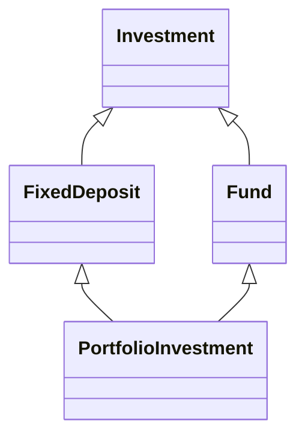

# 面向对象的特性

> [!Note]
>
> 你有一万元的压岁钱要进行投资，可以存定期，也可以购买基金、股票和债券，或者进行混合投资。设计一个计算器来计算你投资和收益。

定义一个类用来保存本金和投资年限

```python
class Investment:
    def __init__(self, principal, years):
        self.principal = principal
        self.years = years

    def show_info(self):
        print(f'本金：{self.principal}元，年限：{self.years}')

inv = Investment(10000, 3)
inv.show_info()
```

## 继承

投资方式：定期存款、基金、股票和债券都是在本金基础上计算利息。我们可以分别创建类，来计算收益，可以拓展`Investment`只添加计算收益的功能。

### 继承的概念

继承是面向对象编程中的一个基本特性，它允许一个类（子类）基于另一个类（父类）来构建，从而获得父类的属性和方法，并可以添加新的功能或修改现有功能。父类也被称为基类或超类。

定义一个定期存款类继承`Investment`，用于计算定期存款的收益。

```python
class FixedDeposit(Investment):
    def __init__(self, principal, years):
        super().__init__(principal, years)
```

类的继承关系图如下：


子类继承了父类的属性和方法，定义子类的实例，可以调用父类的属性和方法。

```python
fixed = FixedDeposit(10000, 3)
fixed.show_info()
```

`super()`是一个特殊的函数，通过它可以在子类中调用父类的方法。通过调用父类的初始化方法，完成了属性的继承。

```python
class FixedDeposit(Investment):
    def __init__(self, principal, years):
        pass

fixed = FixedDeposit(10000, 3)
print(f'fixed.principal = {fixed.principal}')
```

* 上面代码会报错，`principal`属性没有继承。

`__mro__`是Python中类的一个属性，用于查看类的继承顺序。

```python
print(FixedDeposit.__mro__)
```

上面的继承顺序如下

```shell
(<class '__main__.FixedDeposit'>, <class '__main__.Investment'>, <class 'object'>)
```

其中`object`类是Python语言中的默认继承类，成为顶级类。

> [!warning]
>
> Python中继承的层次可以无限延展，但是常用的架构设计通常建议类的继承层次不要超过3-4层（不包括object类）。

上面`Investment`的定义等价于下面的写法

```python
class Investment(object):
    def __init__(self, principal, years):
        self.principal = principal
        self.years = years

    def show_info(self):
        print(f'本金：{self.principal}元，年限：{self.years}')
```

* 上面的类称为新式类，没有`object`称为经典类。
* Ptyhon2中有经典类和新式类的区别，Ptyhon3中这种差异已取消。

### 子类的属性和方法

当子类继承父类后可以给子类添加新的属性和方法。

```python
class FixedDeposit(Investment):
    def __init__(self, principal, years, rate):
        super().__init__(principal, years)
        self.rate = rate

    def calculate_return(self):
        # 复利计算：本金 * (1 + 利率)^年限
        total = self.principal * (1 + self.rate) ** self.years
        profit = total - self.principal
        return total, profit

fixed = FixedDeposit(10000, 3, 0.05)
total, profit = fixed.calculate_return()
print(f'总金额：{total:.2f}元，利润：{profit:.2f}元')
```

* 给定期类添加利率和收益计算。

### 重写方法和属性

子类和父类具有同名属性和方法，默认使用子类的同名属性和方法。

```python
class FixedDeposit(Investment):
    def __init__(self, principal, years, rate):
        super().__init__(principal, years)
        self.rate = rate

    def show_info(self):
        print(f'本金：{self.principal}元，年限：{self.years}，利率：{self.rate}')
        
fixed = FixedDeposit(10000, 3, 0.05)
fixed.show_info()
```

> [!attention]
>
> 重写父类的属性和方法时，必须保证方法名和参数一致，否则会报错。

```python
class FixedDeposit(Investment):
    def __init__(self, principal, years, rate):
        super().__init__(principal, years)
        self.rate = rate

    def show_info(self, name):
        print(f'{name}-本金：{self.principal}元，年限：{self.years}，利率：{self.rate}')

fixed = FixedDeposit(10000, 3, 0.05)
fixed.show_info()
```

### 多继承

可以定义多个子类来继承相同的父类，这里定义一个基金类，用于基金的投资计算。

```python
class Fund(Investment):
    def __init__(self, principal, years, management_fee, expected_return):
        super().__init__(principal, years)
        self.management_fee = management_fee   
        self.expected_return = expected_return 
    
    def calculate_return(self):
        net_return = self.expected_return - self.management_fee
        total = self.principal * (1 + net_return) ** self.years
        profit = total - self.principal
        return total, profit
    
    def show_info(self):
        print(f'本金：{self.principal}元，年限：{self.years}，管理费率：{self.management_fee*100:.2f}%，预期收益：{self.expected_return*100:.2f}%')
        
fund = Fund(10000, 3, 0.005, 0.08)
fund.show_info()
total, profit = fund.calculate_return()
print(f'总金额：{total:.2f}元，利润：{profit:.2f}元')
```

定义一个组合投资类，继承

```python
class HybridCar(ElectricCar, GasCar):
    def __init__(self, make, model, year):
        super().__init__(make, model, year)
        self.battery_size = 30
        self.gas = 40
        
my_car = HybridCar('Li', 'L7', 2023)
my_car.describe_battery()
my_car.describe_gas()
```

上述类的关系图。



在多继承中会调用`super().__init__()`函数会按照继承链从后向前的顺着执行，后执行的初始化值会覆盖之前的值。

```python
class Car:
    def __init__(self):
        print('Car __init__')
        
class ElectricCar(Car):
    def __init__(self):
        super().__init__()
        print('ElectricCar __init__')
        
class GasCar(Car):
    def __init__(self):
        super().__init__()
        print('GasCar __init__')
        
class HybridCar(ElectricCar, GasCar):
    def __init__(self):
        super().__init__()
        print('HybridCar __init__')
        
print(HybridCar.__mro__)
```

> [!warning]
>
> 尽管 Python 支持多重继承，但在实际项目中使用多重继承要谨慎。

### 私有的继承

> 类似C++和Java语言都有保护的属性和方法，Python语法中不支持保护属性和方法。

## 多态

多态是一种使用对象的方式，子类重写父类方法，调用不同子类对象的相同父类方法，可以产生不同的执行结果

实现步骤：

1. 定义父类，并提供公共方法。
2. 定义子类，并重写父类方法。
3. 传递子类对象给调用者，可以看到不同子类，执行效果不同。

```python
class Car:
    def run(self):
        pass
    
class ElectricCar(Car):
    def run(self):
        print('Electric car is running silently.')
        
class GasCar(Car):
    def run(self):
        print('Gas car is running fast.')
        
class Driver:
    def __init__(self, car):
        self.car = car

    def drive(self):
        self.car.run()
        
tesla = ElectricCar()
audi = GasCar()
driver = Driver(tesla)
driver.drive()
driver = Driver(audi)
driver.drive()
```

上述多态的关系图如下：


> [!warning]
>
> 由于Python语言是动态语言，定义变量时不需要指定类型，所以Python的多态特性不明显。

`isinstance`函数用于判断某个实例是否属于某个类，子类的实例也属于父类。

```python
print(isinstance(tesla, ElectricCar))
print(isinstance(tesla, Car))
print(isinstance(tesla, GasCar))
print(isinstance(tesla, object))
```

## 面向对象的三大特性


### `__new__`

`__new__` 是一种负责创建类实例的方法，方法默认返回实例对象，该方法是类方法。

```python
class TodoList:
    def __new__(cls, *args, **kwargs):
        print('1. 创建实例__new__')
        return super().__new__(cls)

    def __init__(self):
        print('2. 初始化实例__init__')
        self.items = []

todo_list = TodoList()
```

创建实例的完整过程：

1. 调用`__new__`创建一个实例，并返回该实例。
2. `super().__new__(cls)`表示调用
3. 调用`__init__`初始化实例中的属性。

> [!warning]


### 单例模式

类属性的应用，全局设计一个App配置工具。

```python
class AppConfig:
    _instance = None

    def __new__(cls):
        if cls._instance is None:
            inst = super().__new__(cls)
            cls._instance = inst
        return cls._instance

c1 = AppConfig()
c2 = AppConfig()
print(c1 is c2)
```

> [!warning]
>
> python通常使用`_xxx`来表示只在类内使用，不再类外使用的属性和方法，这是一种约定俗成写法，不受语法支持。
