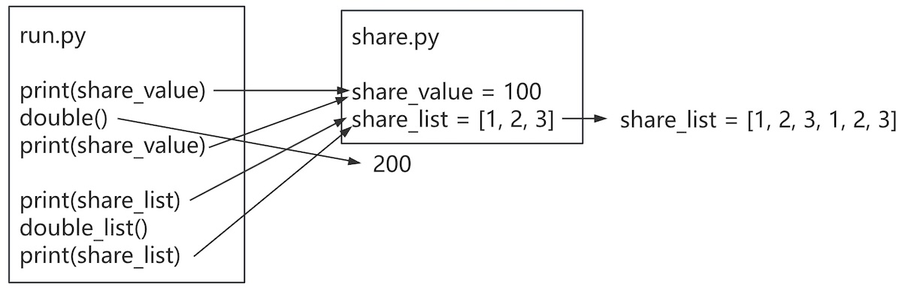

# 模块和包

一个Python文件可以看做一个模块，模块能定义函数，类和变量。

## 模块的使用

### 导入模块

1. 使用`import`导入整个模块。

```python
import math
print(math.sqrt(9))
```

2. 使用` from import`导入单个类、多个类或函数。

```python
from math import sqrt
print(sqrt(9))

from math import sin, fabs
print(sin(3.14159 / 2))
print(fabs(-3))
```

3. 使用`from import *`导入所有函数和类。

```python
from math import *
print(sqrt(9))
```

4. 使用`as`指定别名

```python
# 模块别名
import math as m
print(m.sqrt(9))

# 功能别名
from math import sqrt as sq
print(sq(9))
```

### 自定义模块

在Python中，每个Python文件都可以作为一个模块，模块的名字就是文件的名字。

> [!warning]
>
> 自定义模块名必须要符合标识符命名规则。

1. 创建`todoitem.py`文件，将`TodoItem`类复制到文件中。
2. 创建`todolist.py`文件
   1. 在文件中导入`TodoItem`，如：`from todoitem import TodoItem`。
   2. 将`TodoList`类复制到文件中。

3. 创建`main`，作为入口文件
   1. 在文件中导入`TodoList`，如：`from todolist import TodoList`。
   2. 在入口函数中执行启动程序。


### `__name__`

> [!think]
>
> 如果定义一个类后，如何测试这个类功能是否正确？

Python中，`__name__`是一个特殊变量，用于确定一个模块（文件）是作为主程序运行还是被导入到其他模块中。

```python
print(f'todoitem.py is {__name__}')
```

只有主程序的`__name__`值为`__main__`，被导入文件的`__name__`与文件名相同。在模块中添加测试模块

```python
if __name__ == '__main__':
    item = TodoItem('学习Python')
    print(item)
```

### 模块定位顺序

使用`sys.path`可以打印Python解析器的搜索路径

```python
import sys

print(type(sys.path))
print(sys.path)
```

导入模块时，Python解析器对模块位置的搜索顺序是：

1. 当前目录。
2. 环境变量的配置目录。
3. Python安装默认路径（Linux 系统，默认路径一般为/usr/local/lib/python/）

> [!alert]
>
> 1. 自己的文件名不要和已有模块名重复，否则导致模块功能无法使用。
> 2. 如果使用`from import`或`from import *`导入多个模块的时候，且模块内有同名功能。当调用这个同名功能的时候，调用到的是后面导入的模块的功能。

从上面的打印可以看出`sys.path`实际上是一个数组

* 通过数组操作可以增加和删除程序的搜索路径。
* 控制路径添加的位置可以，控制解释器在搜索模块时的先后顺序。

```python
import sys

print(sys.path)
sys.path.insert(0, '/')
print(sys.path)
sys.path.remove('/')
print(sys.path)
```

### `__all__`

`__all__`是一个模块级变量，是一个列表，定义在 Python 模块中，用于控制从模块导入时的行为。

```python
__all__ = ['TodoItem']
```

只有当使用`from import *`时，仅仅导入`__all__`中列出的名字。

### 模块重新导入

定义模块`myreload`，并定义如下函数

```python
def hello():
    print("hello world")
```

使用交互方式执行程序

```python
import myreload

myreload.hello()
```

修改`myreload`的代码，再次执行

```python
myreload.hello()
```

如果想动态调用修改后的函数

```python
from imp import reload

reload(myreload)
```

再次调用函数，可以动态调用修改后的函数

```python
myreload.hello()
```

> [!warning]
>
> 只有用`import xxx`模块才能使用`reload`，如果使用`from xxx import yyy`方式无法使用`reload`函数。

### 模块的共享数据

定义`share.py`模块，模块中定义两个变量

```python
share_value = 100
share_list = [1, 2, 3]
```

定义`double.py`模块，在模块中定义两个函数

```python
import share

def double():
    share.share_value *= 2

def double_list():
    share.share_list *= 2
```

在`run.py`模块，执行函数

```python
from double import double, double_list
from share import share_value, share_list

print(share_value)
double()
print(share_value)

print(share_list)
double_list()
print(share_list)
```



## 包的使用

Python中的包就是包含多个模块文件的文件夹，并且在这个文件夹有一个`__init__.py`文件。

### 定义包文件

将话费通知类，转换为包的形式。

1. 创建文件夹note，并添加`__init__.py`文件，转换成包文件。
2. 在包中创建不同的模块
   * 创建`base.py`文件，用于保存`Notification`基类。
   * 创建`email.py`文件，保存`EmailNotification`类，在模块中导入`from .base import Notification`。注意：同一个包内导入模块时需要加`.`。
   * 创建`sms.py`文件，保存`SmsNotification`类。
   * 创建`wx.py`文件，保存`WXNotification`类。
   * 创建`serve.py`文件，保存`NotificationService`类。

### 导入包中的文件

1. 导入指定的函数或类

```python
from note.email import EmailNotification

email_note = EmailNotification('张三', 100, 84, 'zs@example.com')
email_note.send()
```

2. 导入指定模块

导入方式一

```python
import note.sms

sms_note = note.sms.SmsNotification('张三', 100, 84, '13800001234')
sms_note.send()
```

导入方式二

```python
from note import wx

wx_note = wx.WXNotification('张三', 100, 84, 'zs-wx')
wx_note.send()
```

3. 导入全部模块

在`__init__.py`文件中添加`__all__ = []`，控制允许导入的模块列表。

```python
__all__ = ['email', 'sms', 'wx', 'serve']
```

导入全部模块

```python
from note import email, sms, wx, serve

email_note = email.EmailNotification('张三', 100, 84, 'zs@example.com')
sms_note = sms.SmsNotification('张三', 100, 84, '13800001234')
wx_note = wx.WXNotification('张三', 100, 84, 'zs-wx')

service = serve.NotificationService()
service.add_notification(email_note)
service.add_notification(sms_note)
service.add_notification(wx_note)

service.send_all()
```

使用`*`代替全面模块

```python
from note import *
```

如果在`__init__.py`文件中没有`__all__`，无法使用`*`导入全部模块。