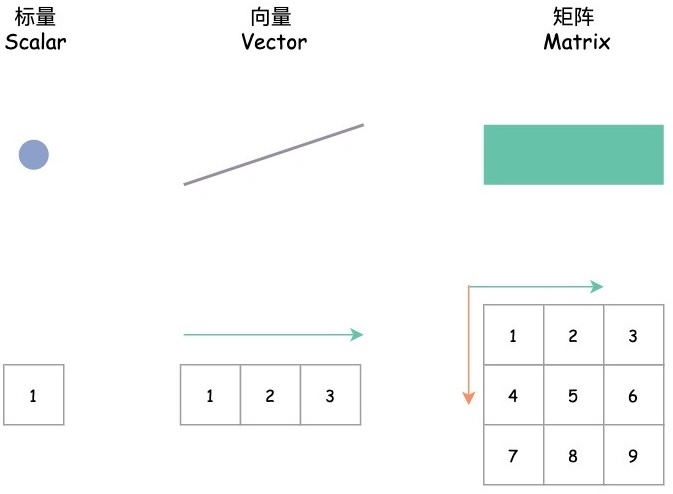
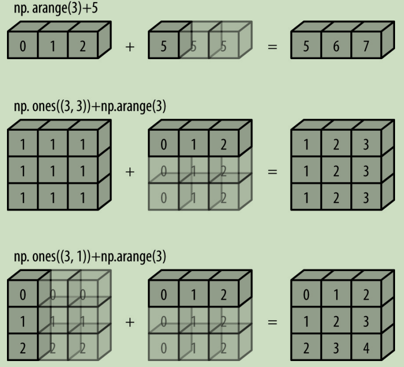

# Numpy

[Numpy](https://numpy.org/)是一个开源的Python科学计算库，用于矩阵运算。

* Numpy支持常见的数组和矩阵操作。
* Numpy支持数值计算任务。



> [!important]
>
> 高维的张量和矩阵之间是可以相互转换的，而张量的计算是以矩阵的计算为基础。

安装Numpy

```shell
pip install numpy
```

## Numpy的数据结构

查看Numpy的安装版本

```python
import numpy
numpy.__version__
```

Python中的标准可变多元素容器是列表，Python的列表可以保存不同类型的数据。

```python
l = [i for i in range(10)]
print(l)

l[5] = 100
print(l)

l[5] = 'learning numpy'
print(l)
```

> [!warning]
>
> Python数组的灵活性是以牺牲效率为代价的，包括存储效率和计算效率。

Python中自带存储固定类型的数据。

```python
import array
arr = array.array('i', [i for i in range(10)])
print(arr)

arr[5] = 100
print(arr)

arr[5] = 'learning numpy'
```

> [!warning]
>
> 数组中只保存相同类型的数据可以提高存储效率和操作效率。

Numpy中数组的类型为`ndarray`，可以直接根据Python的列表创建。

```python
import numpy as np

arr = np.array([i for i in range(10)])
print(arr)
print(type(arr))

arr[5] = 100
print(arr)

arr[5] = 'learning numpy'
```


* Numpy专门针对`ndarray`的操作和运算进行了设计，所以数组存取和计算性能远优于Python列表，数组越大Numpy的优势就越明显。
* Numpy内置了并行运算功能，会自动做并行计算。
* Numpy底层使用C语言编写，内部解除了GIL（全局解释器锁）。

可以通过`dtype`属性查看数组的类型。

```python
print(arr.dtype)
```

### `ndarray`的创建

除了根据列表来创建数组外，Numpy内置一些函数可以辅助数组的创建。

1. `np.zeros`创建全0数组。

```python
# 创建一个长度为10的数组，数组的值都是0。
zeros = np.zeros(10)
print(zeros)
print(zeros.dtype) # 默认的数量类型是浮点型。

zeros_two = np.zeros(10, dtype=int) # 创建整形数组。
print(zeros_two)
print(zeros_two.dtype)
```

`np.zeros_like`根据已有形状构造数据。

```python
a = [1, 2, 3]
arr = np.zeros_like(a)
print(arr)
```

2. `np.ones`创建全1数组。

```python
# 创建一个3×5的浮点型数组，数组的值都是1。
ones = np.ones(shape=(3, 5), dtype=float)
print(ones)
```

`np.ones_like` 根据已有形状构造数据。

```python
a = [[1, 2, 3], [4, 5, 6]]
arr = np.ones_like(a)
print(arr)
```

> [!important]
>
> `ndarray`是Numpy的数组类型，习惯统称为数组，但其支持多个维度：
>
> * 行向量或列向量在Numpy中，可以用一维数组表示。
> * 矩阵在Numpy中，可以用二维数组表示。

Numpy中其他创建数据的方法

* `np.full`用特定值填充数组。
* `np.arange`用于生成一个一维数组，类似于Python内置的`range`函数。
* `np.linspace`用于生成指定间隔内的等间距数值序列。
* `np.array(a, dtype)`和`np.asarray(a, dtype)`从现有数组生成，`a`可以是python数组或ndarry数据。
* `np.random`生成随机数据模块
  * `np.random.randint`生成正数随机数（均匀分布）。
  * `np.random.seed`指定随机种子，是随机数生成的值相同。
  * `np.random.random`生成[0, 1)之间均匀分布的随机数。该函数不能修改随机范围。
  * `np.random.normal`生成正太分布的数组。

### `ndarray`的类型

Numpy数组包含同一类型的值，使用`dtype`属性可以查看数据类型，Numpy支持的常用数据类型如下表。

|  数据类型  |                            描述                            | 简写  |
| :--------: | :--------------------------------------------------------: | ----- |
|  `bool_`   |       布尔值（真、True 或假、False），用一个字节存储       | 'b'   |
|   `int_`   | 默认整型（类似于C语言中的long，通常情况下是int64或int32）  | 'i8'  |
|  `int64`   | 整型（范围从 –9223372036854775808 到 9223372036854775807） | 'i8'  |
|  `uint8`   |               无符号整型（范围从 0 到 255）                | 'u'   |
|  `uint16`  |              无符号整型（范围从 0 到 65535）               | 'u2'  |
|  `float_`  |                     float64 的简化形式                     | 'f8'  |
| `float64`  |   双精度浮点型：符号比特位，11 比特位指数，52 比特位尾数   | 'f8'  |
| `complex_` |                复数，由两个 64 位浮点数表示                | 'c16' |
| `object_`  |                         python对象                         | 'O'   |
| `string_`  |                           字符串                           | 'S'   |

[`dtype`完整的数据类型](https://www.runoob.com/numpy/numpy-dtype.html)

> [!warning]
>
> 如果Numpy中保存了`object_`数据类型，本质上和Python的`list`数据没有区别，保存的是对象的地址。

查看`ndarray`中的数据类型，数据类型一旦确定不同类型的数据会进行隐式数据转换。

```python
arr = np.arange(10)
print(arr)
print(arr.dtype)

# 强制转换为整形
arr[5] = 3.14
print(arr)
print(arr.dtype)

# 创建浮点数据类型。
arr2 = np.array([1, 2, 3.14])
print(arr2.dtype)
```

### Numpy的基本属性

数组属性反映了数组本身固有的信息，常用的属性如下表：

| 属性名字 |     属性解释     |
| :------: | :--------------: |
| `shape`  |  数组维度的元组  |
|  `ndim`  |     数组维数     |
|  `size`  | 数组中的元素数量 |
| `dtype`  |  数组元素的类型  |

```python
x = np.arange(15).reshape(3, 5)
y = np.arange(10)
print(x)
print(y)

# 数组的维度
print(x.ndim)
print(y.ndim)

# 数组的形状
print(x.shape)
print(y.shape)

# 数组中的元素数量
print(x.size)
print(y.size)
```

> [!warning]
>
> Numpy中的数据在内存中都是一维连续存储的，`shape`属性只是标注数据的形状。

## 数据操作

### 修改形状

使用`reshape`函数可以修改数组的形状。

```python
x = np.arange(10)
print(x.ndim)

w = x.reshape(2, 5)
print(w.ndim)

w = x.reshape(10, -1) # -1会根据数据数量和行数自动计算合适的列数。
print(w)
```

### 数据访问

使用索引访问数据

```python
x = np.arange(15).reshape(3, 5)
y = np.arange(10)
print(x)
print(y)

# 访问一维数组
print(y[0])
print(y[-1])

# 访问二维数组
print(x[2, 2]) # 使用元组访问，等价于x[(2, 2)]，推荐
```

### 数组的切片

1. 对于一维数组数组切片操作和Python的列表相同。

```python
print(y[0:5])
print(y[:5])
print(y[5:])
print(y[::2])
print(y[::-1])
```

2. 二维数组的切片操作。

```python
print(x[:2, :3]) # 前两行前三列。
print(x[:2, ::2])

# 读取第一行
print(x[0])
print(x[0, :])

# 读取第一列
col = x[:, 0]
print(col.ndim)
print(col.shape)
```

> [!warning]
>
> 对列数据进行切片，切片后数组的形状为`(length,)`，切片后的数据都会以行向量存储。

### 视图

视图（View）是 NumPy 中非常重要的概念，它指的是与原始数组共享底层数据内存的新数组对象。

```python
sub_x = x[:2, :3]
print(x)
print(sub_x)

sub_x[0, 0] = 100
print(x)
print(sub_x)
```

> [!important]
>
> 常见的视图操作：基本切片、转置（Transpose）、改变数组形状`reshape`和**部分情况下的数据类型转换**。

数据拷贝

```python
sub_x = x[:2, :3].copy()
sub_x[0, 0] = 100
print(x)
print(sub_x)
```

数据分割

* `split`函数可以对数组进行分割。数据分割也是视图操作。
* `vsplit`在垂直方向进行分割，`hsplit`在水平方向上进行分割。

### 数组合并

`concatenate`可以用于数组间的链接

```python
x = np.array([1, 2, 3])
y = np.array([3, 2, 1])
print(x)
print(y)
print(np.concatenate([x, y]))

a = np.array([[1, 2, 3], [4, 5, 6]])
print(np.concatenate([a, a]))  # 垂直方向进行拼接
print(np.concatenate([a, a], axis=1)) # 水平方向进行拼接

np.concatenate([a, y]) # 向量和矩阵不能直接拼接
w = np.concatenate([a, y.reshape(1, -1)]) # 需要修改y的形状
print(w)
```

* 向量和矩阵不能直接拼接，序号修改向量的形状。

> [!important]
>
> `concatenate`合并后的数组不是视图，是将数据复制后生成新的数组。

```python
w[0, 0] = 100
print(w)
print(a)
```

> [!important]
>
> 判断操作是不是引用操作主要看操作结果是否是原数组的**连续子集**，如果是**连续子集**一般为创建视图，如果不是一般为创建数据副本。

其他拼接操作：

* `vstack`将数组在垂直方向拼接。
* `hstack`将数组在水平方向进行合并。
* 这两个方法支持，矩阵和向量间的操作，但要求数据对齐。

## Numpy的运算

### 通用函数

> [!tip]
>
> 给定一个向量长度为一百万，让向量中每个数都乘以2。

Python语言自身的处理方法

```python
n = 1000000
l = [i for i in range(n)]

# 使用for循环处理，并计时
%%time
double = []
for i in l:
    double.append(2 * i)
print(f"列表长度: {len(double)}")
print("前10个元素:", double[:10])  
    
# 使用列表生成式
%%time
double = [2 * i for i in l]
print(f"列表长度: {len(double)}")
print("前10个元素:", double[:10]) 
```

使用Numpy的处理方法

```python
l = np.arange(n)

%%time
double = np.array(2 * i for i in l)

%%time
double = 2 * l # Numpy支持向量与常数的运算操作
print(double[:10])
```

Numpy中将数组作为向量和矩阵进行运算称为通用函数（Universal Function），通用函数的主要目的是对NumPy数组中的值执行更快的重复操作。通用函数常见的运算符操作包括：`+`、`-`、`*`、`/`、`%`等。

```python
x = np.arange(1, 16).reshape(3, 5)

print(x)
print(x + 1)
```

> [!warning]
>
> 这里虽然使用的数学符号，但是调用的是Numpy的函数，Numpy重写了这些符号的操作函数，方便程序员使用。[符号操作重写的方法](附录.md)

通用函数常见的[数学函数](https://numpy.org/doc/stable/reference/routines.math.html)

```python
print(x)
print(np.sin(x))
```

### 广播机制

NumPy的广播（Broadcasting）机制是一种让不同形状的数组进行算术运算的规则。它允许NumPy在执行元素级运算时，自动将较小的数组“扩展”到与较大数组兼容的形状，而无需实际复制数据。



> [!caution]
>
> 如果两个数组的形状在任何一个维度上都不匹配，并且没有任何一个维度等于 1，那么会引发异常。

```python
a = np.ones((3, 4))
b = np.ones((3, 5))  # 第二维：4≠5，且都不是1
# 抛出异常，操作数不能广播，形状 (3,4) (3,5)
```

### 矩阵运算

Numpy中矩阵间运算符的操作，相当于矩阵对应位置元素的运算。

```python
a = np.arange(4).reshape(2, 2)
b = np.full((2, 2), 10)

print(a)
print(b)
print(a + b)
```

数学定义的矩阵运算

```python
print(a)
print(b)
print(a.dot(b)) # 矩阵乘法

print(a)
print(a.T) # 矩阵的转置
```

矩阵求逆。计算函数在`np.linalg`为Numpy线性代数工具包。

```python
inv_a = np.linalg.inv(a)
print(a)
print(inv_a)

print(a.dot(inv_a))
```

* 除此之外矩阵的数学运算还包括：伪逆矩阵、求内积、求范数等，可以查阅Numpy手册。

### 向量和矩阵间的运算

向量和矩阵运算时，需要满足两种情况

1. 两个数组的形状是否满足广播条件。
2. 两个数组的形状是否满足数学运算条件。

```python
v = np.array([1, 2])
print(v)
print(a)
print(v + a)
```

### 聚合运算

Numpy中的聚合函数用于计算数组的统计值等，Numpy中的聚合函数可以直接作用于数组。

```python
big_array = np.random.random(1000000)
%time sum(big_array)
%time np.sum(big_array)
```

Numpy常用的聚合函数包括：`min`、`max`、`mean`、`median`等，可以在数学函数手册中查阅。

> [!warning]
>
> 部分聚合函数可以分别在水平或垂直方向上单独操作。

`arg`函数：用于获得聚合值的索引

```python
x = np.random.normal(0, 1, size=1000000)
print(f'min value index is {np.argmin(x)}') # 获得最小值位置索引
print(f'max value index is {np.argmax(x)}') # 获得最大值位置索引
```

### 数组排序

数组排序

```python
x = np.arange(16)
np.random.shuffle(x) # 将数组打乱
print(x)

z = np.sort(x) # 排序后返回新数组，x顺序不变
print(z)

print(np.argsort(x)) # 返回排序后数字的索引值，对矩阵同样成立
```

* 矩阵排序也可以按照水平和垂直的方向进行排序。

### 高级索引

高级索引（Fancy Indexing，或称：花式索引）传递一个索引数组来一次性获得多个数组元素。

向量的索引

```python
x = np.arange(16)
print(x)

# 指定特定元素的索引
index = [3, 5, 8]
print(x[index])

# 根据原数组索引生成二维矩阵
index = np.array([[0, 2], [1, 3]])
print(x[index])
```

> [!warning]
>
> 高级索引操作返回的都是独立的副本，而不是视图。

矩阵的索引

```python
w = x.reshape(4, -1)

row = np.array([0, 1, 2])
col = np.array([1, 2, 3])
print(w[row, col])

print(w[0, col])
print(w[:2, col])
```

布尔索引

```python
col = [True, False, True, True]
print(w[1:3, col])
```

> [!important]
>
> 使用布尔数组（掩码）从原数组中筛选元素的操作，常被称为“布尔索引”或“掩码索引”。掩码的形状与原数组相同或满足广播机制。

### 布尔运算

与通用运算类似，得到一个全部是布尔值的数组。支持的运算主要是比较运算。

```python
x = np.arange(16)
print(x)

w = x.reshape(4, -1)
print(w < 6)
```

布尔运算的应用

```python
print(np.sum(x <= 3))  # 统计小于3数据的数量
```

* 布尔运算配合特定的函数可以完成统计功能。

与（`&`）或（`|`）非（`~`）运算

```python
print(np.sum((w > 3) & (w < 10))) # 与运算
```

布尔索引的应用

```python
print(x[x < 5]) # 索引小于5的值
```

## 练习

1. 创建一个5x5的矩阵，满足正态分布，并找到它的每行的最大值、最小值、每列的最大值、最小值和矩阵的最大值、最小值。
2. 创建一个5x5x5的张量，其中每行的数值范围从0到4。
3. 创建一个5x5的矩阵，满足正态分布，并在其内部随机防止5个0、5个1。
4. 创建一个5x5的矩阵，满足正态分布，每行减去，每一行的平均值。


