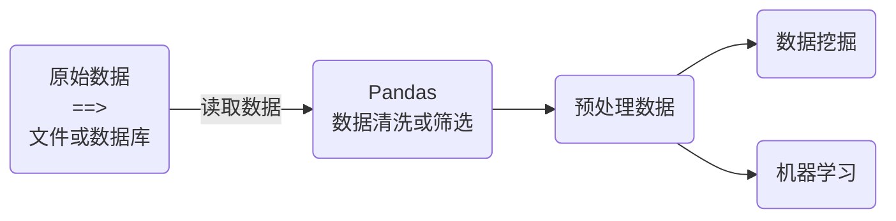

# Pandas

[Pandas](https://pandas.pydata.org/)是在Numpy和Matplotlib基础上建立的数据处理库，主要用于数据分析和数据清理等相关任务，包括电子表格或数据库表等。安装Pandas

```shell
pip install pandas
```



表格数据与Numpy数据的区别：

* 每一列数据类型是一致的。
* 数据类型可能包括数值、字符串等多种类型。
* 有表头的概念。
* 表格数据中可能包含异常值。


在拥有16GB内存的计算机上，pandas可以轻松处理数百万行、数十个列的数据集：

* `int64`和`float64`：每个元素占8个字节。
* 内存 $ =\text{rows}\times\text{columns}\times\text{bytes}=1,000,000\times10\times8=80\text{MB}$​

[Pandas学习网站](https://www.geeksforgeeks.org/pandas-tutorial/?ref=outind)

## Pandas数据结构

Pandas中一共有三种数据结构，分别为：Series、DataFrame和Panel。

* Series是一维数据结构，
* DataFrame是二维数据结构。
* Panel是三维数据结构。

> [!warning]
>
> Panel数据结构很少使用，通常使用其他方式替代这种数据结构。

### DataFrame数据结构

创建一个DataFrame的数据结构

```python
import pandas as pd

# 从网络读取数据
players = pd.read_csv("https://media.geeksforgeeks.org/wp-content/uploads/nba.csv")  
print(type(players))
```

DataFrame是一个类似于表格的数据结构，可以保存任何类型数据（比如整数、字符串、浮点数等）。

* 有`index`行索引对应的轴为0，`columns`列索对应的轴为1。
* 如果没有传入索引参数，则默认会自动创建一个从0-N的整数索引。

DataFrame的基本属性

* Numpy的属性`shape`、`dtypes`、`ndim`
* DataFrame属性：
  * 获得索引`index`、`columns`
  * `values`获得数据矩阵，返回数据类型是Numpy数组。
  * `T`对DataFrame数据进行转置。

```python
print(players.shape)
print(players.index)
print(players.columns)
print(type(players.values))
print(players.values)
players.T
```

DataFrame的整体查询`head()`和`tail`可以查询头部和尾部的数据，默认是5条数据。

```python
players.head()
players.tail(10)
```

#### DataFrame的索引

索引包含`index`和`columns`用于数据查询，可以看作是一个**不可变数组**或有序集合，为任意类型数据。

```python
print(type(players.index))
print(type(players.columns))
```

1. 修改行列索引值。

> [!attention]
>
> DataFrame修改`index`或`columns`的操作，不能修改单个值，只能整体全部修改。

```python
print(players.index[0])
players.index[0] = 'Avery Bradley' # 报错不能修改单个值

index = players.index.tolist() # 将index转换为list
index[0] = 'Avery Bradley'
players.index = index
players
```

2. `index`的设置与重置。设置与重置的操作只针对`index`，`columns`没有该操作。`set_index`可以将某一列数据设置为索引。同时可以设置多重索引。

```python
players_new = players.set_index('Name') # 将球员的名字设置为索引
players_new

players_new = players.set_index(['Name', 'Team'])
players_new
```

> [!warning]
>
> 设置多个索引的操作将数据变为了基于MutiIndex的DataFrame数据结构。

`reset_index`将原来的索引删除或变为一列数据。

```python
players = players_new.reset_index() # 将原来索引变为一列数据
players

temp = players_new.reset_index(drop=True) # 删除原来索引
temp
```

### Series

Series是一维标记数组，只有行索引没有列索引，够保存任何类型的数据。从DataFrame中获取一个Series数据

```python
players = data.set_index('Name')
salary = players['Salary']

print(type(salary))
print(salary.index)
print(salary.columns)
```

Series数据类型中没有`columns`属性

```python
print(salary.columns)
```

### 创建数据

#### 创建Series数据

`pd.Series(data, index=index)`

* `data`：传入的数据，参数支持多种数据类型，包括ndarray、list、dict等。
* `index`：可选参数，与数据的长度相等，默认会自动创建一个从0-N的整数索引。

```python
pd.Series([2, 4, 6])
pd.Series(5, index=[100, 200, 300])
pd.Series(np.arange(10))
population_dict = {
    'California': 38332521,
    'Texas': 26448193,
    'New York': 19651127,
    'Florida': 19552860,
    'Illinois': 12882135
}
population = pd.Series(population_dict)
```

#### 创建DataFrame数据

`pd.DataFrame(data, index=index, columns=index)`，`data`支持多种数据类型，`indes`和`columns`为可选参数。

```python
# 通过单个Series对象创建
pd.DataFrame(population, columns=['population'])

# 通过字典列表创建
data = [{'a': i, 'b': 2 * i} for i in range(3)]
pd.DataFrame(data)

# 通过Series对象字典创建。
area_dict = {
    'California': 423967, 
    'Texas': 695662, 
    'New York': 141297,
    'Florida': 170312, 
    'Illinois': 149995
}
area = pd.Series(area_dict)
pd.DataFrame({'population': population, 'area': area})

# 通过NumPy二维数组创建。
pd.DataFrame(np.random.rand(3, 2), columns=['foo', 'bar'], index=['a', 'b', 'c'])
```

## 数据读取与修改

### 读取数据

DataFramed数据有三种获取方式

1. 直接使用行列索引，直接索引支持切片操作。

```python
import pandas as pd

data = pd.read_csv("https://media.geeksforgeeks.org/wp-content/uploads/nba.csv")  
players = data.set_index('Name')

players['Salary'] # 获取一列数据，返回Series数据类型
players[['Salary', 'Team', 'Number']] # 获取多列数据，返回DataFramed数据类型
players['Salary']['Avery Bradley']

players['Avery Bradley'] # 直接获取一行数据报错

players['Salary'][0:6]
players[0:3][0:6]
```

> [!attention]
>
> 索引方式为先列后行（与Numpy相反），直接索引不支持Numpy类似的操作。

```python
# 下列操作报错
players[2, 2]
players[0:2, 1:3]
```

2. 结合`loc`和`iloc`使用索引，可以先行后列进行索引，支持切片操作。

* `loc`通过名字取值。

```python
players.loc['Avery Bradley', 'Salary']
players.loc['Avery Bradley': 'R.J. Hunter']
players.loc['Avery Bradley': 'R.J. Hunter', ['Salary', 'Team', 'Number']]
```

* `iloc`通过下标进行取值（与Numpy用法相似）。

```python
players.iloc[0, 0]
players.iloc[0: 10, 0:2]
```

3. 混合索引，`loc`、`iloc`和直接索引。

```python
# 使用loc和iloc混合索引数据
players.iloc[0: 10].loc[:, ['Salary', 'Team', 'Number']]

# iloc和直接索引
players.iloc[0: 10]['Salary']
players.iloc[0: 10][['Salary', 'Team', 'Number']]

# 注意：只获取前两行数据不会获取前十行前两列数据
players.iloc[0: 10][0:2]
```

> [!attention]
>
> 老版本中存在`ix`索引，在新版本中已经弃用。

Series数据读取与DataFramed类似也支持`loc`和`iloc`

> [!warning]
>
> 可以把Series对象看成一种特殊的Python字典。

```python
salary = players['Salary']
salary['Avery Bradley']

salary.iloc[10]
salary.iloc[0:5]
```

### 修改数据

修改单个数据应该使用`loc`和`iloc`方法，使用直接索引会产生警告。

```python
players.loc['Avery Bradley', 'Salary'] = 1000
```

修改一列数据可以使用索引

```python
players['Salary'] = 100
players.Salary = 1000
```

### 数据排序

排序有两种形式，一种对于索引进行排序，一种对于内容进行排序，默认值都是从小到大。

1. 使用`sort_values`，可以对单个键或多个键进行排序。

```python
players.sort_values(by='Age')
players.sort_values(by='Age', ascending=False)

# 对多个字段排序传入列表
players.sort_values(by=['Age', 'Weight'], ascending=False) # 降序
```

2. 使用`sort_index`给索引排序。

```python
players.sort_index()
players.sort_index(ascending=False) 
```

## Pandas的运算

### 统计运算

`describe`综合分析，能够自动得出多统计结果，包括count、mean、std、min、max等，count表示数据量（数据行数）

```python
import pandas as pd

data = pd.read_csv("https://media.geeksforgeeks.org/wp-content/uploads/nba.csv")
players = data.set_index('Name')

players.describe()
```

使用单个函数进行统计时，可以设置统计的坐标轴，还是按照默认列统计`axis=0`，如果要对行操作`axis=1`。

1. 常见统计指标：`max`最大值、`var`方差、`std`标准差、`median`中位数。

```python
players.max() # 使用函数，当数据中有字符串时会报错

# DataFrame数据统计
players[['Age', 'Weight', 'Salary']].max() 

# Series数据统计
players['Salary'].max() 

# 统计每一行的最大值，由于数据尺度不同，本组数据中每一行的最大值都是Salary
players[['Age', 'Weight', 'Salary']].max(1) 
```

2. 查找最大值的位置：`idxmax`最大值的位置，`idxmin`最小值的位置

```python
players['Salary'].idxmax()
```

[Series的相关函数](https://pandas.pydata.org/docs/reference/series.html)和[DataFrame的相关函数](https://pandas.pydata.org/docs/reference/frame.html)

### 逻辑运算

逻辑运算主要用于数据的筛选。

1. 使用比较运算符号进行筛选，包括`>`、`<`等。

```python
players['Age'] > 25 # 返回Series数据类型，存储数据为标记数组。

# 将年龄大于25的数据筛选出来，类似与Numpy中的布尔数组索引。
players[players['Age'] > 25] 
```

2. 使用`|`和`&`完成符号逻辑。

```python
# 筛选年龄在[25, 30]之间的数据
players[(players['Age'] <= 30) & (players['Age'] >= 25)]

# 也可以统计不同列的数据
players[(players['Age'] <= 30) & (players['Weight'] >= 185)]
```

3. `query`逻辑查询语句。可以替代逻辑运算符和比较运算符进行数据筛。

```python
# 与上的结果相同，语句更简洁
players.query('Age <= 30 & Weight >= 185')

# 将Number大于Age的球员数据筛选出来
players.query('Number > Age')
```

4. `isin`判断是否存在某个值进行筛选。

```python
# Weight数据是否为185, 200, 205中的一个，返回Series的标记数组
players['Weight'].isin([185, 200, 205]) 

players[players['Weight'].isin([185, 200, 205])] # 筛选数据行

# 只有一个数据也要传入数组
players[players['Weight'].isin([185])] 
```

### 算数运算

实现加、减、乘、除等算数运算，[常见算数运算函数](https://pandas.pydata.org/docs/reference/frame.html#binary-operator-functions)

```python
salary = players['Salary']

# 两种函数运算结果相同
players['new_salary'] = salary.add(1000)
players['new_salary'] = salary + 1000
```

### 自定义运算

`apply`函数可以自定义算数运算

```python
# 自定义一个函数计算薪水的差距
players[['Salary']].apply(lambda x: x.max() - x.min())
```

## 文件读写

Pandas支持复杂的文件读写操作，同时支持多种数据格式，如：CSV、json、Sql，HDF5等。

[Pandas支持读写的文件类型](https://pandas.pydata.org/docs/user_guide/io.html#io-tools-text-csv-hdf5)

使用Pandas很少手动创建数据，都是从其他环境中读取出来进行处理。

1. CSV文件读写。CSV是一种表格文件，存储的数据格式与Excel文件类型。

`read_csv(file, usecols=None)`从CSV中读取数据

* `file`读取文件的路径。
* `usecols`指定读取数据了列数，默认全部读取。

[其他参数可以查阅文档](https://pandas.pydata.org/docs/reference/api/pandas.read_csv.html#pandas.read_csv)

```python
# 读取部分数据
short_data = pd.read_csv("https://media.geeksforgeeks.org/wp-content/uploads/nba.csv", usecols=['Name', 'Age', 'Salary', 'Weight'])
```

`to_csv(file, columns=None, header=True, index=True, mode='w')`将数据保存到文件当中。

* `file`文件保存的路径。
* `columns`保存指定的列，默认全部保存。
* `header`是否写入索引值。
* `index`是否保存行索引。
* `mode`文件读写模式。`w`重新，`a`追加。

```python
short_data = short_data.iloc[0: 5]

# 读取后的数据增加了一行
short_data.to_csv('short_data.csv') 
re_read = pd.read_csv('short_data.csv')

# 不会将索引值变成单独一列。
short_data.to_csv('short_data.csv', index=False)
re_read = pd.read_csv('short_data.csv')

# 直接追加数据追加后会多一行
short_data.to_csv('short_data.csv', index=False, mode='a')
re_read = pd.read_csv('short_data.csv')

# 不写入索引行书正常
short_data.to_csv('short_data.csv', index=False, mode='a', header=False)
re_read = pd.read_csv('short_data.csv')
```

> [!warning]
>
> `read_csv`调用的对象是Pandas库，`to_csv`调用的对象是Series和DataFramed。

2. HDF5文件读写。HDF5文件是一种二进制文件，用于存储和组织大量数据的文件格式。

`to_hdf(file, key, format=None)`保存为HDF5文件，

* `file`文件保存的路径。

* `key`必要参数，指定保存的数据页，类似与Excel中的sheet的概念。
* `format`文件保存格式，通常选择为`tabel`，否则保存时可能会报错。

```python
data = pd.read_csv("https://media.geeksforgeeks.org/wp-content/uploads/nba.csv") 

# 保存HDF5格式 key存储标识符，可以指定为任意一列，也可以指定为数据本身。
data.to_hdf('data.h5', key='sheet1', format='table')
```

`read_hdf`读取HDF5文件。读取时需要指定key

```python
data = pd.read_hdf('data.h5', 'sheet1')
```

> [!warning]
>
> 首次hdf5文件时，需要安装pytables包。

## 缺失值处理

现实工作中的数据很少是干净整齐的，即使目前流行的数据集都会有数据缺失的现象。Pandas的提供了高效的缺失值处理函数，帮助用户处理缺失值问题。

[IMDB电影数据](https://www.kaggle.com/damianpanek/sunday-eda/data)

`notnull`和`isnull`用于判断数据中是否有缺失值，两个函数均为Pandas函数。

* `notnull`数据不为缺失值返回`True`，`isnull`数据为缺失值返回`True`
* 两个函数返回数据均为标记数组。

```python
import pandas as pd
movie = pd.read_csv("IMDB-Movie-Data.csv")
print(pd.isnull(movie)) 
print(pd.notnull(movie))

# 统计每一列缺失值的数量
print(pd.isnull(movie).sum())
```

### 存在缺失值

数据中缺失值的类型为`np.nan`

1. 删除有缺失值的样本数据。

```python
clear_movie = movie.dropna()

movie.shape
clear_movie.shape
```

2. 替换缺失数据。可以填充平均值或中位数，根据每一列的统计数据填充。

使用`fillna(value, inplace=False)`函数来填充平均值。

* `value`要填充的数值。
* `inplace`是否替换原来的值，不替换会生成新一个新的列，数据类型为Series。

```python
# 使用中位数替换票房缺失值
money = movie['Revenue (Millions)']
median = money.median()
money.fillna(median, inplace=True)
movie['Revenue (Millions)'] = money
print(pd.isnull(movie).sum())


# 使用平均值替换评分确实值
score = movie['Metascore']
score.fillna(score.mean(), inplace=True)
movie['Metascore'] = score
print(pd.isnull(movie).sum())

data.replace(to_replace='?', value=np.nan) # 替换部分值
```

### 有默认标记

有缺失值，不是默认`np.nan`类型，为其他的标记或符号。不能使用`fillna`和`dropna`。

[测试数据集](https://archive.ics.uci.edu/ml/machine-learning-databases/breast-cancer-wisconsin/breast-cancer-wisconsin.data)


使用`replace(to_replace, value)`将标记替换为`np.nan`，按前面的步骤处理。

```python
import pandas as pd
url = "https://archive.ics.uci.edu/ml/machine-learning-databases/breast-cancer-wisconsin/breast-cancer-wisconsin.data"
data = pd.read_csv(url)
print(pd.isnull(data).sum())

import numpy as np
replace = data.replace(to_replace='?', value=np.nan)
print(pd.isnull(replace).sum())
```

## 数据离散化

打印体重数据的直方图

```python
import pandas as pd

data = pd.read_csv("https://media.geeksforgeeks.org/wp-content/uploads/nba.csv")
players = data.set_index('Name')
weight = players['Weight']
weight.hist()
```

自然界中的绝大多数数据都属于正太分布。

将连续的数据划分为离散区间，统计每条样本在离散区间上的属性值。

`qcut(x, q)`对数据进行自动分组，返回一维标记数组。

* `x`需要分组的数，必须是Series类型或一维数据。
* `q`分组数量，自动决定分组范围。

```python
group = pd.qcut(weight, q=9)
group.value_counts() # 统计每个分组次数
```

`cut(x, bins)`自定义分组，返回一维标记数组。

* `x`需要分组的数，必须是Series类型或一维数据。
* `bins`划分分组数据的列表。

```python
bins = [160, 180, 200, 220, 240, 260, 280, 300, 320]
cut = pd.cut(weight, bins=bins)
cut.value_counts()
```

`get_dummies(data, prefix=None)`生成one-hot编码。

* `data`要生编码的数据，必须是标记矩阵。
* `prefix`编码列前缀。


```python
pd.get_dummies(cut, prefix='weight')
```

## 数据表操作

### 数据合并

Pandas可以高效的将多张表的数据合并在一起进行数据分析。

针对球员数据的体重生成的one-hot编码。

```python
import pandas as pd

data = pd.read_csv("https://media.geeksforgeeks.org/wp-content/uploads/nba.csv")
players = data.set_index('Name')
weight = players['Weight']
bins = [160, 180, 200, 220, 240, 260, 280, 300, 320]
cut = pd.cut(weight, bins=bins)
flags = pd.get_dummies(cut, prefix='weight')
```

1. `concat(objs, axis=0)`将多个数据进行合并。`objs`数据数组，`axis`合并方向，0垂直方向合并，1水平方向合并。

```python
pd.concat([players, flags], axis=1)
```

2. `merge(left, right, how="inner", on=None)`使用类数据库的方式对数据表进行合并操作。

* `left`左表数据，`right`右表数据。
* `how`合并类型，默认方式是`inner`，包括：`left`、`right`、`out`等。
* `on`用于链接表的索引数组。

```python
left = pd.DataFrame({
    'key1': ['K0', 'K0', 'K1', 'K2'],
    'key2': ['K0', 'K1', 'K0', 'K1'],
    'A': ['A0', 'A1', 'A2', 'A3'],
    'B': ['B0', 'B1', 'B2', 'B3']
})

right = pd.DataFrame({
    'key1': ['K0', 'K1', 'K1', 'K2'],
    'key2': ['K0', 'K0', 'K0', 'K0'],
    'C': ['C0', 'C1', 'C2', 'C3'],
    'D': ['D0', 'D1', 'D2', 'D3']
})
```

内链接，就是取交集。

```python
result = pd.merge(left, right, on=['key1', 'key2'])
```


左链接，以左表的键为主。

```python
result = pd.merge(left, right, how='left', on=['key1', 'key2'])
```


右链接，以右表的键为主。

```python
result = pd.merge(left, right, how='right', on=['key1', 'key2'])
```


外链接，取两表的并集。

```python
result = pd.merge(left, right, how='outer', on=['key1', 'key2'])
```


### 分组与聚合

分组与聚合就是对某些标签或索引的局部进行累计分析。


聚合计算的指标有多种，如`sum()`、`mean()`、`median()`、`min()`和`max()`等。

[星巴克零售店数据](https://www.kaggle.com/datasets/starbucks/store-locations/data)

使用`groupby(by)`函数实现数据分组操作。`by`用于分组的一列或多列。

```python
import pandas as pd
starbucks = pd.read_csv('directory.csv')

# 以国家进行分组
starbucks.groupby('Country').count()

# 以国家和省份进行分组
starbucks.groupby(['Country', 'State/Province']).count()
```

