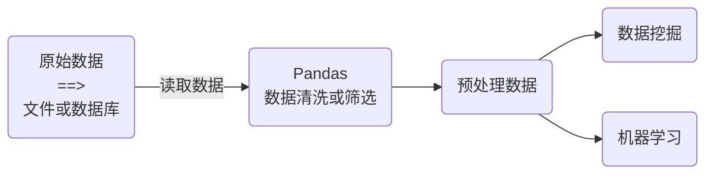
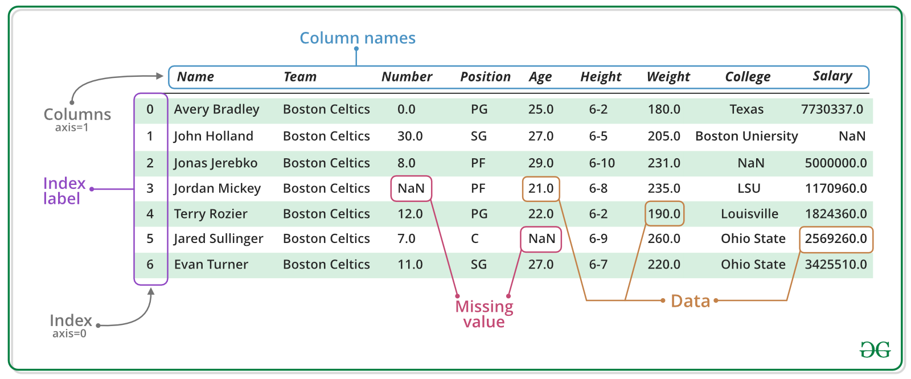
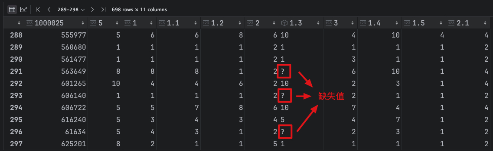

# Pandas

[Pandas](https://pandas.pydata.org/)是在Numpy和Matplotlib基础上建立的数据处理库，主要用于数据分析和数据清理等相关任务，包括电子表格或数据库表等。安装Pandas

```shell
pip install pandas
```


```mermaid
graph LR
a(原始数据\n==>\n文件或数据库)--读取数据-->c
c(Pandas\n数据清洗或筛选)-->d(预处理数据)
d-->i(数据挖掘)
d-->f(机器学习)
```

表格数据与Numpy数据的区别：

* 每一列数据类型是一致的。
* 数据类型可能包括数值、字符串等多种类型。
* 有表头的概念。
* 表格数据中可能包含异常值。



在拥有16GB内存的计算机上，pandas可以轻松处理数百万行、数十个列的数据集：

* `int64`和`float64`：每个元素占8个字节。
* 内存

$$
\text{Total}=\text{rows}\times\text{columns}\times\text{bytes}=1,000,000\times10\times8=80\text{MB}
$$

[Pandas学习网站](https://www.geeksforgeeks.org/pandas-tutorial/?ref=outind)

## Pandas数据结构

Pandas中一共有三种数据结构，分别为：Series、DataFrame和Panel。

* Series是一维数据结构。
* DataFrame是二维数据结构。
* Panel是三维数据结构。

> [!warning]
>
> Panel数据结构很少使用，通常使用其他方式替代这种数据结构。

### DataFrame数据结构

创建一个DataFrame的数据结构

```python
import pandas as pd

# 从文件中读取数据
players = pd.read_csv("nba.csv")  
print(type(players)) # 查看数据结构
```

DataFrame是一个类似于表格的数据结构，可以保存任何类型数据（比如整数、字符串、浮点数等）。

* 有`index`行索引对应的轴为0，`columns`列索对应的轴为1。
* 如果没有传入索引参数，则默认会自动创建一个从0-N的整数索引。

DataFrame的基本属性

* Numpy的属性`shape`、`dtypes`、`ndim`
* DataFrame属性：
  * 获得索引`index`、`columns`
  * `values`获得数据矩阵，返回数据类型是Numpy数组。

```python
print(players.shape)
print(players.index)
print(players.columns)
print(type(players.values))
print(players.values)
```

* 当数据中有多重类型是，`values`返回的Numpy数据类型是`object_`。

DataFrame的整体查询`head()`和`tail`可以查询头部和尾部的数据，默认是5条数据。

```python
players.head()
players.tail(10)
```

#### DataFrame的索引

索引包含`index`和`columns`用于数据查询，可以看作是一个**不可变数组**或有序集合，为任意类型数据。

* `index`表示行索引。
* `columns`表示列索引。

可以将数据中的某一行设置为索引

```python
df = players.set_index('Name') # 将球员的名字设置为索引
df.head()
```

### Series

Series是一维标记数组，只有行索引没有列索引，够保存任何类型的数据。从DataFrame中获取一个Series数据

```python
players_new = players.set_index('Name')
salary = players_new['Salary']

print(type(salary))
print(salary.index)
salary.head()
```

### 创建数据

1. 创建Series数据：`pd.Series(data, index=index)`。
   * `data`：传入的数据，参数支持多种数据类型，包括ndarray、list、dict等。
   * `index`：可选参数，与数据的长度相等，默认会自动创建一个从0-N的整数索引。
2. 创建DataFrame数据：`pd.DataFrame(data, index=index, columns=index)`。
   * `data`支持多种数据类型
   * `indes`和`columns`为可选参数。

## 数据读取与修改

### 读取数据

DataFrame数据有三种获取方式

> [!caution]
>
> 索引方式为先列后行（与Numpy相反），直接索引不支持Numpy类似的操作。

1. 直接使用行列索引，直接索引支持切片操作。

```python
data = pd.read_csv("https://media.geeksforgeeks.org/wp-content/uploads/nba.csv")  
players = data.set_index('Name')

players['Salary'].head() # 获取一列数据，返回Series数据类型
```

获取列数据，并将其转换为Numpy数据类型

```python
arr2 = players['Salary'].to_numpy()
print(type(arr2))
print(arr2.shape)
print(arr2[0:5])
```

> [!warning]
>
> 部分方法得到的Numpy数组与DataFrame共享数据。

2. 结合`loc`和`iloc`使用索引，可以先行后列进行索引，支持切片操作。无法直接使用索引或切片操作

* `loc`通过名字取值。

```python
item = players.loc['Avery Bradley', 'Salary']
sub_df = players.loc['Avery Bradley': 'R.J. Hunter']
sub_df = players.loc['Avery Bradley': 'R.J. Hunter', ['Salary', 'Team', 'Number']]
```

* `iloc`通过下标进行取值（与Numpy用法相似）。

```python
item = players.iloc[0, 0]
sub_df = players.iloc[0: 5, 0:2]
```

> [!caution]
>
> 老版本中存在`ix`索引，在新版本中已经弃用。

Series数据读取与DataFramed类似也支持`loc`和`iloc`。可以把Series对象看成一种特殊的Python字典。

```python
salary = players['Salary']
print(salary['Avery Bradley'])

print(salary.iloc[10])
sub_df = salary.iloc[0:5]
```

### 修改数据

修改单个数据应该使用`loc`和`iloc`方法，使用直接索引会产生警告。

```python
players.loc['Avery Bradley', 'Salary'] = 1000
```

修改一列数据可以使用索引

```python
players['Salary'] = 2000
players.Salary = 4000
```

### 数据排序

排序有两种形式，一种对于索引进行排序，一种对于内容进行排序，默认值都是从小到大。

1. 使用`sort_values`，可以对单个键或多个键进行排序。

```python
df = players.sort_values(by='Age')
df = players.sort_values(by='Age', ascending=False)

# 对多个字段排序传入列表
df = players.sort_values(by=['Age', 'Weight'], ascending=False)# 降序
```

2. 使用`sort_index`给索引排序。

```python
df = players.sort_index()
```

## Pandas的运算

### 统计运算

`describe`综合分析，能够自动得出多统计结果，包括count、mean、std、min、max等，count表示数据量（数据行数），只计算数值列。

```python
data = pd.read_csv("https://media.geeksforgeeks.org/wp-content/uploads/nba.csv")
players = data.set_index('Name')
players.describe()
```

使用单个函数进行统计时，可以设置统计的坐标轴，还是按照默认列统计`axis=0`，如果要对行操作`axis=1`。

1. 常见统计指标：`max`最大值、`var`方差、`std`标准差、`median`中位数。
1. 查找最大值的位置：`idxmax`最大值的位置，`idxmin`最小值的位置

[Series的相关函数](https://pandas.pydata.org/docs/reference/series.html)和[DataFrame的相关函数](https://pandas.pydata.org/docs/reference/frame.html)

### 逻辑运算

逻辑运算主要用于数据的筛选。

1. 使用比较运算符号进行筛选，包括`>`、`<`等。

```python
df = players['Age'] > 25 # 返回Series数据类型，存储数据为标记数组。

# 将年龄大于25的数据筛选出来，类似与Numpy中的布尔数组索引。
df = players[players['Age'] > 25] 
```

其它运算符号

* 使用`|`和`&`完成符号逻辑。
* `query`逻辑查询语句。可以替代逻辑运算符和比较运算符进行数据筛。
* `isin`判断是否存在某个值进行筛选。

### 算数运算

实现加、减、乘、除等算数运算，[常见算数运算函数](https://pandas.pydata.org/docs/reference/frame.html#binary-operator-functions)

```python
salary = players['Salary']

# 两种函数运算结果相同
players['new_salary'] = salary.add(1000)
players['new_salary'] = salary + 200000
```

### 自定义运算

`apply`函数可以自定义算数运算

```python
# 自定义一个函数计算薪水的差距
df = players[['Salary']].apply(lambda x: x.max() - x.min())
```

## 文件读写

Pandas支持复杂的文件读写操作，同时支持多种数据格式，如：CSV、json、Sql，HDF5等。使用Pandas很少手动创建数据，都是从其他环境中读取出来进行处理。

CSV文件读写。CSV是一种表格文件，存储的数据格式与Excel文件类型。

[`read_csv(file, usecols=None)`](https://pandas.pydata.org/docs/reference/api/pandas.read_csv.html#pandas.read_csv)从CSV中读取数据

* `file`读取文件的路径。
* `usecols`指定读取数据了列数，默认全部读取。

```python
# 读取部分数据
short_data = pd.read_csv("nba.csv", usecols=['Name', 'Age', 'Salary', 'Weight'])
```

> [!warning]
>
> `read_csv`调用的对象是Pandas库，`to_csv`调用的对象是Series和DataFramed。

`to_csv(file, columns=None, header=True, index=True, mode='w')`将数据保存到文件当中。

* `file`文件保存的路径。
* `columns`保存指定的列，默认全部保存。
* `header`是否写入索引值。
* `index`是否保存行索引。
* `mode`文件读写模式。`w`重新，`a`追加。

[Pandas支持读写的文件类型](https://pandas.pydata.org/docs/user_guide/io.html#io-tools-text-csv-hdf5)

## 缺失值处理

现实工作中的数据很少是干净整齐的，即使目前流行的数据集都会有数据缺失的现象。Pandas的提供了高效的缺失值处理函数，帮助用户处理缺失值问题。

[IMDB电影数据](https://www.kaggle.com/datasets/harshitshankhdhar/imdb-dataset-of-top-1000-movies-and-tv-shows)

`notnull`和`isnull`用于判断数据中是否有缺失值，两个函数均为Pandas函数。

* `notnull`数据不为缺失值返回`True`，`isnull`数据为缺失值返回`True`
* 两个函数返回数据均为标记数组。

```python
movies = pd.read_csv("imdb_top_1000.csv")

# 统计每一列缺失值的数量
print(pd.isnull(movies).sum())
```

### 存在缺失值

数据中缺失值的类型为`np.nan`

1. 删除有缺失值的样本数据。
1. 替换缺失数据。可以填充平均值或中位数，根据每一列的统计数据填充。使用`fillna(value, inplace=False)`函数来填充平均值。

### 有默认标记

有缺失值，不是默认`np.nan`类型，为其他的标记或符号。不能使用`fillna`和`dropna`。



使用`replace(to_replace, value)`将标记替换为`np.nan`，按前面的步骤处理。

## 练习

使用[IMDB Movies Dataset](https://www.kaggle.com/datasets/harshitshankhdhar/imdb-dataset-of-top-1000-movies-and-tv-shows)完成如下练习

```python
df = pd.read_csv("imdb_top_1000.csv")
df.head()
```

1. 统计2000年及以后上映的电影数量。
2. 计算所有电影的平均时长（分钟），超过120分钟的电影数量，小于120分钟的电影数量。
3. 统计IMDB_Rating在`[8, 9]`内的电影数量。
4. 统计拍摄电影数量最多的导演，并输出该导演的电影数。
5. 统计所有电影的票房总（Gross），并计算平均票房。

