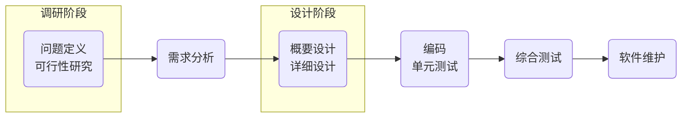

# 软件测试

软件的生命周期



软件测试级别：

1. 单元测试（UT unit test），一般就类、函数、组件进行测试，是最底层的测试。

2. 集成测试（IT system ingertaion test），将多个单元模块组合在一起，然后验证是否能正常工作。

3. 系统测试（ST system test），由测试人员充当用户，对功能、性能、以及软件所运行的软硬件环境进行测试。

   * 前期主要测试系统的功能是否满足需求。

   * 后期主要测试系统运行的性能是否满足需求，以及系统在不同的软硬件环境中的兼容性等。

4. 验收测试，由用户对软件进行测试

   1. $\alpha$ 测试（内测 ）
   2. $\beta$ 测试（公测）
   3. UAT（user acceptance test）测试，由客户派出对于业务非常精通的人员来使用该软件，从而对功能进行测试。 

软件测试金字塔模型


> [!attention]
>
> 底层的软件测试越充分，后期发现bug的概率越小。

## Unitest测试框架

[Unitest](https://docs.python.org/zh-cn/3/library/unittest.html#)是Python自带的单元测试工具。

在文件目录下创建`test_case`测试文件，测试文件一般以`test_`开头。

```python
import unittest

class TestCase(unittest.TestCase):
    def test_01(self):
        print('case 01')

    def test_02(self):
        print('case 02')

if __name__ == '__main__':
    unittest.main()
```

1. 测试类需要继承`unittest.TestCase`框架。
2. `test_01`、`test_02`、`test_03`是测试用例。
3. `unittest.main()`运行本文件中的全部测试函数。

> [!attention]
>
> 每个测试用例需要以`test_`字符串开头。

测试用例（Test Case）用于验证函数在各种情况下都符合要求，良好的测试用例考虑到了函数在各种情况下的行为， 以及预期的结果。

> [!warning]
>
> 软件测试工作的核心内容就是设计合理的测试用例。

完整测试用例。

```python
import unittest

class TestCase(unittest.TestCase):
    @classmethod
    def setUpClass(cls):   # 所有test运行前运行一次
        print('\n')
        print("setUpClass")

    @classmethod
    def tearDownClass(cls):  # 所有test运行后运行一次
        print("tearDownClass")

    def setUp(self):
        print('\n')
        print('setUp')

    def tearDown(self):
        print('tearDown')

    def test_01(self):
        print('case 01')

    def test_02(self):
        print('case 02')

if __name__ == '__main__':
    unittest.main()
```

1. 在每个测试用例开始执行之前，可以使用`setUp`配置测试需要的环境，使用`tearDown`回收资源。

2. `setUpClass`和`tearDownClass`在所有测试用例开始和结束时执行一次。

欧氏距离计算函数

```python
import math

def distance(x1, x2):
    if len(x1) != len(x2):
        raise ValueError("x1和x2的长度不一致")

    sum = 0
    for i in range(len(x1)):
        sum += (x1[i] - x2[i]) ** 2
    return math.sqrt(sum)
```

设计单元测试，验证上述函数的正确性。

```python
import unittest
from dictances import distance

class DistanceCalculationTest(unittest.TestCase):
    def setUp(self):
        self.point1 = [1, 2, 3]
        self.point2 = [4, 5, 6]
        self.point5 = [1, 2]
        self.point6 = [1, 2, 3, 4]

    def test_01(self):
        self.assertAlmostEqual(distance(self.point1, self.point2), 5.196152, places=6)

    def test_02(self):
        self.assertEqual(distance(self.point1, self.point1), 0)

    def test_03(self):
        with self.assertRaises(ValueError):
            distance(self.point5, self.point6)

if __name__ == '__main__':
    unittest.main()
```

`self.assertXXX`函数称为断言，断言是用于判断程序是否为预期的结果，不满足预期结果会抛出异常。

常用断言函数

| 方法                                                         | 检查对象           |
| :----------------------------------------------------------- | :----------------- |
| [`assertEqual(a, b)`](https://docs.python.org/zh-cn/3/library/unittest.html#unittest.TestCase.assertEqual) | `a == b`           |
| [`assertNotEqual(a, b)`](https://docs.python.org/zh-cn/3/library/unittest.html#unittest.TestCase.assertNotEqual) | `a != b`           |
| [`assertTrue(x)`](https://docs.python.org/zh-cn/3/library/unittest.html#unittest.TestCase.assertTrue) | `bool(x) is True`  |
| [`assertFalse(x)`](https://docs.python.org/zh-cn/3/library/unittest.html#unittest.TestCase.assertFalse) | `bool(x) is False` |
| [`assertAlmostEqual`](https://docs.python.org/zh-cn/3/library/unittest.html#unittest.TestCase.assertAlmostEqual) | 近似相等           |
| [`assertRaises`](https://docs.python.org/zh-cn/3/library/unittest.html#unittest.TestCase.assertRaises) | 报错               |


