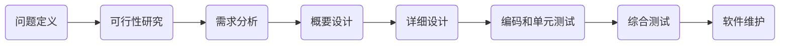

# 软件测试

软件的生命周期




软件测试金字塔模型


## Python单元测试框架

Unitest是Python自带的单元测试工具。

```python
import unittest

class MyTestCase(unittest.TestCase):
    @classmethod
    def setUpClass(cls):   # 所有test运行前运行一次
        print("setUpClass")

    @classmethod
    def tearDownClass(cls):  # 所有test运行后运行一次
        print("tearDownClass")

    def setUp(self):  # 每个test运行前运行一次
        print("setUp")

    def tearDown(self):  # 每个test运行后运行一次
        print("tearDown")

    def test_01(self):  # 测试用例
        print('test_01')

    def test_02(self):
        print('test_01')


if __name__ == '__main__':
    unittest.main()
```

Unitest中的断言

断言是用于判断程序是否为预期的结果

| 方法                                                         | 检查对象           |
| :----------------------------------------------------------- | :----------------- |
| [`assertEqual(a, b)`](https://docs.python.org/zh-cn/3/library/unittest.html#unittest.TestCase.assertEqual) | `a == b`           |
| [`assertNotEqual(a, b)`](https://docs.python.org/zh-cn/3/library/unittest.html#unittest.TestCase.assertNotEqual) | `a != b`           |
| [`assertTrue(x)`](https://docs.python.org/zh-cn/3/library/unittest.html#unittest.TestCase.assertTrue) | `bool(x) is True`  |
| [`assertFalse(x)`](https://docs.python.org/zh-cn/3/library/unittest.html#unittest.TestCase.assertFalse) | `bool(x) is False` |

```python
class MyTestCase(unittest.TestCase):
    def test_01(self): 
        a = 10
        b = 10
        self.assertEqual(a, b)
        self.assertNotEquals(a, b)

    def test_02(self):
        c = False
        self.assertFalse(c)
        self.assertTrue(c)
```


## UnitTest

```python
#coding=utf-8
import sys
import os
base_path = os.getcwd()
import unittest
sys.path.append(base_path)
import unittest
from Base.base_request import request
url = "http://www.imooc.com"
data = {
    "username":"1111",
    "password":"22222"
}
host = 'http://www.imooc.com'

class TestCase01(unittest.TestCase): 
    def setUp(self):
        print("case开始执行")
    
    def tearDown(self):
        print("case结束执行")
    
    @classmethod
    def setUpClass(cls):
        print("case类开始执行")

    @classmethod
    def tearDownClass(cls):
        print("case类执行结束")

    @unittest.skip("这个case不像执行") 
    def test_01(self): # 按照case的字符顺序执行
        TestCase01.a = 5
        print("执行case01")
        #res = requests.get(url=url,params=data).json()
        data1 = {
            "user":"11111"
        }
        self.assertDictEqual(data1, data) # 判断两个字典相等

    @unittest.skip("这个case不像执行")
    def test_02(self):
        print("----------------》执行case02")
        data1 = {
            "username":"1111",
            "password":"22222"
        }
        self.assertDictEqual(data1, data, msg="这两个字典不相等")

    @unittest.skip("这个case不像执行")
    def test_03(self):
        print("执行case03")
        flag = True
        self.assertFalse(flag, msg="不等于True")

    @unittest.skip("这个case不像执行")
    def test_04(self):
        print("执行case04")
        flag = False
        self.assertTrue(flag, msg="不等于False")

    @unittest.skipIf(host !="http://www.imooc.com","这个case不执行")
    def test_05(self):
        print("执行case05")
        flag = "111"
        flag1 = "2222"
        self.assertEqual(flag, flag1, msg="两个str不相等")

    def test_06(self):
        res = request.run_main('get', url,data)
        print(res)

    @unittest.skip("这个case不像执行")
    def test_07(self):
        
        print("执行case07")
        flag = "adfadfadfadfadsfaqeewr"
        s = "fads"
        self.assertIn(s, flag, msg="不包含")

if __name__ == "__main__":
    #unittest.main()
    suite = unittest.TestSuite()
    '''
    suite.addTest(TestCase01('test_06'))
    suite.addTest(TestCase01('test_04'))
    suite.addTest(TestCase01('test_02'))
    suite.addTest(TestCase01('test_05'))
    suite.addTest(TestCase01('test_01'))
    suite.addTest(TestCase01('test_07'))
    '''
    # 按照list顺序执行
    tests = [TestCase01('test_06'),TestCase01('test_02'),TestCase01('test_03'),TestCase01('test_05'),TestCase01('test_01')]
    suite.addTests(tests)
    runner = unittest.TextTestRunner()
    runner.run(suite)
```

#### 批量添加测试用例

```python
import sys
import os
#sys.path.append("E:/www/ImoocInterface/")
import unittest
case_path = os.getcwd()+"/UnittestCase/"
print(case_path)
'''
from UnittestCase.test_case01 import TestCase01
from UnittestCase.test_case02 import TestCase02
from UnittestCase.test_case03 import TestCase03
case_01 = unittest.TestLoader().loadTestsFromTestCase(TestCase01)
case_02 = unittest.TestLoader().loadTestsFromTestCase(TestCase02)
case_03 = unittest.TestLoader().loadTestsFromTestCase(TestCase03)
suote = unittest.TestSuite([case_01,case_02,case_03])
unittest.TextTestRunner().run(suote)
'''
discover = unittest.defaultTestLoader.discover(case_path)
unittest.TextTestRunner().run(discover)
#print(discover)

```

